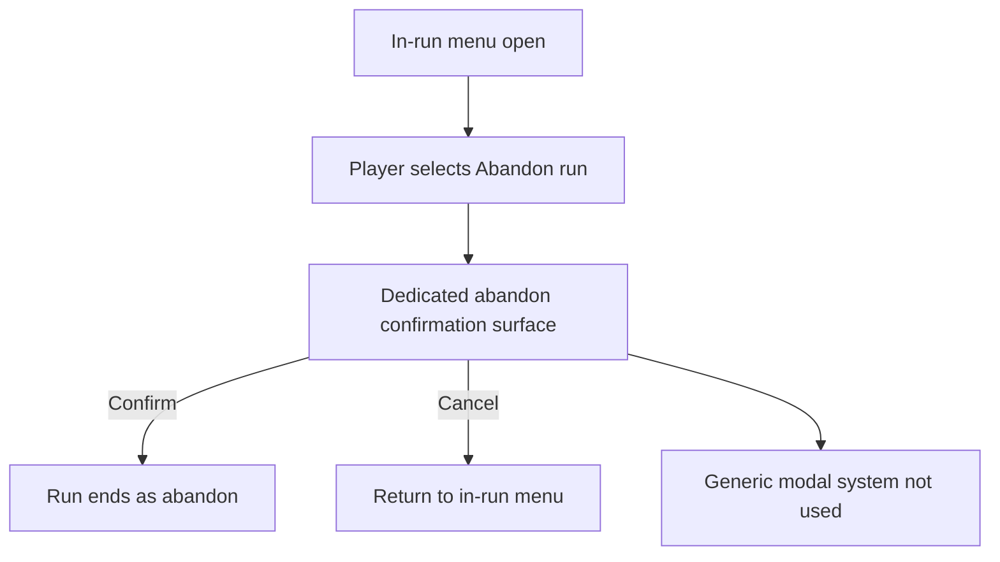

## req_117_define_a_dedicated_in_run_abandon_confirmation_surface_instead_of_the_generic_modal_system - Define a dedicated in-run abandon confirmation surface instead of the generic modal system
> From version: 0.7.0+1b1dda6
> Schema version: 1.0
> Status: Done
> Understanding: 99%
> Confidence: 97%
> Complexity: Medium
> Theme: Shell
> Reminder: Update status/understanding/confidence and references when you edit this doc.

# Needs
- Replace the current `Abandon run` confirmation that depends on the generic modal system.
- Define a dedicated in-run confirmation surface specifically for the abandon action.
- Keep the abandon flow explicit, safe, and visually coherent with the runtime shell.
- Avoid coupling this run-ending action to a generic modal mechanism that is not shaped for the runtime pause/menu context.

# Context
Emberwake already has an explicit in-run `Abandon run` action and a run-commit posture where abandoning a run is a terminal outcome. What now feels wrong is the confirmation experience: it currently goes through the generic modal system, which makes a high-stakes runtime action feel like just another shared dialog.

This request introduces a more intentional confirmation posture:
1. `Abandon run` keeps its current meaning as a terminal action
2. its confirmation should be rendered by a dedicated runtime shell surface
3. the surface should feel owned by the in-run menu/pause flow rather than by a cross-cutting modal layer
4. the user should still get explicit confirmation before the run is ended

The goal is not to redesign the whole shell modal strategy. The goal is to give the abandon flow its own shaped confirmation UI because it is a run-ending action with different stakes and context from generic confirmations.

Scope includes:
- defining a dedicated confirmation surface for `Abandon run`
- defining how that confirmation is entered from the in-run menu
- defining the confirm/cancel actions and expected focus/default posture
- defining how the dedicated confirmation surface coexists with the runtime shell without routing through the generic modal system
- defining validation expectations so abandon remains safe and intentional

Scope excludes:
- redesigning every other modal or confirmation in the product
- changing the gameplay meaning of abandon
- reopening save/load posture
- a full shell navigation rewrite unrelated to abandon confirmation

# Acceptance criteria
- AC1: The request defines a dedicated confirmation surface for `Abandon run` instead of using the generic modal system.
- AC2: The request defines that the dedicated surface is reached from the in-run shell/menu context.
- AC3: The request defines explicit `Confirm abandon` and `Cancel` outcomes.
- AC4: The request defines that confirming abandon still triggers the same terminal run outcome as the current abandon flow.
- AC5: The request defines that canceling the confirmation returns the user safely to the in-run menu without ending the run.
- AC6: The request stays bounded to the abandon confirmation UX and does not expand into a generic modal-system rewrite.

# Dependencies and risks
- Dependency: the in-run shell/menu already exposes `Abandon run` and remains the expected entry point for the new confirmation surface.
- Dependency: the run-commit posture defined by `req_109` remains unchanged and should still govern the terminal outcome.
- Dependency: runtime input/focus behavior should be stable enough that confirm/cancel can be operated safely on desktop and mobile.
- Risk: if the confirmation surface is too lightweight, accidental abandon may still happen.
- Risk: if the confirmation surface is too separate from the in-run shell, the flow may feel like a hard navigation jump instead of a focused confirmation.
- Risk: if the generic modal path is only hidden but not removed from the abandon action, the product may keep two competing confirmation behaviors.

# Open questions
- Should the dedicated abandon confirmation feel like an inline panel state or a full sub-screen of the in-run menu?
  Recommended default: a focused sub-surface owned by the in-run shell, not a generic popup.
- Should the default emphasis be on `Cancel` or on `Confirm abandon`?
  Recommended default: stronger visual safety around `Cancel`, with `Confirm abandon` still explicit and clear.
- Should this new surface later be reused for other terminal runtime actions?
  Recommended default: maybe later, but this request should only solve abandon confirmation first.

# Definition of Ready (DoR)
- [x] Problem statement is explicit and user impact is clear.
- [x] Scope boundaries (in/out) are explicit.
- [x] Acceptance criteria are testable.
- [x] Dependencies and known risks are listed.

# Clarifications
- “Instead of the generic modal system” means the abandon flow should no longer rely on the shared modal path currently used for broad confirmations.
- The product meaning of abandon does not change here; only the confirmation surface changes.
- The new confirmation should still behave like a protective guardrail, not like a silent immediate action.
- This is a shell/runtime UX request, not a gameplay balancing request.

# Companion docs
- Product brief(s): (none yet)
- Architecture decision(s): (none yet)
- Request(s): `req_109_define_a_run_commit_posture_with_in_run_abandon_and_no_mid_run_save_load`, `req_111_define_a_terminal_run_memory_cleanup_posture_when_returning_to_main_screen`

# AI Context
- Summary: Replace the generic modal-based abandon confirmation with a dedicated in-run shell confirmation surface for the terminal `Abandon run` action.
- Keywords: abandon, confirmation, shell, runtime menu, modal, pause menu, terminal action
- Use when: Use when Emberwake should keep abandon as a confirmed terminal action but present that confirmation through a dedicated runtime shell surface.
- Skip when: Skip when the task is about changing abandon gameplay consequences, save/load posture, or redesigning every modal in the app.

# References
- `src/app/AppShell.tsx`
- `src/app/components/ShellMenu.tsx`
- `src/app/components/ActiveRuntimeShellContent.tsx`
- `src/app/components/AppMetaScenePanel.tsx`
- `logics/request/req_109_define_a_run_commit_posture_with_in_run_abandon_and_no_mid_run_save_load.md`
- `logics/request/req_111_define_a_terminal_run_memory_cleanup_posture_when_returning_to_main_screen.md`

# Backlog
- `item_396_define_a_dedicated_runtime_shell_abandon_confirmation_surface`
