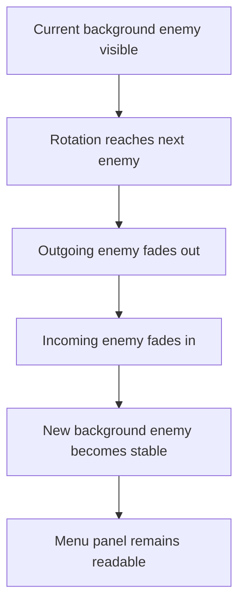

## req_118_define_a_fade_in_fade_out_transition_posture_for_main_screen_background_entity_rotation - Define a fade in/fade out transition posture for main screen background entity rotation
> From version: 0.7.0+1b1dda6
> Schema version: 1.0
> Status: Done
> Understanding: 99%
> Confidence: 97%
> Complexity: Low
> Theme: Shell
> Reminder: Update status/understanding/confidence and references when you edit this doc.

# Needs
- Improve the enemy/background rotation on the main screen so swaps do not feel abrupt.
- Define a fade-out/fade-in transition posture when the left-side background entity changes.
- Keep the hero and menu readability intact while adding a more intentional background presentation rhythm.
- Bound the change to transition behavior rather than reopening the whole main screen composition.

# Context
The main screen already uses runtime entity assets as large background silhouettes, with the hero anchored on one side and a rotating enemy presentation on the other. The current enemy swap is functional but visually harsh because it changes without a dedicated transition treatment.

This request introduces a bounded presentation improvement:
1. when the rotating background entity changes, the outgoing entity should fade out
2. the incoming entity should fade in
3. the transition should feel deliberate and smooth, not like a sudden asset replacement
4. the menu panel and hero readability should remain protected

The goal is not to redesign the main screen or add complex animation. The goal is to add a simple, controlled transition posture that improves the perceived quality of the enemy rotation.

Scope includes:
- defining a fade-out/fade-in transition for main screen background entity rotation
- defining that the transition applies to the rotating enemy/background side of the main screen
- defining constraints so the menu panel remains readable during the transition
- defining validation expectations for desktop and mobile shell rendering

Scope excludes:
- redesigning the full main screen layout
- adding skeletal animation or motion-heavy character animation
- changing the cadence or roster policy of the rotating background entities unless needed only to support the fade
- reopening the in-game runtime presentation system

# Acceptance criteria
- AC1: The request defines a fade-out/fade-in transition posture for main screen background entity swaps.
- AC2: The request defines that the transition applies to the rotating background enemy presentation rather than to the entire shell.
- AC3: The request defines that the transition should remain visually bounded and should not reduce menu readability.
- AC4: The request defines validation expectations for the transition on the supported shell layouts, including desktop and mobile.
- AC5: The request stays bounded to the main screen background rotation transition rather than expanding into a full shell animation redesign.

# Dependencies and risks
- Dependency: the current main screen background entity rotation remains the baseline integration point.
- Dependency: the main screen shell composition must still keep the hero and central panel stable during the enemy fade.
- Risk: if the fade is too slow, the main screen may feel sluggish instead of polished.
- Risk: if the fade overlaps poorly with panel overlays, silhouettes may ghost awkwardly behind the menu.
- Risk: if mobile layout is not validated, the fade may reveal clipping or anchoring defects that are not obvious on desktop.

# Open questions
- Should the fade be a simple opacity crossfade or a slightly staggered fade-out then fade-in?
  Recommended default: a short staggered fade-out then fade-in for clearer rhythm and less muddied overlap.
- Should the hero also participate in this transition?
  Recommended default: no; keep the hero stable and limit the effect to the rotating enemy side.
- Should the transition be the same on desktop and mobile?
  Recommended default: same behavior, but allow shorter timing on mobile if needed for clarity.

# Definition of Ready (DoR)
- [x] Problem statement is explicit and user impact is clear.
- [x] Scope boundaries (in/out) are explicit.
- [x] Acceptance criteria are testable.
- [x] Dependencies and known risks are listed.

# Clarifications
- “Fade in / fade out” means a visual opacity-based transition around entity rotation, not a page-wide route transition.
- The rotating entity is the priority target; the hero should remain stable unless later work explicitly changes that.
- The request is about perceived presentation quality on the main screen, not about gameplay readability.

# Companion docs
- Product brief(s): (none yet)
- Architecture decision(s): (none yet)
- Request(s): `req_107_define_a_main_screen_background_presentation_using_runtime_character_and_enemy_assets`

# AI Context
- Summary: Add a bounded fade-out/fade-in transition to the rotating background entity on the main screen so enemy swaps feel smoother and more intentional.
- Keywords: main screen, shell, fade, crossfade, background entity, enemy rotation, presentation polish
- Use when: Use when Emberwake should smooth the visual transition between rotating background entities on the main menu.
- Skip when: Skip when the work is about gameplay entity rendering, runtime combat feedback, or a full shell animation redesign.

# References
- `src/app/components/AppMetaScenePanel.tsx`
- `src/app/styles/app.css`
- `logics/request/req_107_define_a_main_screen_background_presentation_using_runtime_character_and_enemy_assets.md`

# Backlog
- `item_397_define_a_fade_transition_contract_for_rotating_main_screen_enemy_backdrops`
