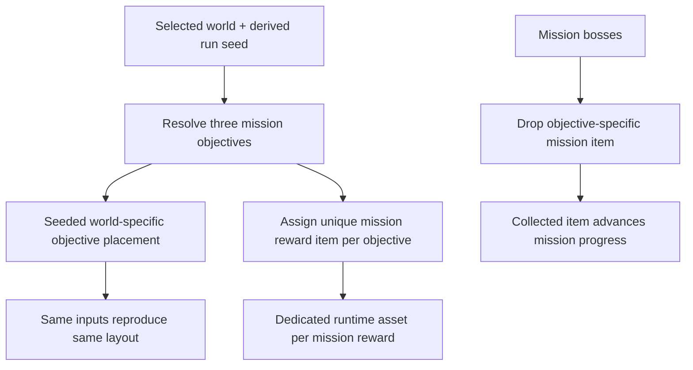

## req_119_define_unique_per_world_mission_reward_items_and_seeded_objective_positions - Define unique per-world mission reward items and seeded objective positions
> From version: 0.7.0+1b1dda6
> Schema version: 1.0
> Status: Done
> Understanding: 100%
> Confidence: 98%
> Complexity: High
> Theme: Gameplay
> Reminder: Update status/understanding/confidence and references when you edit this doc.

# Needs
- Replace the current generic mission reward pickup with truly unique mission items.
- Ensure every mission objective across every world has its own item identity and its own dedicated runtime asset.
- Stop using fully fixed mission-objective coordinates per world.
- Make mission-objective placement vary deterministically from the derived run seed while staying valid for the selected world.

# Context
Emberwake already has a world-specific mission loop with distinct objective names per world, mission bosses, and a three-stage structure. What is still too generic is the reward and placement layer:

1. mission rewards currently read as different through labels, but they still collapse to the same actual pickup type
2. mission objectives currently use authored per-world coordinates, but they do not vary with the derived run seed

That leaves two immersion gaps:
- mission rewards do not yet feel like truly distinct objects recovered from the world
- repeated runs on the same world keep the same objective travel pattern even though the run seed now depends on player name plus selected world

This request introduces the next authored step:
1. each mission objective should map to a unique mission item identity
2. each of those mission items should have its own dedicated asset
3. objective placement should remain world-specific in posture, but should resolve through deterministic seeded placement rules rather than one frozen coordinate set
4. the same normalized player name plus selected world should reproduce the same objective layout, while different seed inputs can produce a different valid layout for that same world

The goal is not to turn mission placement into unconstrained procedural chaos. The goal is to make the world missions feel more authored in reward identity and less static in traversal, while preserving deterministic replayability.

Scope includes:
- defining a unique mission-reward item roster for all world/mission objectives in the current primary mission ladder
- defining that each mission reward item owns a dedicated runtime asset identity
- defining the seam where mission bosses drop those objective-specific items instead of one generic pickup
- defining seeded mission-objective placement rules that derive positions from the run seed and selected world
- defining constraints so seeded positions remain spaced, reachable, and world-appropriate
- defining validation expectations for deterministic seeded replay and reward identity correctness

Scope excludes:
- redesigning the overall three-stage primary mission structure
- introducing side quests or optional branches
- changing world unlock rules
- exposing raw seed internals in the UI
- a full procedural mission generator with arbitrary objective counts

# Acceptance criteria
- AC1: The request defines a unique mission-reward item identity for each current primary mission objective across the authored world roster.
- AC2: The request defines that those mission-reward items should use dedicated runtime asset identities rather than collapsing to one generic pickup asset.
- AC3: The request defines that mission bosses should drop the correct objective-specific mission item for the active world/stage.
- AC4: The request defines that mission-objective positions should be derived from the run seed together with the selected world instead of remaining globally fixed per world.
- AC5: The request defines deterministic posture such that the same normalized player name and selected world reproduce the same objective placement.
- AC6: The request defines placement constraints so seeded objectives stay sufficiently spaced, reachable, and coherent with the active world.
- AC7: The request stays bounded to mission reward identity and seeded objective placement rather than expanding into a broader procedural quest generator.

# Dependencies and risks
- Dependency: the derived run seed contract from `req_112` remains the source of deterministic variation.
- Dependency: the world-specific mission identity work from `req_115` remains the base roster for labels and world ownership.
- Dependency: the mission boss drop seam already present in runtime remains the integration point for unique mission items.
- Dependency: the asset pipeline must be able to carry a larger set of mission-item assets cleanly.
- Risk: if seeded placement is too unconstrained, objectives may spawn in weak or frustrating traversal patterns.
- Risk: if placement is too constrained, the seeded variation may feel fake because layouts barely change.
- Risk: if mission item identities proliferate without clear naming or art direction, the archive and runtime UI may become noisy.
- Risk: if reward identity, drop logic, and archive/catalog seams drift, the wrong item may be displayed or collected.

# Open questions
- Should every mission objective in every world get a completely unique item, or should some worlds share a family with visual variants?
  Recommended default: completely unique item identity per objective, with family coherence only at the art-direction level.
- Should seeded placement be free-form across the whole map or drawn from bounded world-specific anchor sets and offsets?
  Recommended default: bounded world-specific anchor rules plus seeded offsets, so the result varies but remains authored.
- Should the mission item asset also be the same one used in archive/codex surfaces?
  Recommended default: yes, use one shared asset identity across runtime and shell to keep discovery coherent.

# Definition of Ready (DoR)
- [x] Problem statement is explicit and user impact is clear.
- [x] Scope boundaries (in/out) are explicit.
- [x] Acceptance criteria are testable.
- [x] Dependencies and known risks are listed.

# Clarifications
- “Unique item” means a true gameplay/content identity, not just a different label on a shared generic cache pickup.
- “Unique asset” means a dedicated runtime asset entry per mission reward item, even if some art-direction motifs stay related within a world family.
- “Random according to the seed” means deterministic seeded variation, not nondeterministic runtime randomness.
- Seeded placement must still honor the mission-spacing posture already established for the main mission loop.

# Companion docs
- Product brief(s): (none yet)
- Architecture decision(s): (none yet)
- Request(s): `req_102_define_a_primary_map_mission_loop_with_three_target_zones_bosses_and_key_items`, `req_112_define_the_map_seed_as_a_function_of_player_name_and_selected_world`, `req_115_define_unique_per_world_primary_mission_objectives_with_distinct_names_and_positions`

# AI Context
- Summary: Make primary missions feel more authored and replayable by giving every world/stage a unique mission item asset and by deriving objective positions deterministically from the run seed.
- Keywords: mission item, mission rewards, seeded placement, objective positions, world-specific missions, deterministic run seed, unique assets
- Use when: Use when Emberwake should replace generic mission cache rewards and fixed coordinates with objective-specific items and seeded mission layouts.
- Skip when: Skip when the work is only about boss combat tuning, generic loot drops, or a full quest-graph redesign.

# References
- `games/emberwake/src/runtime/missionLoop.ts`
- `games/emberwake/src/runtime/entitySimulation.ts`
- `src/shared/model/worldSeed.ts`
- `src/shared/model/worldProfiles.ts`
- `src/shared/model/lootArchive.ts`
- `src/assets/assetCatalog.ts`
- `games/emberwake/src/content/entities/entityData.ts`

# Backlog
- `item_398_define_unique_primary_mission_reward_item_roster_and_asset_coverage`
- `item_399_define_seeded_world_specific_primary_mission_objective_placement`
