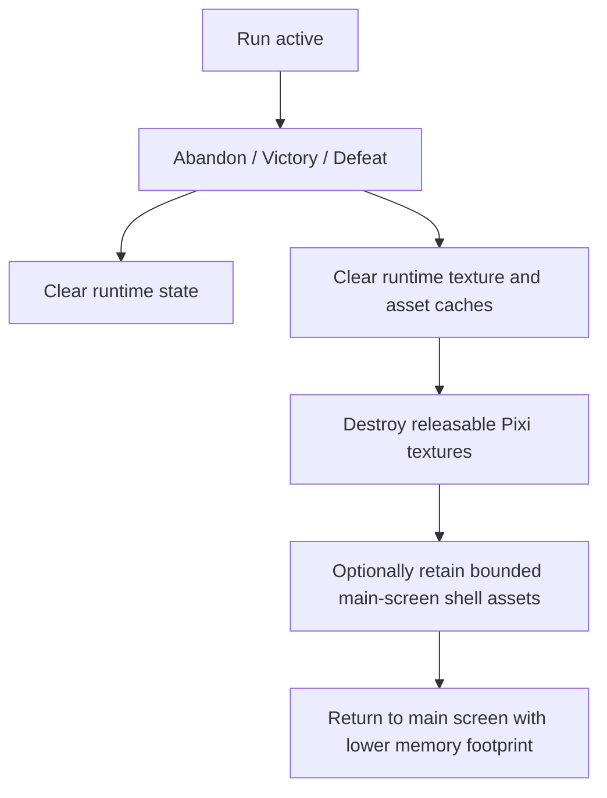

## req_120_define_a_terminal_runtime_texture_and_asset_cache_cleanup_posture_for_main_screen_return - Define a terminal runtime texture and asset cache cleanup posture for main screen return
> From version: 0.7.0+1b1dda6
> Schema version: 1.0
> Status: Draft
> Understanding: 100%
> Confidence: 99%
> Complexity: Medium
> Theme: Performance
> Reminder: Update status/understanding/confidence and references when you edit this doc.

# Needs
- Reduce memory usage after a run has ended and the player returns to the main screen.
- Stop treating terminal run cleanup as only a state/reset concern when heavy runtime textures may still remain cached.
- Define a cleanup posture for texture and asset caches that outlive the runtime session.
- Keep the main screen responsive while allowing bounded retention of the shell assets that are actually still needed there.

# Context
Emberwake already clears terminal run state on `abandon`, `victory -> main screen`, and `defeat -> main screen`. That cleanup is useful but incomplete: runtime state may be dropped while decoded textures and cached runtime assets still remain alive in memory. With the current generated PNG-heavy asset roster, this can leave the app consuming much more memory than expected even after the player is already back on the main screen.

This request introduces a clearer terminal cleanup posture:
1. ending a run and returning to the main screen should release more than gameplay state
2. runtime-only textures and cached asset entries should be eligible for cleanup
3. Pixi-side texture ownership should be explicitly considered during terminal teardown
4. the shell may keep a small bounded set of assets that are immediately needed for the main screen, rather than blindly keeping everything

The goal is not to build a full streaming asset manager in one step. The goal is to stop obvious memory retention after a terminal run outcome and make main-screen return behave more like a true runtime teardown.

Scope includes:
- defining a terminal cleanup seam for runtime texture caches and decoded asset retention
- defining that texture/cache cleanup should run on `abandon`, `victory -> main screen`, and `defeat -> main screen`
- defining which runtime-owned textures should be destroyed or released when they are no longer needed
- defining whether a bounded allowlist of shell/main-screen assets may remain warm after cleanup
- defining validation expectations so memory behavior can be checked after terminal return flows

Scope excludes:
- a full asset streaming architecture redesign
- micro-managing every possible browser cache layer
- forcing all shell assets to unload between every menu transition
- changing gameplay logic or mission progression in the same slice

# Acceptance criteria
- AC1: The request defines a terminal cleanup posture for runtime texture and asset caches in addition to gameplay-state reset.
- AC2: The request defines that this cleanup should run when a run ends and the user returns to the main screen through abandon, victory, or defeat.
- AC3: The request defines that runtime-owned Pixi textures or equivalent decoded texture resources should be explicitly eligible for destruction/release when no longer needed.
- AC4: The request defines whether a bounded set of shell/main-screen assets may be retained warm after terminal cleanup.
- AC5: The request defines validation expectations for checking memory behavior after returning to the main screen.
- AC6: The request stays bounded to terminal runtime cleanup rather than broadening into a complete asset-streaming rewrite.

# Dependencies and risks
- Dependency: the current terminal run cleanup seam in the shell remains the expected trigger point.
- Dependency: asset loading and texture caching seams already present in the shared asset layer remain the likely integration points.
- Dependency: the main screen now uses some entity assets as shell background presentation, so retention policy must distinguish shell-needed assets from runtime-only assets.
- Risk: if cleanup is too aggressive, the main screen may thrash by immediately reloading assets it still needs.
- Risk: if cleanup is too timid, memory use after terminal return will remain much higher than expected.
- Risk: if Pixi texture destruction is not coordinated with cache invalidation, stale references may lead to broken rendering or reload bugs.

# Open questions
- Should cleanup retain no textures at all, or preserve a bounded main-screen allowlist?
  Recommended default: keep only a small main-screen allowlist warm and release the rest.
- Should the cleanup run immediately on terminal return or only after the main screen is shown?
  Recommended default: perform terminal cleanup as part of the return flow so the main screen lands in a cleaner memory state.
- Should validation rely only on manual observation, or include some inspectable counters/diagnostics?
  Recommended default: include at least lightweight inspectable counters or debug evidence so the cleanup can be verified intentionally.

# Definition of Ready (DoR)
- [x] Problem statement is explicit and user impact is clear.
- [x] Scope boundaries (in/out) are explicit.
- [x] Acceptance criteria are testable.
- [x] Dependencies and known risks are listed.

# Clarifications
- “Purge memory” here primarily means releasing runtime-retained texture/cache resources that survive after the gameplay session is over.
- The request is not asking for browser process memory to instantly snap to zero; it is asking for Emberwake to stop holding obvious runtime-heavy assets longer than necessary.
- A bounded main-screen asset allowlist is acceptable if it materially improves UX while still dropping the bulk of runtime texture cost.
- This request complements the existing terminal run cleanup posture; it does not replace it.

# Companion docs
- Product brief(s): (none yet)
- Architecture decision(s): (none yet)
- Request(s): `req_109_define_a_run_commit_posture_with_in_run_abandon_and_no_mid_run_save_load`, `req_111_define_a_terminal_run_memory_cleanup_posture_when_returning_to_main_screen`

# AI Context
- Summary: Define a proper terminal runtime cleanup posture that releases texture and asset caches when returning to the main screen after a concluded run.
- Keywords: memory, cleanup, teardown, textures, pixi, cache, main menu, abandon, victory, defeat
- Use when: Use when Emberwake should reduce retained memory after terminal run outcomes instead of only clearing gameplay state.
- Skip when: Skip when the work is only about generic state reset, gameplay balance, or a full asset streaming overhaul.

# References
- `src/app/AppShell.tsx`
- `src/app/hooks/useRuntimeSession.ts`
- `src/assets/useResolvedAssetTexture.ts`
- `src/game/entities/render/EntityScene.tsx`
- `src/game/world/render/WorldScene.tsx`
- `logics/request/req_111_define_a_terminal_run_memory_cleanup_posture_when_returning_to_main_screen.md`

# Backlog
- `item_400_define_terminal_runtime_texture_cache_release_and_asset_ownership_boundaries`
- `item_401_define_terminal_memory_cleanup_validation_and_runtime_main_screen_allowlist_tuning`
