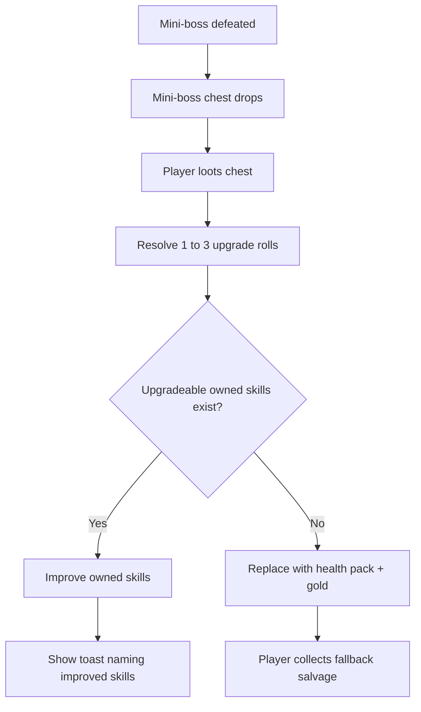

## req_121_define_a_boss_chest_reward_flow_with_random_skill_upgrades_and_fallback_salvage - Define a boss chest reward flow with random skill upgrades and fallback salvage
> From version: 0.7.0+1b1dda6
> Schema version: 1.0
> Status: Done
> Understanding: 100%
> Confidence: 98%
> Complexity: High
> Theme: Gameplay
> Reminder: Update status/understanding/confidence and references when you edit this doc.

# Needs
- Make mini-boss defeats feel more rewarding by dropping a dedicated chest/loot reward.
- Let that boss reward improve already owned skills rather than only adding another generic pickup.
- Surface the reward outcome clearly with toasts that say which skills were upgraded.
- Avoid dead rewards when the player already has every owned skill maxed.

# Context
Emberwake already has mini-bosses, mission bosses, mission rewards, pickups, and toast notifications. What is still missing is a strong mini-boss reward loop that feels consequential at the moment of defeat. A dedicated mini-boss chest solves that gap if it does more than just add another generic resource: it should provide a burst of progression by upgrading existing skills the player already owns.

This request introduces that posture:
1. when a mini-boss is defeated, a mini-boss chest/loot reward should drop
2. when the player loots that chest, the game should attempt between 1 and 3 upgrades on already owned skills
3. the shell should emit toast feedback naming the skills that were improved
4. if the current build has no valid skill upgrades left because all owned skills are maxed, the chest should be replaced by a fallback salvage reward made of health plus gold

The goal is not to redesign the whole loot economy. The goal is to make mini-bosses pay off with a compact, readable, build-forward reward moment that still has a clean fallback when the build is already capped, without changing the separate reward posture already used by mission bosses.

Scope includes:
- defining that mini-boss defeats should produce a dedicated chest/loot reward
- defining the upgrade reward posture as 1 to 3 improvements applied to already owned skills
- defining the candidate pool as skills already possessed by the current build
- defining the toast feedback that names the improved skills
- defining the fallback reward when no valid skill upgrades remain
- defining whether the fallback reward replaces the chest before spawn or resolves at loot time

Scope excludes:
- redesigning all non-boss loot
- changing normal level-up choice rules
- introducing a full affix/enchantment system for boss loot
- changing the meaning of mission-item rewards in the same slice unless explicitly needed later
- applying this chest reward posture to mission bosses

# Acceptance criteria
- AC1: The request defines that mini-boss defeats should produce a dedicated chest or equivalent loot reward.
- AC2: The request defines that looting that reward should attempt between 1 and 3 upgrades on already owned skills.
- AC3: The request defines the selection posture for which owned skills can be upgraded.
- AC4: The request defines that the player should receive toast feedback naming the skill or skills that were improved.
- AC5: The request defines that if all owned skills are already maxed and no valid upgrades remain, the boss chest should be replaced by a fallback reward made of health plus gold.
- AC6: The request explicitly keeps mission-boss rewards out of scope for this chest-upgrade posture.
- AC7: The request stays bounded to mini-boss reward behavior and does not broaden into a full itemization or enchantment system redesign.

# Dependencies and risks
- Dependency: the current mini-boss-drop seam and pickup resolution flow remain the likely integration point for the new chest reward.
- Dependency: the build system must expose enough upgradeable-skill information to resolve valid owned-skill improvements safely.
- Dependency: the shell toast system already exists and can likely carry the reward feedback without introducing a new notification stack.
- Risk: if the 1-to-3 upgrade roll is too strong, mini-bosses may overshadow the normal level-up progression loop.
- Risk: if upgrade selection is too opaque, the reward may feel random rather than exciting.
- Risk: if fallback salvage is triggered too often, boss rewards may feel flat late-game.
- Risk: if toast output is noisy or fragmented, the player may miss what actually improved.

# Open questions
- Should the 1-to-3 upgrade count be uniformly random or weighted toward 1 with rarer 2 and 3?
  Recommended default: weighted toward 1, with 2 and 3 rarer so bosses stay exciting without exploding progression.
- Should the same skill be allowed to receive multiple upgrades from one chest if still upgradeable?
  Recommended default: no, prefer distinct upgraded skills per chest while possible for clearer feedback.
- Should the fallback be a literal chest replacement before spawn or a reward resolution after interacting with the chest?
  Recommended default: replace the chest reward content at resolution time so the flow stays one reward seam.
- Should mission bosses also adopt this chest reward posture later?
  Recommended default: not in this request; keep mission-boss rewards separate for now.

# Definition of Ready (DoR)
- [x] Problem statement is explicit and user impact is clear.
- [x] Scope boundaries (in/out) are explicit.
- [x] Acceptance criteria are testable.
- [x] Dependencies and known risks are listed.

# Clarifications
- “Owned skills” means skills already present in the current build, not undiscovered or unowned roster entries.
- “Improve” means applying a normal bounded skill-upgrade progression step, not inventing a new permanent rarity tier.
- “1 to 3 times” should remain readable and not become an unbounded proc chain.
- “Pack de vie et de l’or” is the explicit dead-end fallback when no build upgrade can be granted.
- This request targets mini-bosses only; mission bosses keep their own mission-reward logic.

# Companion docs
- Product brief(s): (none yet)
- Architecture decision(s): (none yet)
- Request(s): `req_102_define_a_primary_map_mission_loop_with_three_target_zones_bosses_and_key_items`, `req_104_define_a_dual_track_level_up_choice_model_with_reroll_and_pass_meta_limits`

# AI Context
- Summary: Add a mini-boss chest reward loop that upgrades already owned skills 1 to 3 times with toast feedback, and falls back to health plus gold when no upgrades remain.
- Keywords: mini-boss chest, mini-boss loot, skill upgrade, toast, fallback reward, health pack, gold, owned skills
- Use when: Use when Emberwake should make mini-boss defeats pay off through compact build progression rather than only generic drops.
- Skip when: Skip when the work is about mission-boss rewards, generic loot archive presentation, mission-item identity, or a full itemization overhaul.

# References
- `games/emberwake/src/runtime/entitySimulation.ts`
- `games/emberwake/src/runtime/entitySimulationCombat.ts`
- `games/emberwake/src/runtime/buildSystem.ts`
- `src/app/AppShell.tsx`
- `src/app/components/ShellToastStack.tsx`
- `games/emberwake/src/content/entities/entityData.ts`

# Backlog
- `item_402_define_miniboss_chest_reward_resolution_and_owned_skill_upgrade_rules`
- `item_403_define_miniboss_reward_toast_feedback_and_maxed_build_fallback_salvage`
