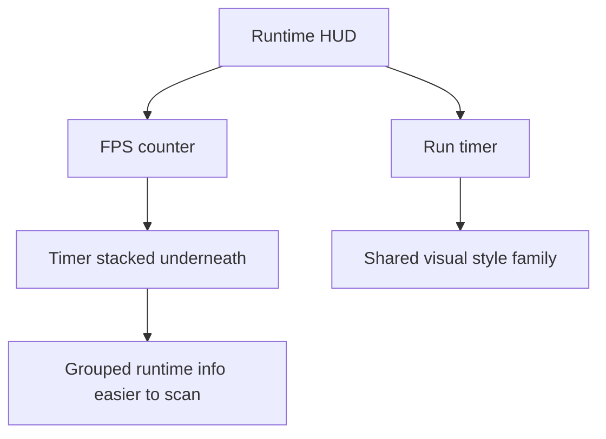

## req_122_define_a_runtime_hud_posture_with_the_timer_stacked_under_the_fps_counter - Define a runtime HUD posture with the timer stacked under the FPS counter
> From version: 0.7.0+1b1dda6
> Schema version: 1.0
> Status: Done
> Understanding: 100%
> Confidence: 99%
> Complexity: Low
> Theme: HUD
> Reminder: Update status/understanding/confidence and references when you edit this doc.

# Needs
- Move the runtime timer so it sits under the FPS counter.
- Keep the timer in the same visual style family as the FPS readout.
- Reduce HUD scattering by grouping technical/runtime readouts together.
- Keep the rest of the player HUD readable after the timer moves.

# Context
The runtime HUD already exposes an FPS counter and a run timer, but they currently do not read as one coherent cluster. Grouping the timer directly under the FPS counter would make the runtime chrome feel more deliberate and easier to scan, especially if both readouts share the same surface language.

This request introduces a bounded HUD posture change:
1. the timer should move under the FPS counter
2. the timer should inherit or align with the same style family as the FPS readout
3. the rest of the HUD should remain stable and readable

The goal is not to redesign the entire runtime HUD. The goal is to tighten one specific information cluster so technical and temporal run context live together.

Scope includes:
- moving the timer to a position under the FPS counter
- aligning timer presentation with the FPS counter visual style
- validating the grouped readout on desktop and mobile runtime layouts

Scope excludes:
- a full HUD redesign
- changing what the timer measures
- changing FPS diagnostics behavior
- moving unrelated HUD elements in the same slice unless required by overlap avoidance

# Acceptance criteria
- AC1: The request defines that the runtime timer should be placed under the FPS counter.
- AC2: The request defines that the timer should match or clearly align with the FPS counter visual style.
- AC3: The request defines that the grouped FPS/timer cluster should remain readable on supported runtime layouts.
- AC4: The request stays bounded to this HUD regrouping rather than broadening into a full runtime HUD redesign.

# Dependencies and risks
- Dependency: the current runtime HUD already exposes both FPS and timer readouts.
- Dependency: the shell/runtime overlay layout must still avoid overlap with the menu trigger and other top-corner elements.
- Risk: if the grouped cluster becomes too prominent, it may compete with more important gameplay HUD signals.
- Risk: if mobile spacing is not checked, the new stack may crowd the top edge.

# Open questions
- Should the timer exactly duplicate the FPS counter frame style or just feel from the same family?
  Recommended default: same family, with slightly less emphasis than FPS if needed.
- Should the grouped cluster live in the exact same corner as the FPS counter today?
  Recommended default: yes, do not introduce extra movement if grouping alone solves the issue.

# Definition of Ready (DoR)
- [x] Problem statement is explicit and user impact is clear.
- [x] Scope boundaries (in/out) are explicit.
- [x] Acceptance criteria are testable.
- [x] Dependencies and known risks are listed.

# Clarifications
- “Dans le même style” means the timer should visually belong to the same HUD family as the FPS readout, not necessarily be pixel-identical.
- This request is about layout and presentation, not about changing timer logic or debug semantics.

# Companion docs
- Product brief(s): (none yet)
- Architecture decision(s): (none yet)
- Request(s): (none yet)

# AI Context
- Summary: Reposition the runtime timer under the FPS counter and align both readouts within the same HUD style family.
- Keywords: timer, fps, hud, runtime overlay, layout, diagnostics, presentation
- Use when: Use when Emberwake should group the timer and FPS readout into one tighter HUD cluster.
- Skip when: Skip when the task is about changing timer logic, diagnostics internals, or a full HUD redesign.

# References
- `src/app/components/ActiveRuntimeShellContent.tsx`
- `src/app/components/ActiveRuntimeShellContent.css`
- `src/game/debug/ShellDiagnosticsPanel.tsx`

# Backlog
- `item_404_define_a_grouped_runtime_hud_cluster_for_fps_and_timer`
