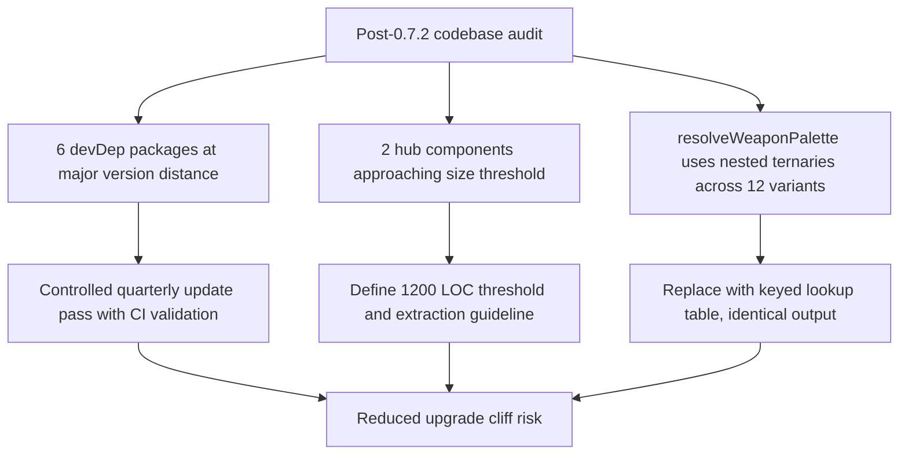

## req_123_define_a_codebase_hygiene_wave_for_dependency_updates_component_size_thresholds_and_weapon_palette_readability - Define a codebase hygiene wave for dependency updates, component size thresholds, and weapon palette readability
> From version: 0.7.2
> Schema version: 1.0
> Status: Ready
> Understanding: 100%
> Confidence: 97%
> Complexity: Medium
> Theme: Delivery
> Reminder: Update status/understanding/confidence and references when you edit this doc.

# Needs
- Schedule and execute a quarterly dependency update cycle for packages that have reached major version distance without blocking current delivery.
- Define a component size threshold and extraction path for the two largest shell components before they become a maintenance liability.
- Replace the nested-ternary weapon-palette resolver with a lookup table to preserve maintainability as the weapon roster grows.

# Context
A post-0.7.2 codebase audit surfaced three bounded hygiene items that do not block current gameplay delivery but carry compounding maintenance risk if left untreated across the next release cycle.

**Dependency drift:**
Several devDependency packages have accumulated major version distance since the last update pass:
- `eslint` 9.39.4 → 10.x (major)
- `@eslint/js` 9.39.4 → 10.x (major)
- `vite` 6.4.1 → 8.x (major)
- `vite-plugin-pwa` 0.21.2 → 1.x (major)
- `@vitejs/plugin-react` 4.7.0 → 6.x (major)
- `jsdom` 26.1.0 → 29.x (major)
- `@types/node` 22.x → 25.x (minor)

None of these carry known security advisories or block feature delivery today. All are devDependency-only and affect only the build toolchain and test environment. However, staying multiple major versions behind creates upgrade cliff risk: the longer the gap grows, the more configuration and API surface must be reconciled in a single migration. A controlled quarterly cycle eliminates that accumulation.

Each package update should be validated in isolation through the existing quality gates (`lint`, `typecheck`, `test`, `build`, `performance:validate`) before being merged. Updates that require configuration changes must document those changes in the commit message.

**Component size thresholds:**
`AppMetaScenePanel` (1 115 LOC) and `ActiveRuntimeShellContent` (1 000 LOC) are both intentionally feature-rich hub components that have grown steadily alongside the shell feature set. At their current size they remain readable and well-structured. At 1 200 LOC they would begin to impede navigation and review.

This request defines a size threshold and an extraction path so that growth beyond the threshold triggers a scoped sub-component extraction rather than unchecked file growth. No extraction is required today — the deliverable is the defined policy and extraction guideline, not a refactor of currently acceptable code.

**Weapon palette readability:**
`resolveWeaponPalette` in `src/game/render/CombatSkillFeedbackScene.tsx` (lines 44–91) uses deeply nested ternary chains to dispatch visual parameters across twelve weapon variants. This pattern was appropriate when the roster was small, but it now obscures which variant maps to which palette entry and makes adding a new weapon error-prone. Replacing it with a keyed lookup table (a plain object or `Map` indexed by weapon type) would make variant coverage explicit, reduce per-variant diff noise, and align the implementation with the style already used in comparable dispatch tables elsewhere in the codebase.

The replacement must not change any visual output: colors, opacities, and feedback parameters must remain identical before and after the refactor.

Scope includes:
- defining and executing a quarterly major-version update pass for the six packages listed above, validated through existing CI quality gates
- defining a 1 200 LOC threshold and extraction guideline for `AppMetaScenePanel` and `ActiveRuntimeShellContent`
- replacing `resolveWeaponPalette` nested ternaries with a lookup table that produces identical visual output

Scope excludes:
- updating production runtime dependencies (`pixi.js`, `@pixi/react`, `react`)
- changing any gameplay tuning, entity behavior, or shell UX
- extracting sub-components from `AppMetaScenePanel` or `ActiveRuntimeShellContent` unless they independently cross the 1 200 LOC threshold during this wave
- adding new weapons or changing weapon visual output

# Acceptance criteria
- AC1: The request defines an update pass for `eslint`, `@eslint/js`, `vite`, `vite-plugin-pwa`, `@vitejs/plugin-react`, `jsdom`, and `@types/node` where each package is updated and validated through the existing quality gates before being merged.
- AC2: The request defines that each package update which requires configuration changes must document those changes in the commit message so the migration delta is traceable.
- AC3: The request defines a 1 200 LOC threshold for `AppMetaScenePanel` and `ActiveRuntimeShellContent` and an extraction guideline that describes how to proceed when either file crosses that threshold.
- AC4: The request defines that no extraction from either hub component is required unless the component independently crosses 1 200 LOC during this wave.
- AC5: The request defines a lookup-table replacement for `resolveWeaponPalette` that covers all twelve existing weapon variants, produces identical visual output to the current nested-ternary implementation, and passes the existing test suite without modification.
- AC6: The request keeps the wave bounded to devDependency updates, a component size policy, and a single render-utility refactor — it does not widen into gameplay, runtime behavior, or shell UX changes.

# Dependencies and risks
- Dependency: all package updates must remain compatible with the existing `vite.config.ts` path aliases, PWA configuration, and ESLint architectural boundary rules.
- Dependency: `resolveWeaponPalette` replacement must be validated against the existing combat-feedback visual output to confirm no regression.
- Risk: a Vite major-version update may require changes to `vite.config.ts` plugin API or PWA configuration surface — isolate and validate before merging.
- Risk: an ESLint major-version update may deprecate or restructure existing `eslint.config.js` rule definitions — verify architectural boundary rules remain enforced after migration.
- Risk: if `jsdom` introduces breaking changes to the test environment API, some component tests may require adjustment — validate against the full test suite before merging.

# Open questions
- Should each package be updated in a separate commit/PR or grouped by toolchain family (ESLint together, Vite + plugins together)?
  Recommended default: group by toolchain family so related configuration changes are co-located and easier to review and roll back.
- Should the component size threshold be documented in a new ADR or in a CLAUDE.md guideline?
  Recommended default: a short CLAUDE.md addition is sufficient; a full ADR is only warranted if the extraction pattern requires a structural topology decision.
- Should the weapon palette lookup table use a plain object or a `Map`?
  Recommended default: plain object literal indexed by weapon-type string, consistent with similar dispatch tables in the codebase.

# Definition of Ready (DoR)
- [x] Problem statement is explicit and user impact is clear.
- [x] Scope boundaries (in/out) are explicit.
- [x] Acceptance criteria are testable.
- [x] Dependencies and known risks are listed.

# Companion docs
- Product brief(s): (none yet)
- Architecture decision(s): (none yet)
- Request(s): (none yet)

# AI Context
- Summary: Bounded codebase hygiene wave covering a quarterly devDependency update pass, a component size threshold policy for the two largest shell components, and a weapon-palette lookup-table refactor.
- Keywords: dependencies, update, devDependency, eslint, vite, jsdom, component size, extraction threshold, weapon palette, lookup table, refactor, hygiene
- Use when: Use when planning or executing the quarterly devDependency update cycle, setting component size policy, or refactoring the resolveWeaponPalette dispatch.
- Skip when: Skip when the work targets gameplay, runtime behavior, production runtime dependencies, or shell UX changes.

# References
- `package.json`
- `vite.config.ts`
- `eslint.config.js`
- `src/game/render/CombatSkillFeedbackScene.tsx`
- `src/app/components/AppMetaScenePanel.tsx`
- `src/app/components/ActiveRuntimeShellContent.tsx`

# Backlog
- `item_408_execute_quarterly_devdependency_update_pass_for_eslint_vite_jsdom_and_related_packages`
- `item_409_define_component_size_threshold_and_extraction_guideline_for_appmetascenepanel_and_activeruntimeshellcontent`
- `item_410_replace_resolveweaponpalette_nested_ternaries_with_a_lookup_table_in_combatskillfeedbackscene`
