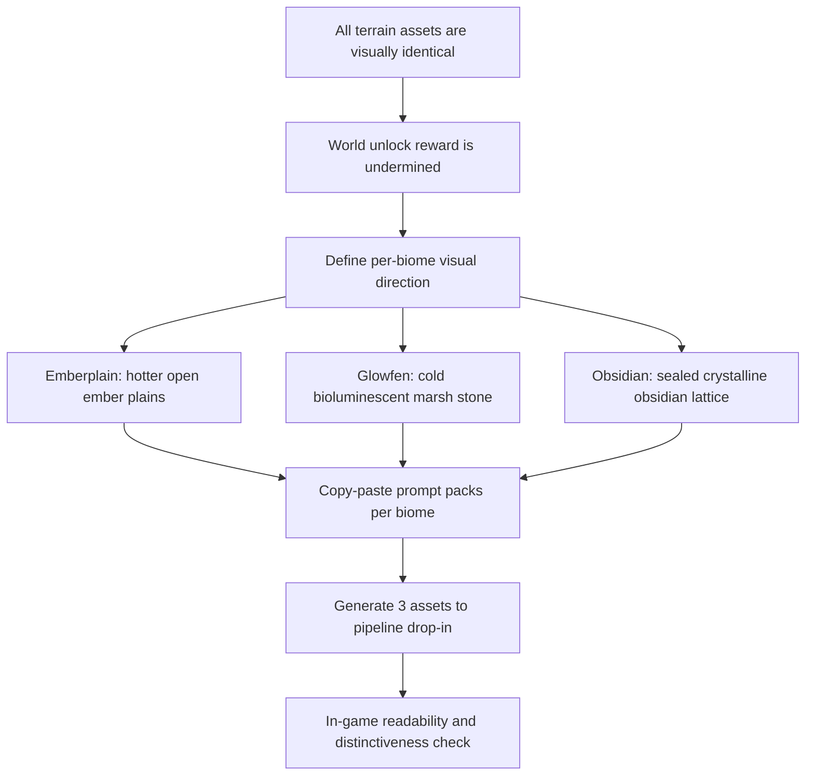

## req_124_define_distinct_per_biome_terrain_asset_variation_for_emberplain_glowfen_and_obsidian - Define distinct per-biome terrain asset variation for Emberplain, Glowfen, and Obsidian
> From version: 0.7.2
> Schema version: 1.0
> Status: Ready
> Understanding: 100%
> Confidence: 97%
> Complexity: Medium
> Theme: UI
> Reminder: Update status/understanding/confidence and references when you edit this doc.

# Needs
- Give each world tier a distinct visual ground identity so that switching worlds feels like entering a different environment rather than playing the same terrain with different difficulty numbers.
- Define per-biome visual direction, production constraints, and prompt packs for Emberplain, Glowfen, and Obsidian — then execute those prompts through the OpenAI Images API, curate the outputs, and promote the approved files into the runtime asset pipeline.
- Preserve the texture logic and runtime pipeline established by `map.terrain.ashfield.runtime.webp` as the hard production reference: same size, same format, same tiling contract, same dark-floor readability floor.
- Ensure each new terrain asset shares compatible edge tonality with the Ashfield reference so that biome adjacency in the world does not produce a hard visual cut at the boundary — variation must live in the interior of each texture, not at its edges.

# Context
The game has five worlds on the unlock ladder (Ashwake Verge → Emberplain Reach → Glowfen Basin → Obsidian Vault → Cinderfall Crown). Each world has an authored identity with a distinct atmospheric description and a dedicated terrain asset slot in the asset catalog:
- `map.terrain.ashfield.runtime`
- `map.terrain.emberplain.runtime`
- `map.terrain.glowfen.runtime`
- `map.terrain.obsidian.runtime`

All four runtime terrain assets currently render as the same texture: dark cracked volcanic stone with scattered orange ember dots. The visual language of Ashfield has been cloned into all slots without variation. Cinderfall Crown has no terrain asset of its own and correctly reuses `map.terrain.emberplain.runtime` as a declared fallback — that fallback remains out of scope for this wave.

The consequence is that a player who completes Ashwake Verge and unlocks Emberplain Reach sees the exact same ground. The world selection cards and the in-run environment communicate no visual distinction between tiers 1, 2, 3, and 4. This undermines both the unlock reward signal and the atmospheric contract each world makes through its description.

The fix is not to change the technical pipeline. The Ashfield texture is correct in every technical dimension:
- 512×512 pixels
- WebP, no transparency, full-coverage ground tile
- Tileable seamless repeat
- Dark floor that preserves entity and pickup readability
- Techno-shinobi style: eroded industrial/geological surfaces with glowing trace elements

The fix is to produce three new terrain assets — one per remaining biome — that share that technical contract but express distinct surface materials, color temperatures, and glow languages derived from each world's authored identity.

**Biome identity reference (from `worldProfiles.ts` descriptions):**

| Biome | Label | Description | Target visual direction |
|-------|-------|-------------|-------------------------|
| `ashfield` | Ashwake Verge | "The first ash-laced frontier where the shell learns to survive." | **Reference.** Dark cracked volcanic stone, scattered orange ember hot-spots, warm dark base. Locked — do not change. |
| `emberplain` | Emberplain Reach | "Open ember lanes with hotter pressure and longer pursuit sightlines." | Same volcanic family as Ashfield but hotter and more open. Fewer dense cracks, longer ember-vein traces running across the surface. Brighter orange and amber flows visible as surface channels. More exposed, less textured noise — the ground reads as swept, flat-scorched planes with molten seams. |
| `glowfen` | Glowfen Basin | "Cold bloom marshland where the swarm hits harder from the fog." | Departure from the volcanic family. Cold, wet, biological. Dark mossy or algae-laced ground, bioluminescent teal/cyan/pale-green glow clusters replacing the orange. Surface reads as sealed marsh stone or dark organic substrate with cold light blooms. The temperature shift should be immediately legible compared to Ashfield. |
| `obsidian` | Obsidian Vault | "A sealed obsidian lattice where elite pressure sharpens into attrition." | Hardest biome. Pure black, ultra-dense, crystalline obsidian fractures. Minimal glow — only faint deep-violet or near-black reflective edges along fracture lines. Surface reads as sealed, polished, geometric — a lattice of obsidian shards rather than eroded stone. Very low ambient light. |

**Production reference (Ashfield):**
All three new assets must match the Ashfield technical baseline:
- Canvas: 512×512 px
- Format: WebP (VP8), no alpha channel, full-coverage
- Tiling: seamless, no obvious edge seam when tiled in a grid
- Base darkness: ground luminance must stay low enough that white and colored entities remain clearly legible on top
- Style: Emberwake techno-shinobi — eroded industrial-geological surfaces, glowing trace elements, no organic foliage or natural above-ground elements
- Glow language: each biome gets exactly one glow family (orange = Ashfield/Emberplain, cold teal = Glowfen, near-zero violet = Obsidian) — do not mix glow families within one asset

**Edge-continuity constraint:**
The Emberwake world renderer tiles terrain textures and can place two different biome tiles adjacent to each other without any blending layer at the boundary. This means a hard tonal contrast between the edge of one terrain asset and the edge of another will produce a visible cut line in the world.

To avoid this, each new terrain asset must treat its edges as a low-variation border zone:
- Edge luminance (approximately the outer 10–15% of the canvas on all four sides) must stay close to the dark, near-neutral base value of the Ashfield reference (~very dark grey, consistent with the cracked stone base of ashfield).
- Biome-specific palette shifts, glow clusters, and surface detail must be concentrated toward the interior and center of the canvas, fading back to the shared dark edge tone before reaching the border.
- This does not require perfect colour matching at every pixel — it requires that the dominant edge tone of each new asset reads as compatible with Ashfield's edge tone so that a biome boundary in the world reads as a gradual shift rather than an abrupt surface swap.
- The Ashfield reference already follows this implicitly (its edges are darker and more neutral than its interior ember spots). New assets must mirror that posture deliberately.

**Delivery path (unchanged pipeline):**
The three generated files must drop directly into `src/assets/map/runtime/` with their canonical asset IDs as file stems:
- `map.terrain.emberplain.runtime.webp`
- `map.terrain.glowfen.runtime.webp`
- `map.terrain.obsidian.runtime.webp`

No code changes are required. The asset catalog, world profiles, and asset pipeline contracts already reference these files.

The full operator loop for this wave mirrors the pattern established by `req_095`:
1. define per-biome visual direction and production specs
2. write the prompt packs for each terrain asset
3. run the prompts through the OpenAI Images API generation workflow
4. deposit scratch candidates under `output/imagegen/terrain-variation/`
5. curate the outputs — select the winning variant per `assetId`, record the selection in a `selection.json`
6. convert/export approved outputs to WebP at 512×512 and promote them into `src/assets/map/runtime/`
7. validate in-game: terrain tiles, entity contrast, pickup readability, biome-boundary continuity

Scope includes:
- defining per-biome visual direction for Emberplain, Glowfen, and Obsidian
- defining production specifications (size, format, tiling, darkness floor, edge-continuity, style) aligned with the Ashfield reference
- writing prompt packs for each of the three terrain assets
- executing the prompts through the OpenAI Images API to produce candidate source images
- defining the scratch output location and variant curation posture (`output/imagegen/terrain-variation/`)
- promoting the approved assets into `src/assets/map/runtime/` as the final pipeline drop-in
- validating the promoted assets in-game at runtime against entity contrast, pickup readability, and biome-boundary continuity

Scope excludes:
- changing the Ashfield asset (`map.terrain.ashfield.runtime.webp` is locked as the reference)
- producing a terrain asset for Cinderfall Crown (which intentionally reuses `map.terrain.emberplain.runtime`)
- changing world generation rules, tile sizing, or biome distribution
- modifying the asset catalog, world profiles, or any source code
- defining animated, multi-layer, or post-process terrain treatments
- changing obstacle or surface-modifier visual assets
- redesigning the generation scripts from `req_095` — reuse the established workflow pattern

# Acceptance criteria
- AC1: The request defines `map.terrain.ashfield.runtime.webp` as the locked production reference for all technical constraints — size, format, tiling contract, darkness floor, and style language — and does not require changes to that asset.
- AC2: The request defines a distinct per-biome visual direction for Emberplain, Glowfen, and Obsidian that is immediately legible as different from Ashfield and from each other, grounded in each world's authored description.
- AC3: The request defines production specifications for each new terrain asset: 512×512 px, WebP, no alpha, full-coverage seamless tile, base darkness sufficient for entity readability.
- AC3b: The request defines an edge-continuity constraint requiring that the outer border zone of each new terrain asset matches the dark near-neutral tone of the Ashfield reference, so that biome-adjacent tiles in the world do not produce a visible hard cut line.
- AC4: The request defines a prompt pack for each of the three terrain assets (Emberplain, Glowfen, Obsidian) and requires that those prompts are executed through the OpenAI Images API to produce candidate source images.
- AC5: The request defines a scratch output location (`output/imagegen/terrain-variation/`) and a variant curation posture — including a `selection.json` to record the promoted winner per `assetId` — before any asset is moved into the runtime folder.
- AC6: The request defines that approved assets are promoted into `src/assets/map/runtime/` as WebP files at 512×512, replacing the current duplicate textures, without any source-code changes.
- AC7: The request defines that each promoted asset must be validated in-game at runtime — tiled across the ground plane with live entities on top — to confirm entity and pickup legibility, and that adjacent-biome tile boundaries do not produce a hard visual cut.
- AC8: The request defines that the three promoted assets must be visually distinguishable from each other at a glance in the world selection card context (small representative crop).
- AC9: The request keeps scope bounded to prompt definition, OpenAI generation, curation, promotion, and validation for three terrain files — it does not widen into code changes, generation rule changes, or obstacle asset redesign.

# Dependencies and risks
- Dependency: `map.terrain.ashfield.runtime.webp` remains the authoritative visual and technical reference — all new assets must be produced in relation to it.
- Dependency: the asset pipeline drop-in contract from `adr_052` and `src/shared/config/assetPipeline.ts` governs file naming, location, and format — no deviation is permitted.
- Dependency: `worldProfiles.ts` descriptions drive the per-biome visual direction; if descriptions change, the visual direction should be revisited.
- Risk: a prompt that produces a surface with too much mid-range grey could reduce entity-to-ground contrast for dark-colored entities — validate against both the player sprite and hostile sprites.
- Risk: the Glowfen cold-glow direction is a strong palette shift from the warm volcanic family; if the output reads as too bright or too green it could increase visual noise during combat.
- Risk: the Obsidian near-zero-glow direction risks producing a ground that is too close to pure black, making crystal and gold pickups harder to read — validate pickup contrast specifically.
- Risk: if the tiling seam is not seamless, the repeated texture will show grid-pattern artifacts across large open areas.
- Risk: if edge-continuity is not enforced during generation, biome-adjacent tiles in the world will produce a sharp cut line that looks worse than the current situation where all biomes share the same texture.
- Dependency: a valid `OPENAI_API_KEY` must be available in the environment to execute the generation workflow.
- Risk: the OpenAI Images API may produce outputs that are technically correct (dark, tileable) but stylistically inconsistent across the three biomes — curation and iteration are expected parts of the loop, not failure conditions.

# Open questions
- Should Cinderfall Crown eventually receive its own terrain asset distinct from Emberplain, given it is the highest-tier world?
  Recommended default: out of scope for this wave — address in a future world-art pass if Cinderfall Crown's tier-5 identity warrants a dedicated ground surface.
- Should Emberplain preserve orange as its glow family (same as Ashfield) or shift to amber/gold to differentiate while staying in the warm spectrum?
  Recommended default: shift to a broader amber/gold with larger ember-vein traces so it reads as a hotter evolution of Ashfield rather than a copy.
- Should the prompt packs specify a target image generation model or remain model-agnostic?
  Recommended default: model-agnostic, using style and material descriptions readable by any generation workflow, consistent with the approach from `req_094`.

# Definition of Ready (DoR)
- [x] Problem statement is explicit and user impact is clear.
- [x] Scope boundaries (in/out) are explicit.
- [x] Acceptance criteria are testable.
- [x] Dependencies and known risks are listed.

# Clarifications
- "Distinct at a glance" means a player previewing the world selection screen can tell Emberplain, Glowfen, and Obsidian apart without reading their names.
- "Same texture logic" means the three new assets must respect the same tiling, darkness, coverage, and edge-tone rules as Ashfield — not that they must look similar to it in their interior.
- "Edge-continuity" does not mean the borders must be identical to Ashfield pixel-for-pixel — it means the outer zone must converge toward the same dark base tone so that a tile boundary in the world does not visually register as a hard cut. The biome identity lives in the interior, not at the edge.
- The Obsidian asset is intentionally the most restrained: less glow, not more. Elite pressure should read through visual austerity, not complexity.
- Validation must occur in a live runtime scene with entities present — a static screenshot of the terrain alone is not sufficient.

# Companion docs
- Product brief(s): `prod_017_graphical_asset_direction_for_runtime_readability_and_shell_identity`
- Architecture decision(s): `adr_052_adopt_a_content_driven_graphical_asset_pipeline_for_runtime_and_shell_surfaces`
- Request(s): `req_094_define_asset_production_specifications_and_prompt_packs_for_the_first_graphical_wave`, `req_097_define_a_runtime_sprite_separation_posture_for_dark_on_dark_asset_readability`, `req_098_define_a_bounded_biome_transition_visual_treatment_to_reduce_hard_map_seams`

# AI Context
- Summary: Define visual direction, production specs, and prompt packs for three new terrain assets (Emberplain, Glowfen, Obsidian), execute generation via OpenAI Images API, curate and promote approved outputs into the runtime pipeline, and validate in-game.
- Keywords: terrain, biome, asset variation, prompt pack, openai, image generation, world identity, emberplain, glowfen, obsidian, ashfield, tiling, visual direction, world selection, promotion, curation
- Use when: Use when producing or reviewing the terrain asset set for worlds 2 through 4, or when briefing an operator on which ground textures need regeneration and why.
- Skip when: Skip when the work targets entity sprites, obstacle assets, shell surfaces, or Cinderfall Crown terrain.

# References
- `src/assets/map/runtime/map.terrain.ashfield.runtime.webp`
- `src/assets/map/runtime/map.terrain.emberplain.runtime.webp`
- `src/assets/map/runtime/map.terrain.glowfen.runtime.webp`
- `src/assets/map/runtime/map.terrain.obsidian.runtime.webp`
- `src/assets/assetCatalog.ts`
- `src/shared/model/worldProfiles.ts`
- `src/shared/config/assetPipeline.ts`
- `output/imagegen/terrain-variation/`
- `scripts/assets/generateFirstWaveAssets.mjs`
- `scripts/assets/promoteFirstWaveAssets.mjs`
- `scripts/assets/buildFirstWaveGallery.mjs`
- `logics/product/prod_017_graphical_asset_direction_for_runtime_readability_and_shell_identity.md`
- `logics/architecture/adr_052_adopt_a_content_driven_graphical_asset_pipeline_for_runtime_and_shell_surfaces.md`

# Backlog
- `item_405_define_per_biome_terrain_visual_direction_production_specs_and_prompt_packs`
- `item_406_execute_openai_terrain_generation_curation_and_runtime_promotion_for_three_biomes`
- `item_407_validate_promoted_terrain_assets_in_game_for_readability_and_biome_boundary_continuity`
