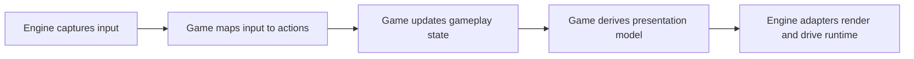

## spec_000_define_initial_engine_to_game_typescript_contract_shapes - Define initial engine to game TypeScript contract shapes
> Date: 2026-03-20
> Status: Proposed
> Related request: `req_018_define_engine_and_gameplay_boundary_for_runtime_reuse`
> Related backlog: `item_071_define_engine_to_game_contracts_for_update_render_and_input_integration`
> Related task: `task_026_orchestrate_engine_gameplay_boundary_extraction_for_runtime_reuse`
> Related architecture: `adr_014_adopt_a_modular_app_engine_game_topology_with_one_way_dependencies`, `adr_015_define_engine_to_game_runtime_contract_boundaries`
> Reminder: Update status, linked refs, example types, and migration notes when the first runtime contracts land in code.

# Overview
This spec defines the first concrete TypeScript-oriented shapes for the `engine -> game` runtime boundary. It keeps the contract narrow and implementation-friendly so the repository can start extracting runtime primitives without inventing a plugin framework.

The first contract is organized around four responsibilities:
- `initialize`
- `map input`
- `update`
- `present`

The engine owns orchestration and transport of these calls. The game owns the meaning of state, actions, and presentation content.

# Goals
- Give the refactor a first concrete contract shape that can be implemented incrementally.
- Keep `engine` independent from Emberwake-specific types and rules.
- Make input, update, and presentation handoff explicit.
- Keep the first contract small enough to support one game immediately.

# Non-goals
- Finalize every future engine API.
- Design a plugin registry or extension marketplace.
- Define final Pixi scene internals or final asset schemas.
- Lock the exact package or folder names used in code.

# Integration flow


# Contract outline
The engine should know:
- normalized input frames
- timing information
- engine-facing presentation data
- camera or viewport services it owns

The engine should not know:
- Emberwake entity states
- Emberwake action names unless expressed as opaque game-owned types
- scenario content meaning
- progression or survival rules

The game should know:
- gameplay state
- gameplay actions or intents
- gameplay update rules
- how to derive presentation data from gameplay state

# Proposed TypeScript shapes
These shapes are intentionally minimal and may be split across `engine-core`, `engine-pixi`, and `games/emberwake` later.

```ts
export type EngineInputFrame = {
  pointer: {
    primaryWorldPoint: { x: number; y: number } | null;
    primaryScreenPoint: { x: number; y: number } | null;
    pressed: boolean;
  };
  movement: {
    vector: { x: number; y: number };
    magnitude: number;
    active: boolean;
    source: "keyboard" | "touch" | "gamepad" | "none";
  };
  buttons: Record<string, boolean>;
  debug: {
    modifierActive: boolean;
  };
};

export type EngineTiming = {
  nowMs: number;
  deltaMs: number;
  fixedStepMs: number;
  tick: number;
};

export type EngineRenderEntity = {
  id: string;
  kind: string;
  worldPosition: { x: number; y: number };
  orientation: number;
  zIndex?: number;
  visible?: boolean;
  tint?: number;
};

export type EngineRenderChunk = {
  id: string;
  x: number;
  y: number;
  variant?: string;
};

export type EnginePresentationModel = {
  cameraTarget?: {
    worldPosition: { x: number; y: number };
    mode?: string;
  };
  world: {
    visibleChunks: EngineRenderChunk[];
  };
  entities: EngineRenderEntity[];
  diagnostics?: Record<string, unknown>;
  overlays?: Record<string, unknown>;
};

export type GameModule<
  TGameState,
  TGameAction,
  TGameInit = void,
  TGameContext = void
> = {
  initialize: (options: {
    init: TGameInit;
    context: TGameContext;
  }) => TGameState;
  mapInput: (options: {
    input: EngineInputFrame;
    state: TGameState;
    context: TGameContext;
  }) => TGameAction;
  update: (options: {
    state: TGameState;
    action: TGameAction;
    timing: EngineTiming;
    context: TGameContext;
  }) => TGameState;
  present: (options: {
    state: TGameState;
    context: TGameContext;
  }) => EnginePresentationModel;
};
```

# Shape notes
- `EngineInputFrame` is engine-owned and normalized. It describes what happened, not what it means in Emberwake.
- `TGameAction` is game-owned. Emberwake may define actions such as `move`, `dash`, `interact`, or `pause`, but those names must not be required by the engine.
- `TGameState` is opaque to the engine. The engine stores or passes it, but does not inspect its internal shape.
- `EnginePresentationModel` is descriptive. It tells the engine what to render or follow, not why those things exist.
- `diagnostics` and `overlays` stay optional because they may later split into separate engine-facing contracts.

# First mapping to the current codebase
The current runtime suggests this first migration posture:
- `initialize`
  likely maps from current runtime-session bootstrap and initial entity or world creation
- `mapInput`
  likely absorbs the game-facing meaning currently split across `useSingleEntityControl` and related movement-intent logic
- `update`
  likely absorbs the gameplay state transitions currently handled by entity simulation and later world or combat rules
- `present`
  likely absorbs the conversion from gameplay state into visible entities, chunks, camera targets, and diagnostics payloads

Initial engine-owned candidates:
- camera math and camera controller primitives
- world-view transforms and visibility helpers
- low-level input math and normalized input frames
- runtime surface and render adapter boundaries

Initial game-owned candidates:
- entity simulation state and rules
- debug scenario content
- world flavor and authored generation meaning
- player-facing gameplay statuses

# Dependency rules
- `app` may import `engine` and `game`
- `game` may import `engine`
- `engine` must not import `game`
- engine-facing contracts may use generics for game state and game action, but must not import Emberwake concrete types

# Migration guidance
- Start by introducing the interfaces in a neutral engine-facing module.
- Add thin adapters around the current runtime rather than rewriting everything at once.
- Keep existing tests green while replacing direct imports with contract-based wiring.
- Only split `presentation` into finer contracts if the first model becomes too broad in actual use.

# Open questions
- Should camera target data remain inside `EnginePresentationModel` or move into a separate presentation channel?
- Should debug overlays be part of the same presentation contract or a parallel debug contract?
- Should `mapInput` return one action, an action array, or a richer intent object once gameplay becomes denser?
- When a second game exists, which fields in `EnginePresentationModel` still feel truly reusable and which should split further?

# References
- `req_018_define_engine_and_gameplay_boundary_for_runtime_reuse`
- `item_071_define_engine_to_game_contracts_for_update_render_and_input_integration`
- `task_026_orchestrate_engine_gameplay_boundary_extraction_for_runtime_reuse`
- `adr_014_adopt_a_modular_app_engine_game_topology_with_one_way_dependencies`
- `adr_015_define_engine_to_game_runtime_contract_boundaries`
