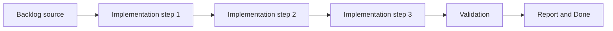

## task_000_bootstrap_react_pixi_pwa_project_foundation - Bootstrap React Pixi PWA project foundation
> From version: 0.1.3
> Status: Done
> Understanding: 97%
> Confidence: 94%
> Progress: 100%
> Complexity: Medium
> Theme: Rendering
> Reminder: Update status/understanding/confidence/progress and dependencies/references when you edit this doc.

# Context
- Derived from backlog item `item_000_bootstrap_react_pixi_pwa_project_foundation`.
- Source file: `logics/backlog/item_000_bootstrap_react_pixi_pwa_project_foundation.md`.
- Related request(s): `req_000_bootstrap_fullscreen_2d_react_pwa_shell`.
- The project needs a frontend-only application foundation based on React, TypeScript, PixiJS, and `@pixi/react`, with no backend runtime dependency.
- The bootstrap must establish the production-ready project skeleton for later requests without prematurely implementing world, camera, or entity behavior.
- The first scaffold should already impose an opinionated runtime structure instead of a flat starter that would need to be reorganized immediately.

# Dependencies
- Blocking: none.
- Unblocks: `task_001_implement_fullscreen_viewport_ownership_and_input_isolation`, `task_002_add_stable_logical_viewport_and_world_space_shell_contract`, `task_004_define_render_static_site_blueprint_and_build_contract`, `task_005_define_mandatory_frontend_and_logics_quality_gates_in_ci`.

# Plan
- [x] 1. Confirm scope, dependencies, and linked acceptance criteria.
- [x] 2. Implement the scoped changes from the backlog item.
- [x] 3. Validate the result and update the linked Logics docs.
- [x] 4. Create a dedicated git commit for this task scope after validation passes.
- [x] FINAL: Update related Logics docs

# AC Traceability
- AC1 -> Scope: The project targets a frontend-only stack based on React, TypeScript, PixiJS, and `@pixi/react`, with no backend service required for local development or production runtime.. Proof: `package.json`, `src/game/render/RuntimeSurface.tsx`.
- AC2 -> Scope: The repository includes a working PWA baseline with installable metadata, build integration, and a static-friendly application shell.. Proof: `vite.config.ts`, `public/icon.svg`, `index.html`.
- AC3 -> Scope: The delivered runtime is still an empty shell and does not yet include world-map, camera, or entity behavior.. Proof: `src/app/AppShell.tsx`.
- AC4 -> Scope: The project structure separates app shell concerns, runtime concerns, rendering integration, input or debug support, and shared utilities so later requests can add features without a structural rewrite.. Proof: `src/app`, `src/game`, `src/shared`.
- AC5 -> Scope: Quality gates and developer commands exist for linting, typecheck, testing, and build in a CI-friendly form.. Proof: `package.json`, `eslint.config.js`, `vitest.config.ts`.
- AC6 -> Scope: The resulting foundation is suitable to host later fullscreen, world-map, and entity work without replacing the core scaffold.. Proof: `src/shared/constants/logicalViewport.ts`, `src/game/render/RuntimeSurface.tsx`.

# Decision framing
- Product framing: Consider
- Product signals: pricing and packaging
- Product follow-up: Review whether a product brief is needed before scope becomes harder to change.
- Architecture framing: Required
- Architecture signals: data model and persistence, contracts and integration, state and sync, security and identity
- Architecture follow-up: Create or link an architecture decision before irreversible implementation work starts.

# Links
- Product brief(s): (none yet)
- Architecture decision(s): `adr_000_adopt_feature_oriented_organic_frontend_structure`, `adr_001_enforce_bounded_file_size_and_isolate_react_side_effects`, `adr_002_separate_react_shell_from_pixi_runtime_ownership`
- Backlog item: `item_000_bootstrap_react_pixi_pwa_project_foundation`
- Request(s): `req_000_bootstrap_fullscreen_2d_react_pwa_shell`

# Validation
- `python3 logics/skills/logics-doc-linter/scripts/logics_lint.py`
- `npm run lint`
- `npm run typecheck`
- `npm run test`
- `npm run build`

# Definition of Done (DoD)
- [x] Scope implemented and acceptance criteria covered.
- [x] Validation commands executed and results captured.
- [x] Linked request/backlog/task docs updated.
- [x] A dedicated git commit has been created for the completed task scope.
- [x] Status is `Done` and progress is `100%`.

# Report
- Implemented the initial frontend runtime scaffold with `Vite`, `React`, `TypeScript`, `PixiJS`, `@pixi/react`, `vite-plugin-pwa`, `Vitest`, and `ESLint`.
- Added an empty Pixi-owned runtime surface plus a thin React-owned shell overlay aligned with the current product identity.
- Introduced domain-first source folders under `src/app`, `src/game`, and `src/shared` so later shell, world, and entity slices can layer in without a structural rewrite.
- Added CI-friendly scripts for `lint`, `typecheck`, `test`, `build`, and `logics:lint`.
- Validation passed with:
  - `npm run lint`
  - `npm run typecheck`
  - `npm run test`
  - `npm run build`
