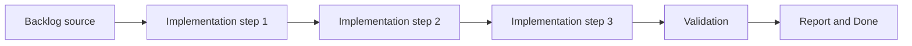

## task_001_implement_fullscreen_viewport_ownership_and_input_isolation - Implement fullscreen viewport ownership and input isolation
> From version: 0.1.3
> Status: Ready
> Understanding: 97%
> Confidence: 94%
> Progress: 5%
> Complexity: Medium
> Theme: Rendering
> Reminder: Update status/understanding/confidence/progress and dependencies/references when you edit this doc.

# Context
- Derived from backlog item `item_001_implement_fullscreen_viewport_ownership_and_input_isolation`.
- Source file: `logics/backlog/item_001_implement_fullscreen_viewport_ownership_and_input_isolation.md`.
- Related request(s): `req_000_bootstrap_fullscreen_2d_react_pwa_shell`.
- The shell must fully own the viewport and prevent browser-page gestures or controls from interfering with the render surface.
- The runtime needs an explicit user-triggered fullscreen path, a robust non-fullscreen fallback layout, and mobile safe-area handling.
- Input ownership on the render surface needs to be explicit so pointer and touch interactions route into the app instead of the page.

# Dependencies
- Blocking: `task_000_bootstrap_react_pixi_pwa_project_foundation`.
- Unblocks: `task_002_add_stable_logical_viewport_and_world_space_shell_contract`, `task_003_add_render_diagnostics_fallback_handling_and_shell_preferences`.

# Plan
- [ ] 1. Confirm scope, dependencies, and linked acceptance criteria.
- [ ] 2. Implement the scoped changes from the backlog item.
- [ ] 3. Validate the result and update the linked Logics docs.
- [ ] 4. Create a dedicated git commit for this task scope after validation passes.
- [ ] FINAL: Update related Logics docs

# AC Traceability
- AC1 -> Scope: The shell fills the full visible viewport on desktop and mobile, with document-level scrolling and overflow neutralized.. Proof: TODO.
- AC2 -> Scope: An explicit user-triggered fullscreen CTA exists when supported through the Fullscreen API, with a robust fullscreen-like fallback layout when true fullscreen is unavailable.. Proof: TODO.
- AC3 -> Scope: Page-level interactions that would interfere with the render surface are suppressed where the browser allows it, including scroll chaining and accidental selection.. Proof: TODO.
- AC4 -> Scope: Mobile safe-area insets are handled so the render shell remains usable on notched or inset devices.. Proof: TODO.
- AC5 -> Scope: Pointer and touch interactions are treated as first-class on the render surface and do not fall back into browser-page navigation behavior.. Proof: TODO.
- AC6 -> Scope: This slice does not yet define world-space invariants or debugging workflows, but it leaves the shell ready for them.. Proof: TODO.

# Decision framing
- Product framing: Required
- Product signals: pricing and packaging, navigation and discoverability
- Product follow-up: Create or link a product brief before implementation moves deeper into delivery.
- Architecture framing: Required
- Architecture signals: data model and persistence, contracts and integration, state and sync, security and identity
- Architecture follow-up: Create or link an architecture decision before irreversible implementation work starts.

# Links
- Product brief(s): (none yet)
- Architecture decision(s): `adr_002_separate_react_shell_from_pixi_runtime_ownership`, `adr_007_isolate_runtime_input_from_browser_page_controls`
- Backlog item: `item_001_implement_fullscreen_viewport_ownership_and_input_isolation`
- Request(s): `req_000_bootstrap_fullscreen_2d_react_pwa_shell`

# Validation
- `python3 logics/skills/logics-doc-linter/scripts/logics_lint.py`
- `npm run lint`
- `npm run typecheck`
- `npm run test`
- `npm run build`

# Definition of Done (DoD)
- [ ] Scope implemented and acceptance criteria covered.
- [ ] Validation commands executed and results captured.
- [ ] Linked request/backlog/task docs updated.
- [ ] A dedicated git commit has been created for the completed task scope.
- [ ] Status is `Done` and progress is `100%`.

# Report
