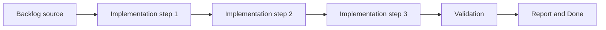

## task_002_add_stable_logical_viewport_and_world_space_shell_contract - Add stable logical viewport and world-space shell contract
> From version: 0.1.3
> Status: Done
> Understanding: 97%
> Confidence: 94%
> Progress: 100%
> Complexity: Medium
> Theme: Rendering
> Reminder: Update status/understanding/confidence/progress and dependencies/references when you edit this doc.

# Context
- Derived from backlog item `item_002_add_stable_logical_viewport_and_world_space_shell_contract`.
- Source file: `logics/backlog/item_002_add_stable_logical_viewport_and_world_space_shell_contract.md`.
- Related request(s): `req_000_bootstrap_fullscreen_2d_react_pwa_shell`.
- The shell needs a stable logical viewport contract so rendering scale and world position do not drift across device classes or responsive modes.
- The default sizing strategy should preserve a stable logical `fit` contract rather than behave like an aggressive cover-style crop.
- The runtime must establish world-space-ready coordinate assumptions before map and entity work begins.

# Dependencies
- Blocking: `task_000_bootstrap_react_pixi_pwa_project_foundation`, `task_001_implement_fullscreen_viewport_ownership_and_input_isolation`.
- Unblocks: `task_003_add_render_diagnostics_fallback_handling_and_shell_preferences`, `task_006_define_deterministic_chunked_world_model_and_seed_contract`, `task_007_implement_camera_controls_for_pan_zoom_and_rotation`.

# Plan
- [x] 1. Confirm scope, dependencies, and linked acceptance criteria.
- [x] 2. Implement the scoped changes from the backlog item.
- [x] 3. Validate the result and update the linked Logics docs.
- [x] 4. Create a dedicated git commit for this task scope after validation passes.
- [x] FINAL: Update related Logics docs

# AC Traceability
- AC1 -> Scope: The shell defines explicit logical viewport rules that remain stable across mobile and large-screen layouts, with a fit-style baseline rather than cover-style cropping.. Proof: `src/app/hooks/useLogicalViewportModel.ts`, `src/shared/constants/logicalViewport.ts`.
- AC2 -> Scope: Viewport changes do not arbitrarily alter logical scale or world position.. Proof: `src/app/hooks/useLogicalViewportModel.ts`.
- AC3 -> Scope: The shell is explicitly compatible with a future large or unbounded scrollable world and does not assume fixed screen-sized gameplay space.. Proof: `src/shared/constants/runtimeContract.ts`, `src/app/AppShell.tsx`.
- AC4 -> Scope: Shared technical vocabulary is documented and consistent for later shell, world, and entity work.. Proof: `src/shared/constants/runtimeContract.ts`.
- AC5 -> Scope: The shell sets a lightweight performance expectation that later map and entity slices can inherit.. Proof: `src/shared/constants/performanceBudget.ts`, `src/app/AppShell.tsx`.
- AC6 -> Scope: This slice leaves map rendering, camera controls, and entity logic out of scope while making them possible without a shell rewrite.. Proof: `src/game/render/RuntimeSurface.tsx`, `src/app/AppShell.tsx`.

# Decision framing
- Product framing: Consider
- Product signals: pricing and packaging
- Product follow-up: Review whether a product brief is needed before scope becomes harder to change.
- Architecture framing: Required
- Architecture signals: data model and persistence, contracts and integration, state and sync, security and identity, delivery and operations
- Architecture follow-up: Create or link an architecture decision before irreversible implementation work starts.

# Links
- Product brief(s): (none yet)
- Architecture decision(s): `adr_003_define_coordinate_spaces_and_camera_contract`
- Backlog item: `item_002_add_stable_logical_viewport_and_world_space_shell_contract`
- Request(s): `req_000_bootstrap_fullscreen_2d_react_pwa_shell`

# Validation
- `python3 logics/skills/logics-doc-linter/scripts/logics_lint.py`
- `npm run lint`
- `npm run typecheck`
- `npm run test`
- `npm run build`

# Definition of Done (DoD)
- [x] Scope implemented and acceptance criteria covered.
- [x] Validation commands executed and results captured.
- [x] Linked request/backlog/task docs updated.
- [x] A dedicated git commit has been created for the completed task scope.
- [x] Status is `Done` and progress is `100%`.

# Report
- Added a shared logical viewport model with a stable `fit` baseline, explicit mobile versus large-screen layout mode, and deterministic visible-world sizing derived from shell measurements.
- Established shared runtime vocabulary for `screen-space`, `world-space`, `chunk-space`, render layers, and the shell's unbounded-world posture.
- Added a lightweight shell performance contract so later world and entity slices inherit an explicit FPS floor target.
- Validation passed with:
  - `npm run lint`
  - `npm run typecheck`
  - `npm run test`
  - `npm run build`
