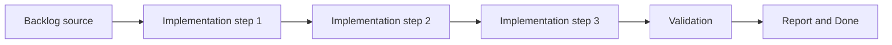

## task_003_add_render_diagnostics_fallback_handling_and_shell_preferences - Add render diagnostics fallback handling and shell preferences
> From version: 0.1.3
> Status: Ready
> Understanding: 97%
> Confidence: 94%
> Progress: 5%
> Complexity: Medium
> Theme: Rendering
> Reminder: Update status/understanding/confidence/progress and dependencies/references when you edit this doc.

# Context
- Derived from backlog item `item_003_add_render_diagnostics_fallback_handling_and_shell_preferences`.
- Source file: `logics/backlog/item_003_add_render_diagnostics_fallback_handling_and_shell_preferences.md`.
- Related request(s): `req_000_bootstrap_fullscreen_2d_react_pwa_shell`.
- The shell needs a single standard debug entry point so render diagnostics do not get scattered across later map and entity work.
- The runtime must remain diagnosable when Pixi, WebGL, or fullscreen fail or degrade.
- Shell-level preferences such as debug visibility and fullscreen preference should persist locally without becoming gameplay persistence.

# Dependencies
- Blocking: `task_000_bootstrap_react_pixi_pwa_project_foundation`, `task_001_implement_fullscreen_viewport_ownership_and_input_isolation`, `task_002_add_stable_logical_viewport_and_world_space_shell_contract`.
- Unblocks: later world, entity, diagnostics, and profiling tasks.

# Plan
- [ ] 1. Confirm scope, dependencies, and linked acceptance criteria.
- [ ] 2. Implement the scoped changes from the backlog item.
- [ ] 3. Validate the result and update the linked Logics docs.
- [ ] 4. Create a dedicated git commit for this task scope after validation passes.
- [ ] FINAL: Update related Logics docs

# AC Traceability
- AC1 -> Scope: A single standard shell-level debug entry point exists for rendering diagnostics and is mounted by default in development without becoming visually noisy.. Proof: TODO.
- AC2 -> Scope: Shell-level diagnostics are available in development and preview environments, can be toggled through a shortcut or equivalent control, and are hidden or disabled by default in production builds.. Proof: TODO.
- AC3 -> Scope: If Pixi, WebGL, or true fullscreen cannot initialize correctly, the shell fails in a controlled and diagnosable way rather than silently.. Proof: TODO.
- AC4 -> Scope: Local shell preferences such as fullscreen preference and debug visibility can be persisted without expanding into gameplay-state persistence.. Proof: TODO.
- AC5 -> Scope: This slice keeps later map and entity diagnostics compatible with one shared debug workflow instead of fragmenting tooling.. Proof: TODO.
- AC6 -> Scope: Fallback and preference behavior remain limited to shell concerns and do not pull in gameplay features.. Proof: TODO.

# Decision framing
- Product framing: Consider
- Product signals: pricing and packaging
- Product follow-up: Review whether a product brief is needed before scope becomes harder to change.
- Architecture framing: Required
- Architecture signals: data model and persistence, contracts and integration, state and sync, security and identity
- Architecture follow-up: Create or link an architecture decision before irreversible implementation work starts.

# Links
- Product brief(s): (none yet)
- Architecture decision(s): `adr_006_standardize_debug_first_runtime_instrumentation`, `adr_009_limit_persistence_to_local_versioned_frontend_storage`
- Backlog item: `item_003_add_render_diagnostics_fallback_handling_and_shell_preferences`
- Request(s): `req_000_bootstrap_fullscreen_2d_react_pwa_shell`

# Validation
- `python3 logics/skills/logics-doc-linter/scripts/logics_lint.py`
- `npm run lint`
- `npm run typecheck`
- `npm run test`
- `npm run build`

# Definition of Done (DoD)
- [ ] Scope implemented and acceptance criteria covered.
- [ ] Validation commands executed and results captured.
- [ ] Linked request/backlog/task docs updated.
- [ ] A dedicated git commit has been created for the completed task scope.
- [ ] Status is `Done` and progress is `100%`.

# Report
