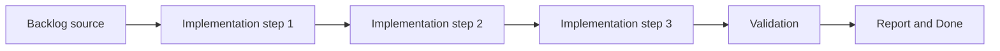

## task_004_define_render_static_site_blueprint_and_build_contract - Define Render static site blueprint and build contract
> From version: 0.5.0
> Status: Done
> Understanding: 97%
> Confidence: 94%
> Progress: 100%
> Complexity: Medium
> Theme: Delivery
> Reminder: Update status/understanding/confidence/progress and dependencies/references when you edit this doc.

# Context
- Derived from backlog item `item_014_define_render_static_site_blueprint_and_build_contract`.
- Source file: `logics/backlog/item_014_define_render_static_site_blueprint_and_build_contract.md`.
- Related request(s): `req_000_bootstrap_fullscreen_2d_react_pwa_shell`, `req_003_create_render_static_free_plan_blueprint`.
- Render delivery needs a concrete static-site blueprint instead of an ad hoc dashboard setup.
- This slice defines and should produce the `render.yaml` service contract early so the frontend can be deployed reproducibly on the free plan.

# Dependencies
- Blocking: `task_000_bootstrap_react_pixi_pwa_project_foundation`.
- Unblocks: `task_005_define_mandatory_frontend_and_logics_quality_gates_in_ci` and later release tasks.

# Plan
- [x] 1. Confirm scope, dependencies, and linked acceptance criteria.
- [x] 2. Implement the scoped changes from the backlog item.
- [x] 3. Validate the result and update the linked Logics docs.
- [x] 4. Create a dedicated git commit for this task scope after validation passes.
- [x] FINAL: Update related Logics docs

# AC Traceability
- AC1 -> Scope: The request produces a Render Blueprint for a static site and does not assume a backend runtime, database, worker, or other non-static service.. Proof: `render.yaml`.
- AC2 -> Scope: The deployment model is expressed through a Git-backed `render.yaml` file rather than an ad hoc dashboard-only setup.. Proof: `render.yaml`.
- AC3 -> Scope: The Blueprint targets the Render free plan static-site path and avoids assumptions that require paid-tier infrastructure.. Proof: `render.yaml`.
- AC4 -> Scope: The Blueprint remains compatible with the frontend-only stack defined in `req_000_bootstrap_fullscreen_2d_react_pwa_shell`.. Proof: `render.yaml`, `package.json`.
- AC5 -> Scope: The Blueprint captures the minimum required static deployment settings, including build command and publish directory.. Proof: `render.yaml`.
- AC6 -> Scope: The request defines a Vite-compatible frontend env strategy in which public client variables use the `VITE_` prefix and are treated as build-time public values.. Proof: `render.yaml`, `.env.example`.
- AC7 -> Scope: The request treats `.env.example` as the versioned documentation source for expected frontend variables.. Proof: `.env.example`.
- AC8 -> Scope: The request treats `.env.local` and `.env.production` as non-versioned files, with `.env.production` explicitly positioned as a local mirror of Render build-time values rather than the source of truth.. Proof: `.gitignore`, `render.yaml`.
- AC9 -> Scope: The request treats the initial deployment path as a `release`-driven free-plan static-site deployment without requiring preview or staging environments.. Proof: `render.yaml`.
- AC10 -> Scope: The resulting deployment blueprint is suitable for later implementation without forcing the app into a backend or multi-service topology.. Proof: `render.yaml`.

# Decision framing
- Product framing: Required
- Product signals: pricing and packaging, experience scope
- Product follow-up: Create or link a product brief before implementation moves deeper into delivery.
- Architecture framing: Required
- Architecture signals: data model and persistence, contracts and integration, security and identity, delivery and operations
- Architecture follow-up: Create or link an architecture decision before irreversible implementation work starts.

# Links
- Product brief(s): `prod_003_high_density_top_down_survival_action_direction`, `prod_004_emberwake_name_and_brand_direction`
- Architecture decision(s): `adr_010_treat_render_build_variables_as_public_frontend_configuration`, `adr_013_use_a_dedicated_release_branch_for_deployable_static_releases`
- Backlog item: `item_014_define_render_static_site_blueprint_and_build_contract`
- Request(s): `req_000_bootstrap_fullscreen_2d_react_pwa_shell`, `req_003_create_render_static_free_plan_blueprint`

# Validation
- `python3 logics/skills/logics-doc-linter/scripts/logics_lint.py`
- `npm run build`

# Definition of Done (DoD)
- [x] Scope implemented and acceptance criteria covered.
- [x] Validation commands executed and results captured.
- [x] Linked request/backlog/task docs updated.
- [x] A dedicated git commit has been created for the completed task scope.
- [x] Status is `Done` and progress is `100%`.

# Report
- Added a Git-backed `render.yaml` Blueprint for a single static Render service targeting the free plan.
- Locked the deployment branch to `release`, disabled PR previews for the initial delivery path, and documented public `VITE_*` build-time values directly in the Blueprint.
- Kept the deployment contract aligned with the frontend-only PWA runtime by using `npm ci && npm run build` and publishing `dist`.
- Validation passed with:
  - `npm run build`
  - `python3 logics/skills/logics-doc-linter/scripts/logics_lint.py`
