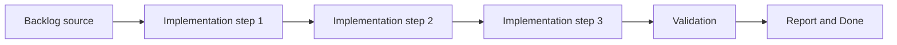

## task_005_define_mandatory_frontend_and_logics_quality_gates_in_ci - Define mandatory frontend and Logics quality gates in CI
> From version: 0.1.4
> Status: Ready
> Understanding: 97%
> Confidence: 94%
> Progress: 10%
> Complexity: Medium
> Theme: Delivery
> Reminder: Update status/understanding/confidence/progress and dependencies/references when you edit this doc.

# Context
- Derived from backlog item `item_018_define_mandatory_frontend_and_logics_quality_gates_in_ci`.
- Source file: `logics/backlog/item_018_define_mandatory_frontend_and_logics_quality_gates_in_ci.md`.
- Related request(s): `req_003_create_render_static_free_plan_blueprint`, `req_004_prepare_github_actions_ci_pipeline`.
- The repository needs a single baseline pass/fail contract in CI.
- This slice fixes which frontend and Logics checks are mandatory and blocking from day one so regressions are blocked consistently.

# Dependencies
- Blocking: `task_000_bootstrap_react_pixi_pwa_project_foundation`, `task_004_define_render_static_site_blueprint_and_build_contract`.
- Unblocks: all implementation tasks that should land behind enforced CI.

# Plan
- [ ] 1. Confirm scope, dependencies, and linked acceptance criteria.
- [ ] 2. Implement the scoped changes from the backlog item.
- [ ] 3. Validate the result and update the linked Logics docs.
- [ ] 4. Create a dedicated git commit for this task scope after validation passes.
- [ ] FINAL: Update related Logics docs

# AC Traceability
- AC1 -> Scope: The request defines a GitHub Actions CI pipeline for the repository rather than a local-only validation approach.. Proof: TODO.
- AC2 -> Scope: The CI scope remains compatible with the frontend-only static architecture and does not assume backend runtime services.. Proof: TODO.
- AC3 -> Scope: The pipeline includes the baseline repository checks needed for this stack, such as install, lint, typecheck, tests, and build verification, with tests remaining part of the baseline even if initially lightweight.. Proof: TODO.
- AC4 -> Scope: The request treats lint, typecheck, tests, build verification, and Logics lint as the initial blocking mandatory checks for the CI workflow.. Proof: TODO.
- AC5 -> Scope: The request treats `push` and `pull_request` as the default triggering events for the initial CI workflow.. Proof: TODO.
- AC6 -> Scope: The CI trigger design remains compatible with a dedicated `release` branch used for deployable states.. Proof: TODO.
- AC7 -> Scope: The CI design accounts for dependency caching suitable for the project's package-management setup.. Proof: TODO.
- AC8 -> Scope: The CI design remains compatible with the delivery direction defined in `req_003_create_render_static_free_plan_blueprint`.. Proof: TODO.
- AC9 -> Scope: The CI design accounts for Logics validation as part of repository quality rather than treating `logics/` as out-of-band documentation.. Proof: TODO.
- AC10 -> Scope: The resulting pipeline foundation is suitable for later extension into deployment or release workflows without requiring a full CI redesign.. Proof: TODO.

# Decision framing
- Product framing: Not needed
- Product signals: (none detected)
- Product follow-up: No product brief follow-up is expected based on current signals.
- Architecture framing: Required
- Architecture signals: contracts and integration, delivery and operations
- Architecture follow-up: Create or link an architecture decision before irreversible implementation work starts.

# Links
- Product brief(s): (none yet)
- Architecture decision(s): `adr_001_enforce_bounded_file_size_and_isolate_react_side_effects`
- Backlog item: `item_018_define_mandatory_frontend_and_logics_quality_gates_in_ci`
- Request(s): `req_003_create_render_static_free_plan_blueprint`, `req_004_prepare_github_actions_ci_pipeline`

# Validation
- `python3 logics/skills/logics-doc-linter/scripts/logics_lint.py`
- `npm run lint`
- `npm run typecheck`
- `npm run test`
- `npm run build`

# Definition of Done (DoD)
- [ ] Scope implemented and acceptance criteria covered.
- [ ] Validation commands executed and results captured.
- [ ] Linked request/backlog/task docs updated.
- [ ] A dedicated git commit has been created for the completed task scope.
- [ ] Status is `Done` and progress is `100%`.

# Report
