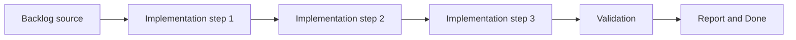

## task_006_define_deterministic_chunked_world_model_and_seed_contract - Define deterministic chunked world model and seed contract
> From version: 0.1.3
> Status: Ready
> Understanding: 96%
> Confidence: 92%
> Progress: 5%
> Complexity: High
> Theme: World
> Reminder: Update status/understanding/confidence/progress and dependencies/references when you edit this doc.

# Context
- Derived from backlog item `item_005_define_deterministic_chunked_world_model_and_seed_contract`.
- Source file: `logics/backlog/item_005_define_deterministic_chunked_world_model_and_seed_contract.md`.
- Related request(s): `req_001_render_top_down_infinite_chunked_world_map`.
- The map layer needs a deterministic chunked world model with stable identity before camera culling and entity indexing can build on it.
- World, chunk, and screen coordinates need explicit transforms grounded in stable logical units rather than pixels.
- A global world seed must exist early enough to support deterministic debug content and later procedural generation.

# Dependencies
- Blocking: `task_002_add_stable_logical_viewport_and_world_space_shell_contract`.
- Unblocks: `task_007_implement_camera_controls_for_pan_zoom_and_rotation`, `task_008_define_entity_contract_and_generic_archetype_baseline`, and later map streaming tasks.

# Plan
- [ ] 1. Confirm scope, dependencies, and linked acceptance criteria.
- [ ] 2. Implement the scoped changes from the backlog item.
- [ ] 3. Validate the result and update the linked Logics docs.
- [ ] 4. Create a dedicated git commit for this task scope after validation passes.
- [ ] FINAL: Update related Logics docs

# AC Traceability
- AC1 -> Scope: The world model uses fixed square chunks with a default target of `16x16` tiles or logical cells per chunk.. Proof: TODO.
- AC2 -> Scope: World, chunk, and screen coordinates are explicitly distinguished and transform cleanly between one another.. Proof: TODO.
- AC3 -> Scope: Stable logical world units and tile sizing are defined independently from raw screen pixels.. Proof: TODO.
- AC4 -> Scope: Chunk identity is deterministic from chunk coordinates and compatible with a global world-seed model, starting from a fixed default seed that can be overridden later.. Proof: TODO.
- AC5 -> Scope: The world model supports positive and negative coordinates and remains compatible with a future infinite-map approach.. Proof: TODO.
- AC6 -> Scope: This slice provides the deterministic world contract required by later rendering, culling, and entity indexing work.. Proof: TODO.

# Decision framing
- Product framing: Required
- Product signals: conversion journey, navigation and discoverability
- Product follow-up: Create or link a product brief before implementation moves deeper into delivery.
- Architecture framing: Required
- Architecture signals: contracts and integration
- Architecture follow-up: Create or link an architecture decision before irreversible implementation work starts.

# Links
- Product brief(s): (none yet)
- Architecture decision(s): `adr_003_define_coordinate_spaces_and_camera_contract`, `adr_005_make_world_identity_deterministic_from_seed_and_coordinates`
- Backlog item: `item_005_define_deterministic_chunked_world_model_and_seed_contract`
- Request(s): `req_001_render_top_down_infinite_chunked_world_map`

# Validation
- `python3 logics/skills/logics-doc-linter/scripts/logics_lint.py`
- `npm run lint`
- `npm run typecheck`
- `npm run test`

# Definition of Done (DoD)
- [ ] Scope implemented and acceptance criteria covered.
- [ ] Validation commands executed and results captured.
- [ ] Linked request/backlog/task docs updated.
- [ ] A dedicated git commit has been created for the completed task scope.
- [ ] Status is `Done` and progress is `100%`.

# Report
