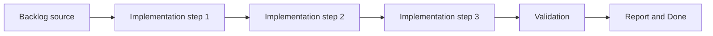

## task_007_implement_camera_controls_for_pan_zoom_and_rotation - Implement camera controls for pan zoom and rotation
> From version: 0.1.3
> Status: Ready
> Understanding: 96%
> Confidence: 92%
> Progress: 5%
> Complexity: High
> Theme: World
> Reminder: Update status/understanding/confidence/progress and dependencies/references when you edit this doc.

# Context
- Derived from backlog item `item_004_implement_camera_controls_for_pan_zoom_and_rotation`.
- Source file: `logics/backlog/item_004_implement_camera_controls_for_pan_zoom_and_rotation.md`.
- Related request(s): `req_001_render_top_down_infinite_chunked_world_map`.
- The world-map layer needs a concrete camera manipulation contract from the start: pan, zoom, and rotation.
- Desktop and mobile controls must be explicit so map navigation does not become an emergent side effect of trial-and-error gestures.
- The full camera kit should exist early for debugging and world inspection even if the first player-facing loop keeps zoom and rotation out of its primary controls.

# Dependencies
- Blocking: `task_002_add_stable_logical_viewport_and_world_space_shell_contract`, `task_006_define_deterministic_chunked_world_model_and_seed_contract`.
- Unblocks: player-control boundary work and later map rendering or diagnostics tasks.

# Plan
- [ ] 1. Confirm scope, dependencies, and linked acceptance criteria.
- [ ] 2. Implement the scoped changes from the backlog item.
- [ ] 3. Validate the result and update the linked Logics docs.
- [ ] 4. Create a dedicated git commit for this task scope after validation passes.
- [ ] FINAL: Update related Logics docs

# AC Traceability
- AC1 -> Scope: The default desktop controls are explicit, with pointer drag for pan, mouse wheel for zoom, and keyboard rotation controls such as `Q` and `E`.. Proof: TODO.
- AC2 -> Scope: The default mobile controls are explicit, with one-finger pan, pinch-to-zoom, and two-finger rotation as the baseline gesture model.. Proof: TODO.
- AC3 -> Scope: Zoom and rotation behave around a defined pivot rule, preferably the viewport center by default.. Proof: TODO.
- AC4 -> Scope: Zoom is constrained by explicit minimum and maximum bounds.. Proof: TODO.
- AC5 -> Scope: Rotation is free-form by default and camera reset actions can restore position, zoom, and rotation to a known state.. Proof: TODO.
- AC6 -> Scope: The camera contract remains compatible with later chunked-world rendering without requiring a camera rewrite, while still allowing pan, zoom, and rotation to stay debug-oriented in the first player loop.. Proof: TODO.

# Decision framing
- Product framing: Required
- Product signals: conversion journey, pricing and packaging, navigation and discoverability
- Product follow-up: Create or link a product brief before implementation moves deeper into delivery.
- Architecture framing: Consider
- Architecture signals: contracts and integration
- Architecture follow-up: Review whether an architecture decision is needed before implementation becomes harder to reverse.

# Links
- Product brief(s): (none yet)
- Architecture decision(s): `adr_003_define_coordinate_spaces_and_camera_contract`
- Backlog item: `item_004_implement_camera_controls_for_pan_zoom_and_rotation`
- Request(s): `req_001_render_top_down_infinite_chunked_world_map`

# Validation
- `python3 logics/skills/logics-doc-linter/scripts/logics_lint.py`
- `npm run lint`
- `npm run typecheck`
- `npm run test`
- `npm run build`

# Definition of Done (DoD)
- [ ] Scope implemented and acceptance criteria covered.
- [ ] Validation commands executed and results captured.
- [ ] Linked request/backlog/task docs updated.
- [ ] A dedicated git commit has been created for the completed task scope.
- [ ] Status is `Done` and progress is `100%`.

# Report
