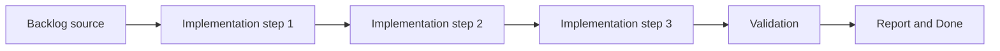

## task_008_define_entity_contract_and_generic_archetype_baseline - Define entity contract and generic archetype baseline
> From version: 0.1.3
> Status: Done
> Understanding: 94%
> Confidence: 91%
> Progress: 100%
> Complexity: High
> Theme: Entities
> Reminder: Update status/understanding/confidence/progress and dependencies/references when you edit this doc.

# Context
- Derived from backlog item `item_009_define_entity_contract_and_generic_archetype_baseline`.
- Source file: `logics/backlog/item_009_define_entity_contract_and_generic_archetype_baseline.md`.
- Related request(s): `req_002_render_evolving_world_entities_on_the_map`.
- The entity layer needs a minimum shared entity contract before movement, rendering, and lifecycle systems can diverge.
- The first implementation should start from one generic movable archetype rather than prematurely locking several gameplay-specific families.
- A player-controlled entity should still fit the same shared contract rather than becoming a special-case data model.

# Dependencies
- Blocking: `task_006_define_deterministic_chunked_world_model_and_seed_contract`.
- Unblocks: `task_009_implement_fixed_step_entity_movement_and_state_update_loop`, `task_010_define_single_entity_control_contract_and_input_ownership_boundaries`, and later entity rendering tasks.

# Plan
- [x] 1. Confirm scope, dependencies, and linked acceptance criteria.
- [x] 2. Implement the scoped changes from the backlog item.
- [x] 3. Validate the result and update the linked Logics docs.
- [x] 4. Create a dedicated git commit for this task scope after validation passes.
- [x] FINAL: Update related Logics docs

# AC Traceability
- AC1 -> Scope: The entity layer defines a minimum shared contract that includes at least stable identity, world position, orientation, visual representation, and mutable state.. Proof: `src/game/entities/model/entityContract.ts`.
- AC2 -> Scope: The first implementation starts from one generic movable archetype rather than multiple gameplay-specialized families.. Proof: `src/game/entities/model/entityContract.ts`.
- AC3 -> Scope: Entities include a simple footprint model such as a radius or equivalent size indicator.. Proof: `src/game/entities/model/entityContract.ts`.
- AC4 -> Scope: Entity orientation is part of the baseline contract and is available for rendering and later movement-facing behavior.. Proof: `src/game/entities/model/entityContract.ts`.
- AC5 -> Scope: Render ordering or layer priority for entities is explicit enough to avoid unstable draw order.. Proof: `src/game/entities/model/entityContract.ts`.
- AC6 -> Scope: This baseline contract is suitable for later movement, chunk indexing, inspection, and player-control slices without being replaced by a special player entity model.. Proof: `src/game/entities/model/entityContract.ts`, `src/game/entities/model/entityContract.test.ts`.

# Decision framing
- Product framing: Not needed
- Product signals: (none detected)
- Product follow-up: No product brief follow-up is expected based on current signals.
- Architecture framing: Required
- Architecture signals: data model and persistence, contracts and integration
- Architecture follow-up: Create or link an architecture decision before irreversible implementation work starts.

# Links
- Product brief(s): (none yet)
- Architecture decision(s): `adr_000_adopt_feature_oriented_organic_frontend_structure`
- Backlog item: `item_009_define_entity_contract_and_generic_archetype_baseline`
- Request(s): `req_002_render_evolving_world_entities_on_the_map`

# Validation
- `python3 logics/skills/logics-doc-linter/scripts/logics_lint.py`
- `npm run lint`
- `npm run typecheck`
- `npm run test`

# Definition of Done (DoD)
- [x] Scope implemented and acceptance criteria covered.
- [x] Validation commands executed and results captured.
- [x] Linked request/backlog/task docs updated.
- [x] A dedicated git commit has been created for the completed task scope.
- [x] Status is `Done` and progress is `100%`.

# Report
- Added a shared entity contract covering identity, world position, orientation, visual representation, mutable state, footprint radius, and explicit render layer.
- Added a single generic movable archetype factory that keeps the future player-controlled entity inside the same baseline contract as every other entity.
- Added unit tests for the contract shape and surfaced the baseline entity contract in diagnostics.
- Validation passed with:
  - `npm run lint`
  - `npm run typecheck`
  - `npm run test`
  - `python3 logics/skills/logics-doc-linter/scripts/logics_lint.py`
