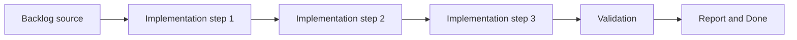

## task_009_implement_fixed_step_entity_movement_and_state_update_loop - Implement fixed-step entity movement and state update loop
> From version: 0.1.3
> Status: Done
> Understanding: 94%
> Confidence: 91%
> Progress: 100%
> Complexity: High
> Theme: Entities
> Reminder: Update status/understanding/confidence/progress and dependencies/references when you edit this doc.

# Context
- Derived from backlog item `item_010_implement_fixed_step_entity_movement_and_state_update_loop`.
- Source file: `logics/backlog/item_010_implement_fixed_step_entity_movement_and_state_update_loop.md`.
- Related request(s): `req_002_render_evolving_world_entities_on_the_map`.
- The entity layer needs a deterministic update loop that does not depend on arbitrary frame mutations.
- Movement should start as continuous world-space motion driven directly by velocity, without requiring steering, acceleration, collision resolution, or pathfinding yet.
- Evolving entity state needs a simple, reproducible update model that later simulation systems can extend.

# Dependencies
- Blocking: `task_008_define_entity_contract_and_generic_archetype_baseline`.
- Unblocks: `task_010_define_single_entity_control_contract_and_input_ownership_boundaries`, `task_011_define_mobile_virtual_stick_steering_model_for_the_first_player_loop`, and later entity simulation tasks.

# Plan
- [x] 1. Confirm scope, dependencies, and linked acceptance criteria.
- [x] 2. Implement the scoped changes from the backlog item.
- [x] 3. Validate the result and update the linked Logics docs.
- [x] 4. Create a dedicated git commit for this task scope after validation passes.
- [x] FINAL: Update related Logics docs

# AC Traceability
- AC1 -> Scope: Entity updates are compatible with a fixed simulation-step mindset even if rendering remains frame-based.. Proof: `src/game/entities/hooks/useEntitySimulation.ts`, `src/game/entities/model/entitySimulation.ts`.
- AC2 -> Scope: Entity movement uses continuous world-space motion and supports direct velocity-based updates in the first pass.. Proof: `src/game/entities/model/entitySimulation.ts`, `src/game/entities/model/entitySimulation.test.ts`.
- AC3 -> Scope: Initial movement remains deterministic, scripted, or developer-driven without requiring advanced AI or pathfinding.. Proof: `src/game/entities/model/entitySimulation.ts`, `src/game/entities/model/entitySimulation.test.ts`.
- AC4 -> Scope: Entities can expose or transition through evolving state over time, even if the first implementation uses simple placeholder states.. Proof: `src/game/entities/model/entitySimulation.ts`, `src/game/debug/ShellDiagnosticsPanel.tsx`.
- AC5 -> Scope: Acceleration, collision resolution, combat, and advanced animation remain out of scope for this slice.. Proof: `src/game/entities/model/entitySimulation.ts`.
- AC6 -> Scope: The resulting movement and state loop is reusable by later indexing, rendering, and behavior slices.. Proof: `src/game/entities/hooks/useEntitySimulation.ts`, `src/app/AppShell.tsx`.

# Decision framing
- Product framing: Not needed
- Product signals: (none detected)
- Product follow-up: No product brief follow-up is expected based on current signals.
- Architecture framing: Consider
- Architecture signals: contracts and integration
- Architecture follow-up: Review whether an architecture decision is needed before implementation becomes harder to reverse.

# Links
- Product brief(s): `prod_000_initial_single_entity_navigation_loop`
- Architecture decision(s): `adr_004_run_simulation_on_a_fixed_timestep`
- Backlog item: `item_010_implement_fixed_step_entity_movement_and_state_update_loop`
- Request(s): `req_002_render_evolving_world_entities_on_the_map`

# Validation
- `python3 logics/skills/logics-doc-linter/scripts/logics_lint.py`
- `npm run lint`
- `npm run typecheck`
- `npm run test`
- `npm run build`

# Definition of Done (DoD)
- [x] Scope implemented and acceptance criteria covered.
- [x] Validation commands executed and results captured.
- [x] Linked request/backlog/task docs updated.
- [x] A dedicated git commit has been created for the completed task scope.
- [x] Status is `Done` and progress is `100%`.

# Report
- Added a fixed-step entity simulation contract and deterministic scripted movement phases that evolve entity velocity, position, state, and orientation in world space.
- Added a reusable React simulation hook that advances the entity loop independently from render cadence while keeping the current simulation state available to the shell.
- Replaced the static entity diagnostics preview with live simulation-backed entity data in the shell and diagnostics overlay.
- Added unit coverage for deterministic phases, continuous movement, and orientation updates.
- Validation passed with:
  - `npm run lint`
  - `npm run typecheck`
  - `npm run test`
  - `npm run build`
