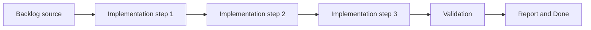

## task_010_define_single_entity_control_contract_and_input_ownership_boundaries - Define single entity control contract and input ownership boundaries
> From version: 0.1.3
> Status: Done
> Understanding: 95%
> Confidence: 92%
> Progress: 100%
> Complexity: Medium
> Theme: Gameplay
> Reminder: Update status/understanding/confidence/progress and dependencies/references when you edit this doc.

# Context
- Derived from backlog item `item_024_define_single_entity_control_contract_and_input_ownership_boundaries`.
- Source file: `logics/backlog/item_024_define_single_entity_control_contract_and_input_ownership_boundaries.md`.
- Related request(s): `req_001_render_top_down_infinite_chunked_world_map`, `req_002_render_evolving_world_entities_on_the_map`, `req_006_define_player_interactions_for_world_and_entities`.
- The first playable loop needs one clear control contract for the player-controlled entity.
- This slice separates player input ownership from camera and system behavior so the runtime does not mix gestures ambiguously.

# Dependencies
- Blocking: `task_007_implement_camera_controls_for_pan_zoom_and_rotation`, `task_008_define_entity_contract_and_generic_archetype_baseline`, `task_009_implement_fixed_step_entity_movement_and_state_update_loop`.
- Unblocks: `task_011_define_mobile_virtual_stick_steering_model_for_the_first_player_loop` and later player-facing UI or feedback tasks.

# Plan
- [x] 1. Confirm scope, dependencies, and linked acceptance criteria.
- [x] 2. Implement the scoped changes from the backlog item.
- [x] 3. Validate the result and update the linked Logics docs.
- [x] 4. Create a dedicated git commit for this task scope after validation passes.
- [x] FINAL: Update related Logics docs

# AC Traceability
- AC1 -> Scope: The request defines a player interaction scope dedicated to world and entity interactions rather than leaving input behavior implicit across rendering requests.. Proof: `src/game/input/model/singleEntityControlContract.ts`.
- AC2 -> Scope: The request defines the first interaction verbs relevant to the project, including at least selecting, inspecting, commanding, and camera-related interactions where ownership matters.. Proof: `src/game/input/model/singleEntityControlContract.ts`, `src/app/AppShell.tsx`.
- AC3 -> Scope: The request treats direct control of a single entity as the primary first interaction layer, while selection and inspection stay secondary and debug-friendly in the first loop.. Proof: `src/game/input/model/singleEntityControlContract.ts`, `src/game/entities/model/entitySimulation.ts`.
- AC4 -> Scope: The request remains compatible with a first mobile-first direct-control slice in which a single entity is steered through the world using a touch drag input similar to a virtual joypad.. Proof: `src/game/input/model/singleEntityControlContract.ts`.
- AC5 -> Scope: The request treats the primary touch-drag gesture in the first player loop as entity steering rather than camera dragging.. Proof: `src/game/camera/hooks/useCameraController.ts`.
- AC6 -> Scope: The request defines a visible virtual-stick baseline with a small dead zone and clamped proportional magnitude for the first mobile control scheme.. Proof: `src/game/input/model/singleEntityControlContract.ts`.
- AC7 -> Scope: The request keeps the first player-facing movement gesture model single-finger and avoids conflicting concurrent gesture ownership for movement.. Proof: `src/game/camera/hooks/useCameraController.ts`, `src/game/input/model/singleEntityControlContract.ts`.
- AC8 -> Scope: The request distinguishes between interactions targeting the world, interactions targeting entities, and interactions targeting UI or system overlays.. Proof: `src/game/input/model/singleEntityControlContract.ts`, `src/app/AppShell.tsx`.
- AC9 -> Scope: The request covers both desktop and mobile interaction expectations at a product level, with `WASD` or arrow-key movement treated as the preferred desktop fallback and direct gestures favored for movement on mobile.. Proof: `src/game/input/model/singleEntityControlContract.ts`, `src/game/input/model/singleEntityControlContract.test.ts`.
- AC10 -> Scope: The request stays compatible with the camera pan or zoom or rotation model defined in `req_001_render_top_down_infinite_chunked_world_map` while allowing free camera manipulation to remain debug-oriented in the first loop.. Proof: `src/game/camera/hooks/useCameraController.ts`, `src/app/AppShell.tsx`.
- AC11 -> Scope: The request remains compatible with the entity rendering and inspection expectations defined in `req_002_render_evolving_world_entities_on_the_map`.. Proof: `src/game/entities/model/entitySimulation.ts`, `src/game/debug/ShellDiagnosticsPanel.tsx`.
- AC12 -> Scope: The request avoids prematurely locking in advanced gameplay systems that belong to later requests.. Proof: `src/game/input/model/singleEntityControlContract.ts`, `src/game/entities/model/entitySimulation.ts`.

# Decision framing
- Product framing: Consider
- Product signals: navigation and discoverability
- Product follow-up: Review whether a product brief is needed before scope becomes harder to change.
- Architecture framing: Required
- Architecture signals: contracts and integration
- Architecture follow-up: Create or link an architecture decision before irreversible implementation work starts.

# Links
- Product brief(s): `prod_000_initial_single_entity_navigation_loop`
- Architecture decision(s): `adr_007_isolate_runtime_input_from_browser_page_controls`
- Backlog item: `item_024_define_single_entity_control_contract_and_input_ownership_boundaries`
- Request(s): `req_001_render_top_down_infinite_chunked_world_map`, `req_002_render_evolving_world_entities_on_the_map`, `req_006_define_player_interactions_for_world_and_entities`

# Validation
- `python3 logics/skills/logics-doc-linter/scripts/logics_lint.py`
- `npm run lint`
- `npm run typecheck`
- `npm run test`
- `npm run build`

# Definition of Done (DoD)
- [x] Scope implemented and acceptance criteria covered.
- [x] Validation commands executed and results captured.
- [x] Linked request/backlog/task docs updated.
- [x] A dedicated git commit has been created for the completed task scope.
- [x] Status is `Done` and progress is `100%`.

# Report
- Added a single-entity control contract that makes player steering the primary interaction, formalizes ownership boundaries, and documents the desktop fallback and debug-camera posture.
- Added keyboard steering with `WASD` and arrow keys, plus a dedicated control hook that exposes the current input owner and control intent.
- Routed the simulation through the control contract so the primary entity now responds to direct movement intent while camera manipulation stays behind explicit debug gestures such as `Shift + drag` or `Shift + wheel`.
- Surfaced control ownership and intent diagnostics in the shell and diagnostics panel.
- Validation passed with:
  - `npm run lint`
  - `npm run typecheck`
  - `npm run test`
  - `npm run build`
