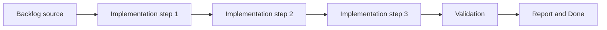

## task_011_define_mobile_virtual_stick_steering_model_for_the_first_player_loop - Define mobile virtual stick steering model for the first player loop
> From version: 0.1.3
> Status: Ready
> Understanding: 95%
> Confidence: 92%
> Progress: 5%
> Complexity: Medium
> Theme: Gameplay
> Reminder: Update status/understanding/confidence/progress and dependencies/references when you edit this doc.

# Context
- Derived from backlog item `item_025_define_mobile_virtual_stick_steering_model_for_the_first_player_loop`.
- Source file: `logics/backlog/item_025_define_mobile_virtual_stick_steering_model_for_the_first_player_loop.md`.
- Related request(s): `req_001_render_top_down_infinite_chunked_world_map`, `req_002_render_evolving_world_entities_on_the_map`, `req_006_define_player_interactions_for_world_and_entities`.
- The mobile-first loop needs a concrete steering model rather than vague touch intent.
- This slice defines the visible virtual-stick behavior, dead zone, and magnitude rules for the first controllable entity.

# Dependencies
- Blocking: `task_009_implement_fixed_step_entity_movement_and_state_update_loop`, `task_010_define_single_entity_control_contract_and_input_ownership_boundaries`.
- Unblocks: first playable mobile loop validation, onboarding, and browser smoke work.

# Plan
- [ ] 1. Confirm scope, dependencies, and linked acceptance criteria.
- [ ] 2. Implement the scoped changes from the backlog item.
- [ ] 3. Validate the result and update the linked Logics docs.
- [ ] 4. Create a dedicated git commit for this task scope after validation passes.
- [ ] FINAL: Update related Logics docs

# AC Traceability
- AC1 -> Scope: The request defines a player interaction scope dedicated to world and entity interactions rather than leaving input behavior implicit across rendering requests.. Proof: TODO.
- AC2 -> Scope: The request defines the first interaction verbs relevant to the project, including at least selecting, inspecting, commanding, and camera-related interactions where ownership matters.. Proof: TODO.
- AC3 -> Scope: The request treats direct control of a single entity as the primary first interaction layer, while selection and inspection stay secondary and debug-friendly in the first loop.. Proof: TODO.
- AC4 -> Scope: The request remains compatible with a first mobile-first direct-control slice in which a single entity is steered through the world using a touch drag input similar to a virtual joypad.. Proof: TODO.
- AC5 -> Scope: The request treats the primary touch-drag gesture in the first player loop as entity steering rather than camera dragging.. Proof: TODO.
- AC6 -> Scope: The request defines a visible virtual-stick baseline with a small dead zone and clamped proportional magnitude for the first mobile control scheme.. Proof: TODO.
- AC7 -> Scope: The request keeps the first player-facing movement gesture model single-finger and avoids conflicting concurrent gesture ownership for movement.. Proof: TODO.
- AC8 -> Scope: The request distinguishes between interactions targeting the world, interactions targeting entities, and interactions targeting UI or system overlays.. Proof: TODO.
- AC9 -> Scope: The request covers both desktop and mobile interaction expectations at a product level, with `WASD` or arrow-key movement treated as the preferred desktop fallback and direct gestures favored for movement on mobile.. Proof: TODO.
- AC10 -> Scope: The request stays compatible with the camera pan or zoom or rotation model defined in `req_001_render_top_down_infinite_chunked_world_map` while allowing free camera manipulation to remain debug-oriented in the first loop.. Proof: TODO.
- AC11 -> Scope: The request remains compatible with the entity rendering and inspection expectations defined in `req_002_render_evolving_world_entities_on_the_map`.. Proof: TODO.
- AC12 -> Scope: The request avoids prematurely locking in advanced gameplay systems that belong to later requests.. Proof: TODO.

# Decision framing
- Product framing: Consider
- Product signals: navigation and discoverability
- Product follow-up: Review whether a product brief is needed before scope becomes harder to change.
- Architecture framing: Consider
- Architecture signals: contracts and integration
- Architecture follow-up: Review whether an architecture decision is needed before implementation becomes harder to reverse.

# Links
- Product brief(s): `prod_000_initial_single_entity_navigation_loop`
- Architecture decision(s): `adr_007_isolate_runtime_input_from_browser_page_controls`
- Backlog item: `item_025_define_mobile_virtual_stick_steering_model_for_the_first_player_loop`
- Request(s): `req_001_render_top_down_infinite_chunked_world_map`, `req_002_render_evolving_world_entities_on_the_map`, `req_006_define_player_interactions_for_world_and_entities`

# Validation
- `python3 logics/skills/logics-doc-linter/scripts/logics_lint.py`
- `npm run lint`
- `npm run typecheck`
- `npm run test`
- `npm run build`

# Definition of Done (DoD)
- [ ] Scope implemented and acceptance criteria covered.
- [ ] Validation commands executed and results captured.
- [ ] Linked request/backlog/task docs updated.
- [ ] A dedicated git commit has been created for the completed task scope.
- [ ] Status is `Done` and progress is `100%`.

# Report
