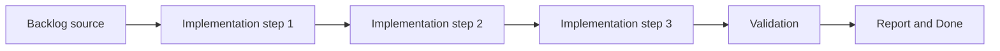

## task_012_define_semantic_versioning_and_changelog_operating_model - Define semantic versioning and changelog operating model
> From version: 0.1.2
> Status: Ready
> Understanding: 95%
> Confidence: 92%
> Progress: 5%
> Complexity: Medium
> Theme: Delivery
> Reminder: Update status/understanding/confidence/progress and dependencies/references when you edit this doc.

# Context
- Derived from backlog item `item_059_define_semantic_versioning_and_changelog_operating_model`.
- Source file: `logics/backlog/item_059_define_semantic_versioning_and_changelog_operating_model.md`.
- Related request(s): `req_015_define_release_workflow_and_deployment_operations`.
- Release communication needs a lightweight but explicit operating model.
- This slice defines how versions and changelog entries are maintained so delivered states remain understandable and no release ships without curated notes.

# Dependencies
- Blocking: `task_004_define_render_static_site_blueprint_and_build_contract`, `task_005_define_mandatory_frontend_and_logics_quality_gates_in_ci`.
- Unblocks: later release automation, changelog validation, and release-candidate tasks.

# Plan
- [ ] 1. Confirm scope, dependencies, and linked acceptance criteria.
- [ ] 2. Implement the scoped changes from the backlog item.
- [ ] 3. Validate the result and update the linked Logics docs.
- [ ] 4. Create a dedicated git commit for this task scope after validation passes.
- [ ] FINAL: Update related Logics docs

# AC Traceability
- AC1 -> Scope: The request defines a release-workflow scope distinct from raw deployment configuration.. Proof: TODO.
- AC2 -> Scope: The request remains compatible with the static Render-hosting model and the future GitHub Actions CI pipeline.. Proof: TODO.
- AC3 -> Scope: The request treats lightweight semantic versioning and a curated changelog discipline as the intended default release-identification model.. Proof: TODO.
- AC4 -> Scope: The request defines `package.json` as the source of truth for the application version and requires a matching changelog file for each released version.. Proof: TODO.
- AC5 -> Scope: The request treats a missing or stale changelog as a release blocker rather than an optional documentation gap.. Proof: TODO.
- AC6 -> Scope: The request defines a per-version changelog naming convention compatible with the user's existing repositories, such as `changelogs/CHANGELOGS_X_Y_Z.md`.. Proof: TODO.
- AC7 -> Scope: The request treats Git tags and GitHub releases as consumers of curated version notes rather than relying only on auto-generated notes.. Proof: TODO.
- AC8 -> Scope: The request remains compatible with the static Render-hosting model and the future GitHub Actions CI pipeline.. Proof: TODO.
- AC9 -> Scope: If preview-style environments are introduced later, the request treats them first as technical validation surfaces rather than as separate product release channels.. Proof: TODO.
- AC10 -> Scope: The request addresses rollback or recovery thinking appropriate to a static-site deployment.. Proof: TODO.
- AC11 -> Scope: The request does not assume a backend service topology or an enterprise-grade release-management stack.. Proof: TODO.
- AC12 -> Scope: The request complements rather than duplicates the Render Blueprint request.. Proof: TODO.

# Decision framing
- Product framing: Not needed
- Product signals: (none detected)
- Product follow-up: No product brief follow-up is expected based on current signals.
- Architecture framing: Consider
- Architecture signals: delivery and operations
- Architecture follow-up: Create or link an architecture decision before irreversible implementation work starts.

# Links
- Product brief(s): (none yet)
- Architecture decision(s): `adr_012_require_curated_versioned_changelogs_for_releases`
- Backlog item: `item_059_define_semantic_versioning_and_changelog_operating_model`
- Request(s): `req_015_define_release_workflow_and_deployment_operations`

# Validation
- `python3 logics/skills/logics-doc-linter/scripts/logics_lint.py`

# Definition of Done (DoD)
- [ ] Scope implemented and acceptance criteria covered.
- [ ] Validation commands executed and results captured.
- [ ] Linked request/backlog/task docs updated.
- [ ] A dedicated git commit has been created for the completed task scope.
- [ ] Status is `Done` and progress is `100%`.

# Report
