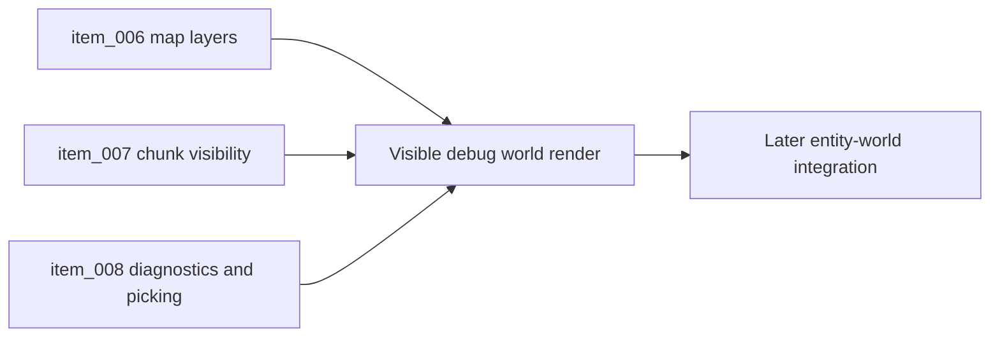

## task_013_orchestrate_world_render_and_chunk_visibility_foundation - Orchestrate world render and chunk visibility foundation
> From version: 0.1.3
> Status: Done
> Understanding: 95%
> Confidence: 91%
> Progress: 100%
> Complexity: High
> Theme: World
> Reminder: Update status/understanding/confidence/progress and dependencies/references when you edit this doc.

# Context
- Derived from backlog items `item_006_render_debug_top_down_map_layers_and_coordinate_overlays`, `item_007_add_chunk_visibility_preload_caching_and_rotated_camera_culling`, and `item_008_add_map_diagnostics_picking_and_camera_reset_workflow`.
- Related request(s): `req_001_render_top_down_infinite_chunked_world_map`.
- The runtime already owns viewport, camera, and deterministic world coordinates, but it does not yet render a visible debug map.
- This orchestration task groups the slices needed to make the chunked world visible, inspectable, and stable under camera transforms before richer gameplay systems land.

# Dependencies
- Blocking: `task_002_add_stable_logical_viewport_and_world_space_shell_contract`, `task_003_add_render_diagnostics_fallback_handling_and_shell_preferences`, `task_006_define_deterministic_chunked_world_model_and_seed_contract`, `task_007_implement_camera_controls_for_pan_zoom_and_rotation`.
- Unblocks: entity-world integration, player-facing traversal validation, and browser smoke coverage for real runtime visuals.

# Plan
- [x] 1. Establish the debug top-down map render layer in Pixi using deterministic chunk content.
- [x] 2. Add chunk visibility resolution, preload margin, and rotated-camera-compatible culling.
- [x] 3. Add map-facing diagnostics, world picking, and camera reset workflow linked to the visible map.
- [x] 4. Validate the runtime and update linked Logics docs.
- [x] FINAL: Create a dedicated git commit for this orchestration scope.

# AC Traceability
- `item_006` -> Visible top-down map layers, chunk boundaries, and coordinate overlays are rendered in world space. Proof: `src/game/world/render/WorldScene.tsx`, `.playwright-cli/page-2026-03-17T07-29-32-017Z.png`.
- `item_007` -> Visible chunk set, preload margin, cache posture, and rotated-camera culling are explicit. Proof: `src/game/world/hooks/useVisibleChunkSet.ts`, `src/game/world/model/worldViewMath.ts`, `src/game/world/model/worldViewMath.test.ts`.
- `item_008` -> Map diagnostics, world picking, and reset workflow are integrated with the visible world render. Proof: `src/game/world/hooks/useWorldInteractionDiagnostics.ts`, `src/game/debug/ShellDiagnosticsPanel.tsx`, `src/app/AppShell.tsx`.

# Decision framing
- Product framing: Required
- Product signals: navigation and discoverability, engagement loop
- Product follow-up: Link or refine the product brief once the world becomes visibly explorable.
- Architecture framing: Required
- Architecture signals: contracts and integration, runtime and boundaries
- Architecture follow-up: Keep alignment with `adr_002`, `adr_003`, `adr_005`, and `adr_006`.

# Links
- Product brief(s): `prod_000_initial_single_entity_navigation_loop`, `prod_002_readable_world_traversal_and_presence`
- Architecture decision(s): `adr_002_separate_react_shell_from_pixi_runtime_ownership`, `adr_003_define_coordinate_spaces_and_camera_contract`, `adr_005_make_world_identity_deterministic_from_seed_and_coordinates`, `adr_006_standardize_debug_first_runtime_instrumentation`
- Backlog item(s): `item_006_render_debug_top_down_map_layers_and_coordinate_overlays`, `item_007_add_chunk_visibility_preload_caching_and_rotated_camera_culling`, `item_008_add_map_diagnostics_picking_and_camera_reset_workflow`
- Request(s): `req_001_render_top_down_infinite_chunked_world_map`

# Validation
- `npm run lint`
- `npm run typecheck`
- `npm run test`
- `npm run build`
- `python3 logics/skills/logics-doc-linter/scripts/logics_lint.py`

# Definition of Done (DoD)
- [x] Covered backlog items are implemented or explicitly split further with updated traceability.
- [x] The visible world render is present in the runtime and validated under camera transforms.
- [x] Linked backlog/task docs are updated with proofs and status.
- [x] A dedicated git commit has been created for the completed orchestration scope.
- [x] Status is `Done` and progress is `100%`.

# Report
- Added a visible Pixi world scene with deterministic chunk tiles, chunk boundaries, and coordinate labels rendered in stable world space under camera pan, zoom, and rotation.
- Added rotated-camera-aware visible chunk resolution with preload margin and a bounded recent chunk cache for runtime diagnostics.
- Added world picking diagnostics for hover and selection on the runtime surface, and surfaced chunk visibility and picking state in the shell diagnostics.
- Validated with:
  - `npm run lint`
  - `npm run typecheck`
  - `npm run test`
  - `npm run build`
  - `python3 logics/skills/logics-doc-linter/scripts/logics_lint.py`
  - visual browser verification via Playwright snapshot and screenshot
