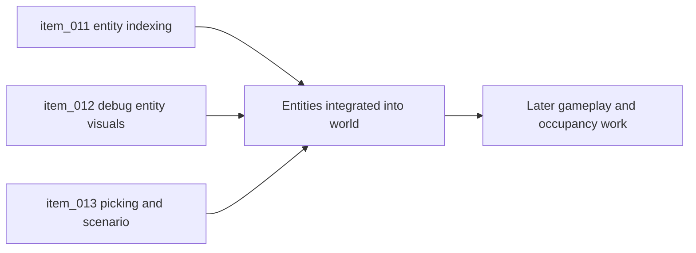

## task_014_orchestrate_entity_world_integration_and_debug_presentation - Orchestrate entity world integration and debug presentation
> From version: 0.5.0
> Status: Done
> Understanding: 95%
> Confidence: 91%
> Progress: 100%
> Complexity: High
> Theme: Entities
> Reminder: Update status/understanding/confidence/progress and dependencies/references when you edit this doc.

# Context
- Derived from backlog items `item_011_add_chunk_aware_entity_indexing_tracking_and_chunk_crossing`, `item_012_render_debug_entity_layers_with_orientation_footprint_and_ordering`, and `item_013_add_entity_picking_selection_inspection_and_deterministic_debug_scenario`.
- Related request(s): `req_002_render_evolving_world_entities_on_the_map`.
- The entity contract, simulation loop, and control baseline exist, but entities are not yet spatially integrated into visible world rendering.
- This orchestration task groups the slices that make entities truly present in the chunked world and inspectable in runtime.

# Dependencies
- Blocking: `task_008_define_entity_contract_and_generic_archetype_baseline`, `task_009_implement_fixed_step_entity_movement_and_state_update_loop`, `task_010_define_single_entity_control_contract_and_input_ownership_boundaries`, `task_013_orchestrate_world_render_and_chunk_visibility_foundation`.
- Unblocks: richer gameplay interactions, occupancy rules, and future survivor-style density work.

# Plan
- [x] 1. Add chunk-aware entity indexing and continuity across visibility and chunk boundaries.
- [x] 2. Render debug entity layers in world space with footprint, facing, state, and stable ordering.
- [x] 3. Add picking, selection-friendly inspection, and a deterministic debug scenario tied to the world render.
- [x] 4. Validate the runtime and update linked Logics docs.
- [x] FINAL: Create a dedicated git commit for this orchestration scope.

# AC Traceability
- `item_011` -> Entities are tracked in world space with chunk-aware indexing and continuity across chunk crossing. Proof: `src/game/entities/model/entitySpatialIndex.ts`, `src/game/entities/model/entitySpatialIndex.test.ts`, `src/game/entities/hooks/useEntityWorld.ts`.
- `item_012` -> Debug entity visuals render consistently in world space with ordering, footprint, and facing signals. Proof: `src/game/entities/render/EntityScene.tsx`, `src/game/render/RuntimeSurface.tsx`.
- `item_013` -> Picking, inspection, and deterministic entity scenarios are available for runtime debugging. Proof: `src/game/entities/model/entityDebugScenario.ts`, `src/game/entities/hooks/useEntityWorld.ts`, `src/game/debug/ShellDiagnosticsPanel.tsx`, `src/app/AppShell.tsx`.

# Request AC Traceability
- req_002_render_evolving_world_entities_on_the_map coverage: AC1, AC10, AC11, AC12, AC13, AC14, AC15, AC16, AC17, AC18, AC19, AC2, AC20, AC21, AC22, AC23, AC24, AC25, AC26, AC27, AC28, AC29, AC3, AC30, AC31, AC32, AC33, AC34, AC4, AC5, AC6, AC7, AC8, AC9. Proof: `task_014_orchestrate_entity_world_integration_and_debug_presentation` closes the linked request chain for `req_002_render_evolving_world_entities_on_the_map` and carries the delivery evidence for `item_013_add_entity_picking_selection_inspection_and_deterministic_debug_scenario`.

# Decision framing
- Product framing: Required
- Product signals: engagement loop, navigation and discoverability
- Product follow-up: Keep alignment with the single-entity control brief and the long-term high-density survival direction.
- Architecture framing: Required
- Architecture signals: contracts and integration, runtime and boundaries
- Architecture follow-up: Keep entity-world boundaries compatible with `adr_002`, `adr_003`, `adr_004`, and `adr_005`.

# Links
- Product brief(s): `prod_000_initial_single_entity_navigation_loop`, `prod_003_high_density_top_down_survival_action_direction`
- Architecture decision(s): `adr_002_separate_react_shell_from_pixi_runtime_ownership`, `adr_003_define_coordinate_spaces_and_camera_contract`, `adr_004_run_simulation_on_a_fixed_timestep`, `adr_005_make_world_identity_deterministic_from_seed_and_coordinates`
- Backlog item(s): `item_011_add_chunk_aware_entity_indexing_tracking_and_chunk_crossing`, `item_012_render_debug_entity_layers_with_orientation_footprint_and_ordering`, `item_013_add_entity_picking_selection_inspection_and_deterministic_debug_scenario`
- Request(s): `req_002_render_evolving_world_entities_on_the_map`

# Validation
- `npm run lint`
- `npm run typecheck`
- `npm run test`
- `npm run build`
- `python3 logics/skills/logics-doc-linter/scripts/logics_lint.py`

# Definition of Done (DoD)
- [x] Covered backlog items are implemented or explicitly split further with updated traceability.
- [x] Entities are visible, inspectable, and continuous across chunk movement in runtime.
- [x] Linked backlog/task docs are updated with proofs and status.
- [x] A dedicated git commit has been created for the completed orchestration scope.
- [x] Status is `Done` and progress is `100%`.

# Report
- Added a deterministic debug entity scenario, chunk-aware entity indexing, visible-vs-tracked entity separation, and stable render ordering for world-space entity presentation.
- Added a Pixi entity render layer that shows footprint, facing, selection state, and labels directly in the world render under camera transforms.
- Wired world picking into entity selection and shell diagnostics so clicking an entity updates the selected inspection target in the shared debug workflow.
- Validation passed with:
  - `npm run lint`
  - `npm run typecheck`
  - `npm run test`
  - `npm run build`
  - runtime browser verification of entity rendering and click selection
