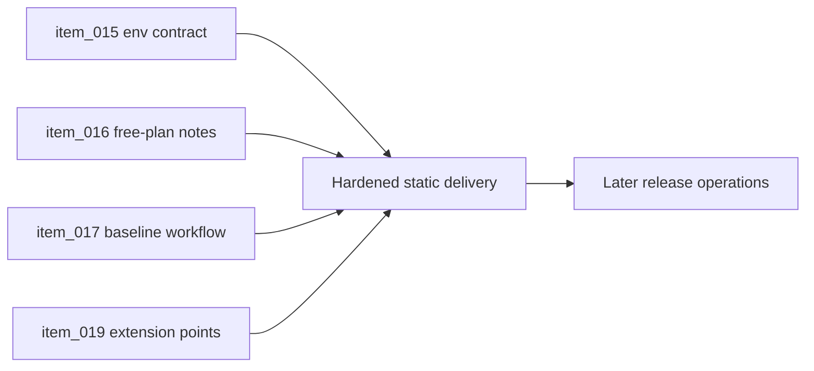

## task_015_orchestrate_static_delivery_and_ci_hardening - Orchestrate static delivery and CI hardening
> From version: 0.1.3
> Status: Done
> Understanding: 95%
> Confidence: 93%
> Progress: 100%
> Complexity: Medium
> Theme: Delivery
> Reminder: Update status/understanding/confidence/progress and dependencies/references when you edit this doc.

# Context
- Derived from backlog items `item_015_define_frontend_env_mirroring_and_render_build_variable_contract`, `item_016_define_free_plan_static_delivery_constraints_and_operating_notes`, `item_017_define_baseline_github_actions_workflow_triggers_and_dependency_caching`, and `item_019_define_ci_workflow_extension_points_for_later_delivery_and_release_automation`.
- Related request(s): `req_003_create_render_static_free_plan_blueprint`, `req_004_prepare_github_actions_ci_pipeline`.
- Render Blueprint and CI exist, but delivery posture, env mirroring, caching, and extension points are not fully hardened and traced.
- This orchestration task groups the slices that make static delivery and CI sustainable.

# Dependencies
- Blocking: `task_004_define_render_static_site_blueprint_and_build_contract`, `task_005_define_mandatory_frontend_and_logics_quality_gates_in_ci`, `task_012_define_semantic_versioning_and_changelog_operating_model`.
- Unblocks: release readiness, deployable release branch operations, and later automation layers.

# Plan
- [x] 1. Harden frontend env mirroring and document build-time public configuration boundaries.
- [x] 2. Capture Render free-plan operational constraints and validate the repository against them.
- [x] 3. Refine GitHub Actions triggers, dependency caching, and CI extension posture for later release automation.
- [x] 4. Validate the delivery workflow and update linked Logics docs.
- [x] FINAL: Create a dedicated git commit for this orchestration scope.

# AC Traceability
- `item_015` -> Frontend env mirroring and public build variable behavior are explicit and reproducible. Proof: `.env.example`, `.gitignore`, `README.md`, `render.yaml`.
- `item_016` -> Render free-plan operational constraints are documented and reflected in delivery choices. Proof: `render.yaml`, `README.md`.
- `item_017` -> CI triggers and dependency caching are explicit and stable. Proof: `.github/workflows/ci.yml`.
- `item_019` -> CI remains extendable toward later deployment and release automation without redesign. Proof: `.github/workflows/ci.yml`.

# Decision framing
- Product framing: Not needed
- Product signals: (none detected)
- Product follow-up: No product brief follow-up is expected based on current signals.
- Architecture framing: Required
- Architecture signals: delivery and operations
- Architecture follow-up: Keep alignment with `adr_010`, `adr_012`, and `adr_013`.

# Links
- Product brief(s): (none yet)
- Architecture decision(s): `adr_010_treat_render_build_variables_as_public_frontend_configuration`, `adr_012_require_curated_versioned_changelogs_for_releases`, `adr_013_use_a_dedicated_release_branch_for_deployable_static_releases`
- Backlog item(s): `item_015_define_frontend_env_mirroring_and_render_build_variable_contract`, `item_016_define_free_plan_static_delivery_constraints_and_operating_notes`, `item_017_define_baseline_github_actions_workflow_triggers_and_dependency_caching`, `item_019_define_ci_workflow_extension_points_for_later_delivery_and_release_automation`
- Request(s): `req_003_create_render_static_free_plan_blueprint`, `req_004_prepare_github_actions_ci_pipeline`

# Validation
- `npm run ci`
- `npm run release:changelog:validate`
- `python3 logics/skills/logics-doc-linter/scripts/logics_lint.py`

# Definition of Done (DoD)
- [x] Covered backlog items are implemented or explicitly split further with updated traceability.
- [x] Delivery and CI behavior are reproducible locally and documented for release-branch flow.
- [x] Linked backlog/task docs are updated with proofs and status.
- [x] A dedicated git commit has been created for the completed orchestration scope.
- [x] Status is `Done` and progress is `100%`.

# Report
- Hardened the frontend env contract by documenting public `VITE_*` usage directly in `.env.example` and aligning repository guidance with Render-managed build variables.
- Documented the Render static free-plan operating envelope in the README and kept the deployable artifact centered on `dist/` from the `release` branch.
- Upgraded GitHub Actions with explicit concurrency, dependency cache-path wiring, build artifact upload, manual invocation, and a `release`-branch readiness job that validates the changelog contract without deploying.
- Validation passed with:
  - `npm run ci`
  - `npm run release:changelog:validate`
  - `python3 logics/skills/logics-doc-linter/scripts/logics_lint.py`
