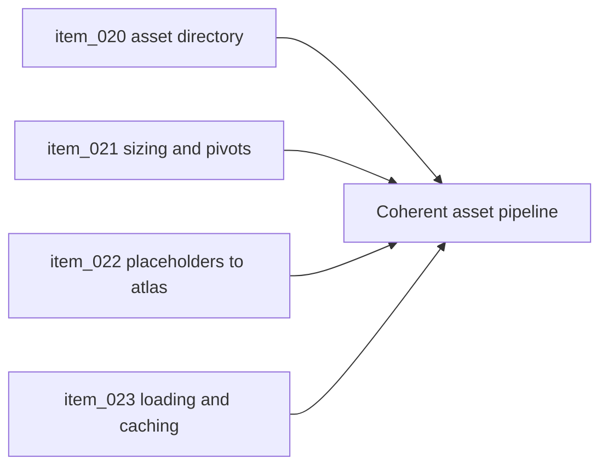

## task_016_orchestrate_asset_pipeline_and_runtime_packaging_foundation - Orchestrate asset pipeline and runtime packaging foundation
> From version: 0.1.3
> Status: Done
> Understanding: 94%
> Confidence: 92%
> Progress: 100%
> Complexity: Medium
> Theme: Assets
> Reminder: Update status/understanding/confidence/progress and dependencies/references when you edit this doc.

# Context
- Derived from backlog items `item_020_define_asset_directory_naming_and_ownership_model_for_map_entities_and_overlays`, `item_021_define_logical_sizing_pivot_and_orientation_conventions_for_runtime_assets`, `item_022_define_placeholder_to_atlas_runtime_packaging_strategy`, and `item_023_define_asset_loading_caching_and_pwa_delivery_expectations`.
- Related request(s): `req_005_define_asset_pipeline_for_map_and_entities`.
- Visual identity and asset direction are documented, but the technical pipeline is not yet formalized in repo structure and runtime loading behavior.
- This orchestration task groups the minimum asset decisions needed before real map and entity visuals multiply.

# Dependencies
- Blocking: `task_000_bootstrap_react_pixi_pwa_project_foundation`, `task_003_add_render_diagnostics_fallback_handling_and_shell_preferences`.
- Unblocks: richer map visuals, entity visuals, and UI surface styling without ad-hoc asset sprawl.

# Plan
- [x] 1. Define directory ownership and naming for map, entity, and overlay assets.
- [x] 2. Fix logical sizing, pivots, orientation, and placeholder-to-atlas migration rules.
- [x] 3. Define runtime asset loading, caching, and PWA delivery expectations.
- [x] 4. Validate the docs and repository conventions.
- [x] FINAL: Create a dedicated git commit for this orchestration scope.

# AC Traceability
- `item_020` -> Asset ownership and directory model are explicit. Proof: `src/assets/README.md`, `src/shared/config/assetPipeline.ts`.
- `item_021` -> Logical sizing, pivot, and orientation rules are explicit. Proof: `src/shared/config/assetPipeline.ts`.
- `item_022` -> Placeholder-to-atlas packaging strategy is defined. Proof: `src/shared/config/assetPipeline.ts`, `README.md`.
- `item_023` -> Runtime loading and caching expectations are aligned with PWA/static delivery. Proof: `src/shared/config/assetPipeline.ts`, `README.md`, `render.yaml`.

# Decision framing
- Product framing: Required
- Product signals: visual design, navigation and discoverability
- Product follow-up: Keep alignment with the visual identity briefs.
- Architecture framing: Required
- Architecture signals: runtime and boundaries, contracts and integration
- Architecture follow-up: Keep alignment with `adr_008` and `adr_011`.

# Links
- Product brief(s): `prod_004_emberwake_name_and_brand_direction`, `prod_005_visual_identity_dark_fantasy_with_synthetic_energy_accents`
- Architecture decision(s): `adr_008_define_asset_logical_sizing_and_runtime_packaging_rules`, `adr_011_use_typed_typescript_as_the_initial_data_and_config_authoring_model`
- Backlog item(s): `item_020_define_asset_directory_naming_and_ownership_model_for_map_entities_and_overlays`, `item_021_define_logical_sizing_pivot_and_orientation_conventions_for_runtime_assets`, `item_022_define_placeholder_to_atlas_runtime_packaging_strategy`, `item_023_define_asset_loading_caching_and_pwa_delivery_expectations`
- Request(s): `req_005_define_asset_pipeline_for_map_and_entities`

# Validation
- `python3 logics/skills/logics-doc-linter/scripts/logics_lint.py`

# Definition of Done (DoD)
- [x] Covered backlog items are implemented or explicitly split further with updated traceability.
- [x] Asset conventions are documented well enough to guide implementation without ad-hoc naming drift.
- [x] Linked backlog/task docs are updated with proofs and status.
- [x] A dedicated git commit has been created for the completed orchestration scope.
- [x] Status is `Done` and progress is `100%`.

# Report
- Added an explicit `src/assets/` ownership layout for map, entity, and overlay assets, with separate `source`, `placeholders`, and `runtime` stages per domain.
- Added a typed asset pipeline contract that fixes naming posture, logical sizing, pivots, placeholder-to-atlas migration, and runtime caching/loading expectations.
- Extended the repository README with the asset pipeline posture so future runtime work can reference a single public convention instead of inventing domain-local rules.
- Validation passed with:
  - `npm run lint`
  - `npm run typecheck`
  - `npm run test`
  - `python3 logics/skills/logics-doc-linter/scripts/logics_lint.py`
