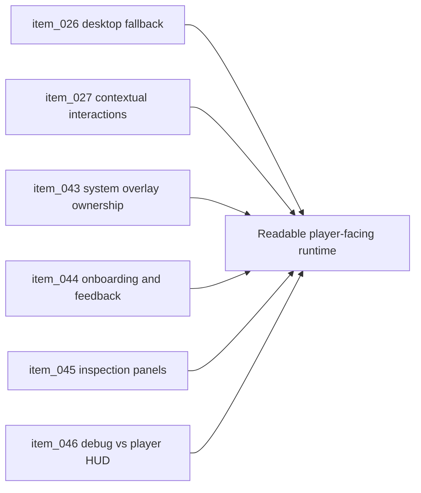

## task_017_orchestrate_player_facing_interaction_feedback_and_overlay_surfaces - Orchestrate player-facing interaction feedback and overlay surfaces
> From version: 0.1.3
> Status: Ready
> Understanding: 95%
> Confidence: 91%
> Progress: 0%
> Complexity: High
> Theme: UX
> Reminder: Update status/understanding/confidence/progress and dependencies/references when you edit this doc.

# Context
- Derived from backlog items `item_026_define_desktop_fallback_controls_and_debug_input_separation`, `item_027_define_selection_inspection_and_contextual_interaction_flow`, `item_043_define_system_overlay_ownership_and_fullscreen_install_prompt_behavior`, `item_044_define_minimal_player_facing_runtime_feedback_and_onboarding_surfaces`, `item_045_define_contextual_inspection_panels_across_mobile_and_desktop`, and `item_046_define_debug_overlay_separation_from_player_facing_hud`.
- Related request(s): `req_006_define_player_interactions_for_world_and_entities`, `req_011_define_ui_hud_and_overlay_system`.
- Direct steering exists, but player-facing feedback, contextual inspection, and overlay ownership are not yet organized into a usable runtime experience.
- This orchestration task groups the minimal UX layer needed to turn the technical shell into a readable playable surface.

# Dependencies
- Blocking: `task_010_define_single_entity_control_contract_and_input_ownership_boundaries`, `task_011_define_mobile_virtual_stick_steering_model_for_the_first_player_loop`, `task_014_orchestrate_entity_world_integration_and_debug_presentation`.
- Unblocks: first understandable player loop, smoke testing for the loop, and later HUD growth.

# Plan
- [ ] 1. Refine desktop fallback input and keep debug-only gestures separate from player-facing controls.
- [ ] 2. Add minimal onboarding, runtime feedback, and contextual inspection surfaces.
- [ ] 3. Separate system overlays, debug diagnostics, and player-facing HUD ownership.
- [ ] 4. Validate the runtime and update linked Logics docs.
- [ ] FINAL: Create a dedicated git commit for this orchestration scope.

# AC Traceability
- `item_026` -> Desktop fallback controls and debug input ownership are explicit and non-conflicting. Proof: TODO.
- `item_027` -> Selection, inspection, and contextual interactions are readable without diluting the primary movement loop. Proof: TODO.
- `item_043` -> System overlays own fullscreen/install/system messaging cleanly. Proof: TODO.
- `item_044` -> Minimal onboarding and player-facing runtime feedback are visible and restrained. Proof: TODO.
- `item_045` -> Inspection surfaces work across mobile and desktop postures. Proof: TODO.
- `item_046` -> Debug overlay and player-facing HUD remain explicitly separated. Proof: TODO.

# Decision framing
- Product framing: Required
- Product signals: conversion journey, navigation and discoverability, engagement loop
- Product follow-up: Keep alignment with the initial single-entity loop and visual identity briefs.
- Architecture framing: Required
- Architecture signals: runtime and boundaries, contracts and integration
- Architecture follow-up: Keep alignment with `adr_002`, `adr_006`, and `adr_007`.

# Links
- Product brief(s): `prod_000_initial_single_entity_navigation_loop`, `prod_001_minimal_overlay_and_feedback_for_early_runtime`, `prod_002_readable_world_traversal_and_presence`, `prod_005_visual_identity_dark_fantasy_with_synthetic_energy_accents`
- Architecture decision(s): `adr_002_separate_react_shell_from_pixi_runtime_ownership`, `adr_006_standardize_debug_first_runtime_instrumentation`, `adr_007_isolate_runtime_input_from_browser_page_controls`
- Backlog item(s): `item_026_define_desktop_fallback_controls_and_debug_input_separation`, `item_027_define_selection_inspection_and_contextual_interaction_flow`, `item_043_define_system_overlay_ownership_and_fullscreen_install_prompt_behavior`, `item_044_define_minimal_player_facing_runtime_feedback_and_onboarding_surfaces`, `item_045_define_contextual_inspection_panels_across_mobile_and_desktop`, `item_046_define_debug_overlay_separation_from_player_facing_hud`
- Request(s): `req_006_define_player_interactions_for_world_and_entities`, `req_011_define_ui_hud_and_overlay_system`

# Validation
- `npm run lint`
- `npm run typecheck`
- `npm run test`
- `npm run build`
- `python3 logics/skills/logics-doc-linter/scripts/logics_lint.py`

# Definition of Done (DoD)
- [ ] Covered backlog items are implemented or explicitly split further with updated traceability.
- [ ] The runtime exposes a minimal but readable player-facing layer distinct from debug tooling.
- [ ] Linked backlog/task docs are updated with proofs and status.
- [ ] A dedicated git commit has been created for the completed orchestration scope.
- [ ] Status is `Done` and progress is `100%`.

# Report

