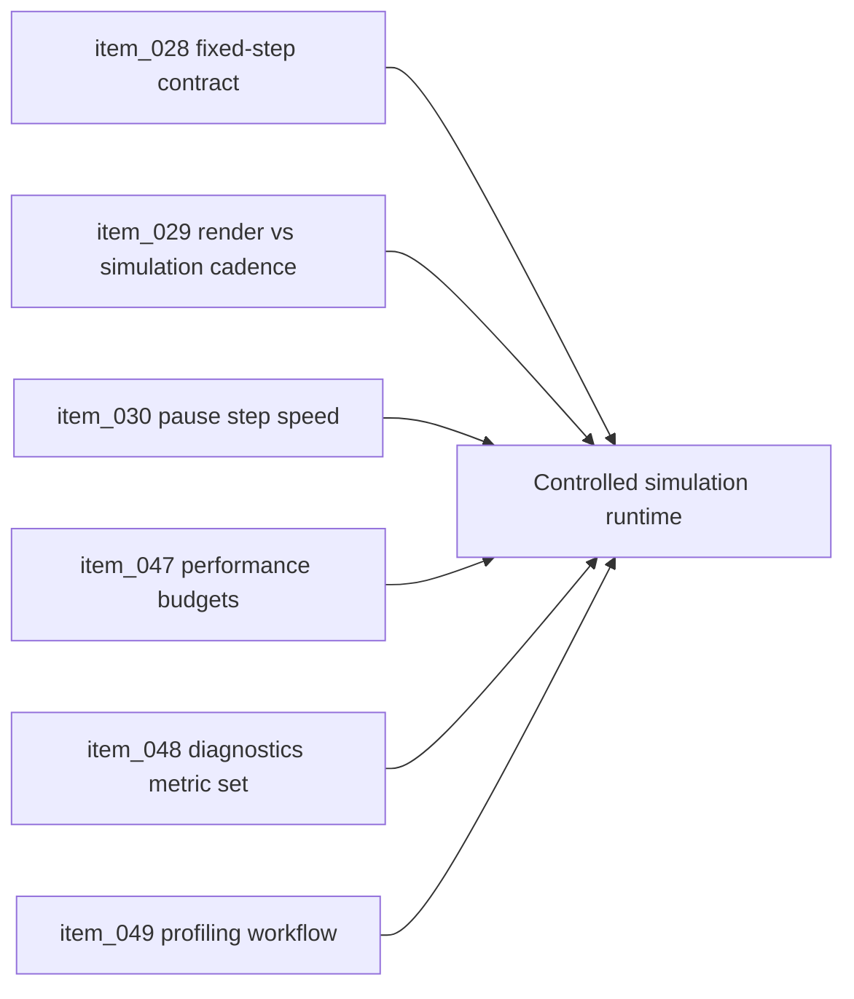

## task_018_orchestrate_simulation_cadence_debug_controls_and_performance_metrics - Orchestrate simulation cadence, debug controls, and performance metrics
> From version: 0.1.3
> Status: Ready
> Understanding: 95%
> Confidence: 91%
> Progress: 0%
> Complexity: High
> Theme: Runtime
> Reminder: Update status/understanding/confidence/progress and dependencies/references when you edit this doc.

# Context
- Derived from backlog items `item_028_define_fixed_timestep_simulation_loop_contract`, `item_029_define_render_and_simulation_cadence_separation`, `item_030_define_pause_step_and_simulation_speed_debug_controls`, `item_047_define_core_runtime_performance_budgets_and_mobile_reference_target`, `item_048_define_the_standard_in_app_diagnostics_metric_set`, and `item_049_define_profiling_workflow_and_regression_review_expectations`.
- Related request(s): `req_007_define_simulation_loop_and_deterministic_update_model`, `req_012_define_performance_budgets_profiling_and_diagnostics`.
- A fixed-step entity loop exists, but the runtime still lacks explicit cadence controls, standard metrics, and profiling posture.
- This orchestration task groups the runtime controls and metrics needed to keep growth debuggable.

# Dependencies
- Blocking: `task_009_implement_fixed_step_entity_movement_and_state_update_loop`, `task_014_orchestrate_entity_world_integration_and_debug_presentation`.
- Unblocks: reliable perf budgets, richer browser smoke tests, and later density-heavy gameplay work.

# Plan
- [ ] 1. Formalize cadence separation and fixed-step runtime behavior at the app level.
- [ ] 2. Add pause, single-step, and simulation-speed controls for debug operation.
- [ ] 3. Standardize runtime diagnostics metrics, performance targets, and profiling review posture.
- [ ] 4. Validate the runtime and update linked Logics docs.
- [ ] FINAL: Create a dedicated git commit for this orchestration scope.

# AC Traceability
- `item_028` -> Fixed-step simulation loop contract is explicit across runtime subsystems. Proof: TODO.
- `item_029` -> Render cadence and simulation cadence are intentionally separated. Proof: TODO.
- `item_030` -> Pause, step, and speed controls exist for debug use. Proof: TODO.
- `item_047` -> Performance budgets and reference targets are explicit. Proof: TODO.
- `item_048` -> Standard in-app metrics are visible and consistent. Proof: TODO.
- `item_049` -> Profiling and regression review workflow is documented and usable. Proof: TODO.

# Decision framing
- Product framing: Consider
- Product signals: engagement loop, navigation and discoverability
- Product follow-up: Keep the runtime focused on readability and responsiveness rather than over-instrumenting player-facing surfaces.
- Architecture framing: Required
- Architecture signals: runtime and boundaries, delivery and operations
- Architecture follow-up: Keep alignment with `adr_004` and `adr_006`.

# Links
- Product brief(s): `prod_000_initial_single_entity_navigation_loop`, `prod_003_high_density_top_down_survival_action_direction`
- Architecture decision(s): `adr_004_run_simulation_on_a_fixed_timestep`, `adr_006_standardize_debug_first_runtime_instrumentation`
- Backlog item(s): `item_028_define_fixed_timestep_simulation_loop_contract`, `item_029_define_render_and_simulation_cadence_separation`, `item_030_define_pause_step_and_simulation_speed_debug_controls`, `item_047_define_core_runtime_performance_budgets_and_mobile_reference_target`, `item_048_define_the_standard_in_app_diagnostics_metric_set`, `item_049_define_profiling_workflow_and_regression_review_expectations`
- Request(s): `req_007_define_simulation_loop_and_deterministic_update_model`, `req_012_define_performance_budgets_profiling_and_diagnostics`

# Validation
- `npm run ci`
- `python3 logics/skills/logics-doc-linter/scripts/logics_lint.py`

# Definition of Done (DoD)
- [ ] Covered backlog items are implemented or explicitly split further with updated traceability.
- [ ] Simulation cadence and diagnostics are explicit enough to support future performance-sensitive work.
- [ ] Linked backlog/task docs are updated with proofs and status.
- [ ] A dedicated git commit has been created for the completed orchestration scope.
- [ ] Status is `Done` and progress is `100%`.

# Report

