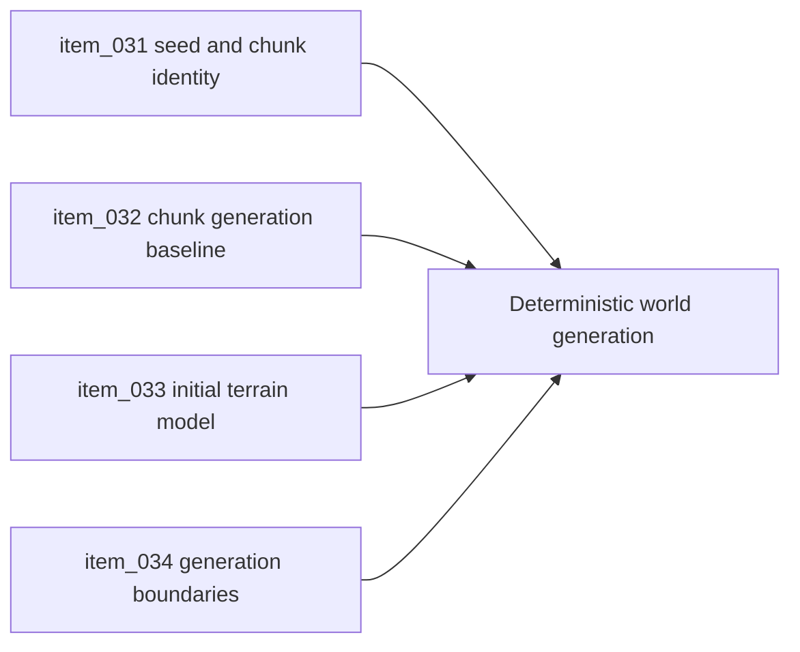

## task_019_orchestrate_deterministic_world_generation_foundation - Orchestrate deterministic world generation foundation
> From version: 0.5.0
> Status: Done
> Understanding: 94%
> Confidence: 92%
> Progress: 100%
> Complexity: High
> Theme: World
> Reminder: Update status/understanding/confidence/progress and dependencies/references when you edit this doc.

# Context
- Derived from backlog items `item_031_define_global_world_seed_and_chunk_identity_contract`, `item_032_define_deterministic_chunk_generation_baseline`, `item_033_define_initial_terrain_layer_and_variation_model`, and `item_034_define_generation_boundaries_versus_rendering_assets_and_entities`.
- Related request(s): `req_008_define_infinite_chunked_world_generation_model`.
- The world contract already exposes seed and chunk identity, but generation rules are not yet promoted into a structured implementation path.
- This orchestration task groups the first deterministic generation slices needed before content gets richer.

# Dependencies
- Blocking: `task_006_define_deterministic_chunked_world_model_and_seed_contract`, `task_013_orchestrate_world_render_and_chunk_visibility_foundation`.
- Unblocks: richer terrain content, persistence boundaries, and future biome or density systems.

# Plan
- [x] 1. Promote the seed and chunk identity contract into a generation-facing API.
- [x] 2. Add deterministic chunk content generation and an initial terrain variation layer.
- [x] 3. Separate generation concerns from render, assets, and entity population boundaries.
- [x] 4. Validate the runtime and update linked Logics docs.
- [x] FINAL: Create a dedicated git commit for this orchestration scope.

# AC Traceability
- `item_031` -> Global world seed and chunk identity remain explicit and reusable. Proof: `src/game/world/model/worldContract.ts`, `src/game/world/model/worldGeneration.ts`.
- `item_032` -> Deterministic chunk generation baseline exists. Proof: `src/game/world/model/worldGeneration.ts`, `src/game/world/model/worldGeneration.test.ts`.
- `item_033` -> Initial terrain layer and variation model are visible. Proof: `src/game/world/model/worldGeneration.ts`, `src/game/world/model/chunkDebugData.ts`, `src/game/world/render/WorldScene.tsx`.
- `item_034` -> Generation boundaries versus assets and entities are explicit. Proof: `src/game/world/model/worldGeneration.ts`, `src/game/world/model/chunkDebugData.ts`.

# Request AC Traceability
- req_008_define_infinite_chunked_world_generation_model coverage: AC1, AC2, AC3, AC4, AC5, AC6, AC7. Proof: `task_019_orchestrate_deterministic_world_generation_foundation` closes the linked request chain for `req_008_define_infinite_chunked_world_generation_model` and carries the delivery evidence for `item_034_define_generation_boundaries_versus_rendering_assets_and_entities`.

# Decision framing
- Product framing: Required
- Product signals: engagement loop, navigation and discoverability
- Product follow-up: Keep the generation model aligned with readable traversal and long-term density goals.
- Architecture framing: Required
- Architecture signals: contracts and integration, runtime and boundaries
- Architecture follow-up: Keep alignment with `adr_003` and `adr_005`.

# Links
- Product brief(s): `prod_002_readable_world_traversal_and_presence`, `prod_003_high_density_top_down_survival_action_direction`
- Architecture decision(s): `adr_003_define_coordinate_spaces_and_camera_contract`, `adr_005_make_world_identity_deterministic_from_seed_and_coordinates`
- Backlog item(s): `item_031_define_global_world_seed_and_chunk_identity_contract`, `item_032_define_deterministic_chunk_generation_baseline`, `item_033_define_initial_terrain_layer_and_variation_model`, `item_034_define_generation_boundaries_versus_rendering_assets_and_entities`
- Request(s): `req_008_define_infinite_chunked_world_generation_model`

# Validation
- `npm run lint`
- `npm run typecheck`
- `npm run test`
- `npm run build`
- `python3 logics/skills/logics-doc-linter/scripts/logics_lint.py`

# Definition of Done (DoD)
- [x] Covered backlog items are implemented or explicitly split further with updated traceability.
- [x] Deterministic generation is visible and reusable without being entangled with rendering-only concerns.
- [x] Linked backlog/task docs are updated with proofs and status.
- [x] A dedicated git commit has been created for the completed orchestration scope.
- [x] Status is `Done` and progress is `100%`.

# Report
- Promoted the seed and chunk identity contract into a generation-facing API that returns deterministic chunk content from seed and coordinates.
- Added a first terrain-layer model with stable terrain kinds and tile variants so chunks no longer rely on flat color hashing alone.
- Kept generation output free of render colors, asset references, and entity concerns, with debug rendering translating generated terrain into visible chunk styling afterward.
- Validation passed with:
  - `npm run lint`
  - `npm run typecheck`
  - `npm run test`
  - `npm run build`
  - `python3 logics/skills/logics-doc-linter/scripts/logics_lint.py`
