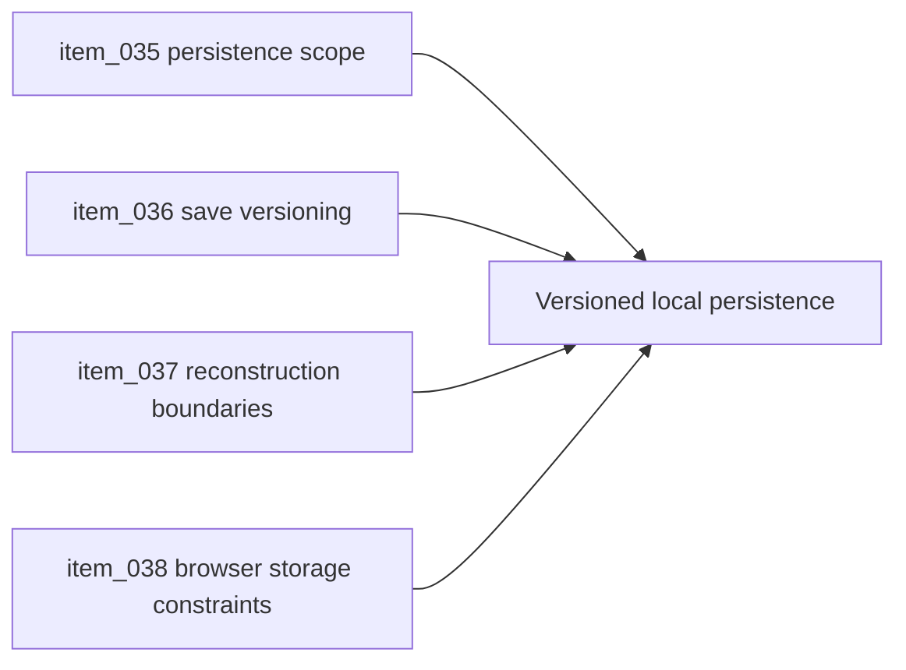

## task_020_orchestrate_persistence_and_reconstruction_boundaries - Orchestrate persistence and reconstruction boundaries
> From version: 0.1.3
> Status: Ready
> Understanding: 94%
> Confidence: 90%
> Progress: 0%
> Complexity: Medium
> Theme: Persistence
> Reminder: Update status/understanding/confidence/progress and dependencies/references when you edit this doc.

# Context
- Derived from backlog items `item_035_define_first_local_persistence_scope_for_preferences_seed_and_camera_state`, `item_036_define_local_save_versioning_migration_and_invalidation_policy`, `item_037_define_deterministic_world_reconstruction_versus_persisted_state_boundaries`, and `item_038_define_browser_and_pwa_storage_operational_constraints`.
- Related request(s): `req_009_define_local_persistence_and_save_strategy`.
- Shell preferences exist, but persistence policy is not yet formalized across camera, world seed, and future gameplay state.
- This orchestration task groups the first persistence choices so local storage does not sprawl implicitly.

# Dependencies
- Blocking: `task_003_add_render_diagnostics_fallback_handling_and_shell_preferences`, `task_019_orchestrate_deterministic_world_generation_foundation`.
- Unblocks: stable save/load posture, deterministic reconstruction, and future progression state.

# Plan
- [ ] 1. Define the first persisted state set and local storage ownership.
- [ ] 2. Add versioning, invalidation, and migration posture for stored state.
- [ ] 3. Separate reconstructible deterministic world state from state that must actually be persisted.
- [ ] 4. Validate the persistence model and update linked Logics docs.
- [ ] FINAL: Create a dedicated git commit for this orchestration scope.

# AC Traceability
- `item_035` -> First local persistence scope is explicit. Proof: TODO.
- `item_036` -> Save versioning and invalidation posture are explicit. Proof: TODO.
- `item_037` -> Reconstruction boundaries between deterministic world and persisted state are explicit. Proof: TODO.
- `item_038` -> Browser and PWA storage constraints are accounted for. Proof: TODO.

# Decision framing
- Product framing: Consider
- Product signals: navigation and discoverability
- Product follow-up: Keep persisted state minimal enough to preserve fast iteration.
- Architecture framing: Required
- Architecture signals: data model and persistence, delivery and operations
- Architecture follow-up: Keep alignment with `adr_009` and `adr_011`.

# Links
- Product brief(s): `prod_000_initial_single_entity_navigation_loop`
- Architecture decision(s): `adr_009_limit_persistence_to_local_versioned_frontend_storage`, `adr_011_use_typed_typescript_as_the_initial_data_and_config_authoring_model`
- Backlog item(s): `item_035_define_first_local_persistence_scope_for_preferences_seed_and_camera_state`, `item_036_define_local_save_versioning_migration_and_invalidation_policy`, `item_037_define_deterministic_world_reconstruction_versus_persisted_state_boundaries`, `item_038_define_browser_and_pwa_storage_operational_constraints`
- Request(s): `req_009_define_local_persistence_and_save_strategy`

# Validation
- `npm run lint`
- `npm run typecheck`
- `npm run test`
- `python3 logics/skills/logics-doc-linter/scripts/logics_lint.py`

# Definition of Done (DoD)
- [ ] Covered backlog items are implemented or explicitly split further with updated traceability.
- [ ] Local persistence remains minimal, versioned, and compatible with deterministic reconstruction.
- [ ] Linked backlog/task docs are updated with proofs and status.
- [ ] A dedicated git commit has been created for the completed orchestration scope.
- [ ] Status is `Done` and progress is `100%`.

# Report

