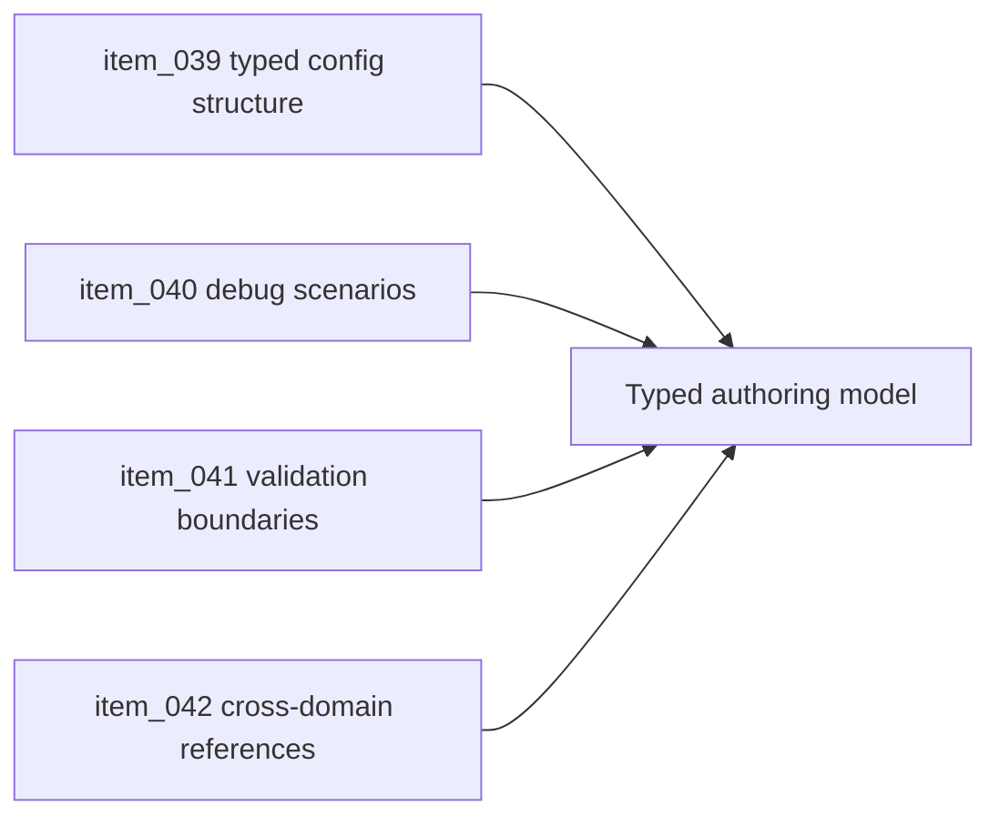

## task_021_orchestrate_typed_data_configuration_and_scenario_authoring - Orchestrate typed data, configuration, and scenario authoring
> From version: 0.1.3
> Status: Ready
> Understanding: 94%
> Confidence: 90%
> Progress: 0%
> Complexity: Medium
> Theme: Data
> Reminder: Update status/understanding/confidence/progress and dependencies/references when you edit this doc.

# Context
- Derived from backlog items `item_039_define_domain_owned_typed_typescript_configuration_structure`, `item_040_define_official_debug_scenario_data_model`, `item_041_define_validation_typing_and_runtime_configuration_boundaries`, and `item_042_define_data_reference_contracts_across_world_entities_and_assets`.
- Related request(s): `req_010_define_game_data_and_configuration_model`.
- The repo already leans on typed TypeScript and debug scenarios conceptually, but the authoring model is not yet applied consistently to world, entities, and assets.
- This orchestration task groups the data-side contracts that keep content from turning into scattered literals.

# Dependencies
- Blocking: `task_016_orchestrate_asset_pipeline_and_runtime_packaging_foundation`, `task_019_orchestrate_deterministic_world_generation_foundation`.
- Unblocks: test fixtures, debug scenarios, and later content authoring beyond code-only prototypes.

# Plan
- [ ] 1. Define domain-owned typed configuration structure for world, entity, and asset-adjacent data.
- [ ] 2. Add official debug scenario data and clear validation/runtime boundaries.
- [ ] 3. Make cross-domain references explicit across world, entities, and assets.
- [ ] 4. Validate the authoring model and update linked Logics docs.
- [ ] FINAL: Create a dedicated git commit for this orchestration scope.

# AC Traceability
- `item_039` -> Domain-owned typed configuration structure is explicit. Proof: TODO.
- `item_040` -> Official debug scenario data model exists. Proof: TODO.
- `item_041` -> Validation, typing, and runtime boundaries are explicit. Proof: TODO.
- `item_042` -> Data references across world, entities, and assets are explicit. Proof: TODO.

# Decision framing
- Product framing: Consider
- Product signals: engagement loop
- Product follow-up: Keep the data model simple enough to support fast iteration and testing.
- Architecture framing: Required
- Architecture signals: data model and persistence, contracts and integration
- Architecture follow-up: Keep alignment with `adr_011`.

# Links
- Product brief(s): `prod_000_initial_single_entity_navigation_loop`
- Architecture decision(s): `adr_011_use_typed_typescript_as_the_initial_data_and_config_authoring_model`
- Backlog item(s): `item_039_define_domain_owned_typed_typescript_configuration_structure`, `item_040_define_official_debug_scenario_data_model`, `item_041_define_validation_typing_and_runtime_configuration_boundaries`, `item_042_define_data_reference_contracts_across_world_entities_and_assets`
- Request(s): `req_010_define_game_data_and_configuration_model`

# Validation
- `npm run lint`
- `npm run typecheck`
- `npm run test`
- `python3 logics/skills/logics-doc-linter/scripts/logics_lint.py`

# Definition of Done (DoD)
- [ ] Covered backlog items are implemented or explicitly split further with updated traceability.
- [ ] Typed configuration and debug-scenario authoring are coherent across domains.
- [ ] Linked backlog/task docs are updated with proofs and status.
- [ ] A dedicated git commit has been created for the completed orchestration scope.
- [ ] Status is `Done` and progress is `100%`.

# Report

