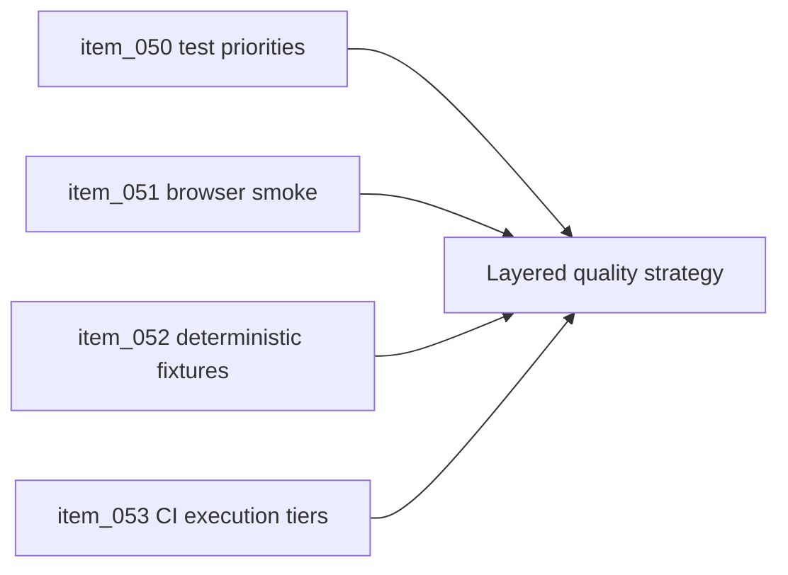

## task_022_orchestrate_testing_browser_smoke_and_ci_execution_tiers - Orchestrate testing, browser smoke, and CI execution tiers
> From version: 0.5.0
> Status: Done
> Understanding: 95%
> Confidence: 91%
> Progress: 100%
> Complexity: High
> Theme: Quality
> Reminder: Update status/understanding/confidence/progress and dependencies/references when you edit this doc.

# Context
- Derived from backlog items `item_050_define_unit_and_integration_testing_priorities_for_transforms_world_and_simulation`, `item_051_define_browser_smoke_strategy_for_runtime_and_first_player_loop`, `item_052_define_deterministic_fixtures_and_scenarios_for_automated_tests`, and `item_053_define_ci_test_execution_tiers_and_gating_rules`.
- Related request(s): `req_013_define_frontend_testing_strategy_for_rendering_simulation_and_world_logic`.
- Basic unit tests exist, but they do not yet cover the real runtime loop, deterministic fixtures, or CI tiering strategy.
- This orchestration task groups the testing slices that turn the current project into a guarded runtime rather than a growing prototype.

# Dependencies
- Blocking: `task_015_orchestrate_static_delivery_and_ci_hardening`, `task_017_orchestrate_player_facing_interaction_feedback_and_overlay_surfaces`, `task_018_orchestrate_simulation_cadence_debug_controls_and_performance_metrics`, `task_021_orchestrate_typed_data_configuration_and_scenario_authoring`.
- Unblocks: trustworthy release readiness and later automation gates.

# Plan
- [x] 1. Expand test priorities around transforms, world logic, and simulation invariants.
- [x] 2. Add deterministic fixtures and browser smoke coverage for the first real player loop.
- [x] 3. Define CI execution tiers and gating rules across fast and slower checks.
- [x] 4. Validate the test strategy and update linked Logics docs.
- [ ] FINAL: Create a dedicated git commit for this orchestration scope.

# AC Traceability
- `item_050` -> Unit and integration testing priorities are explicit around runtime math and simulation. Proof: `README.md`, `src/game/camera/model/cameraMath.test.ts`, `src/game/world/model/worldViewMath.test.ts`, `src/game/entities/model/entitySimulation.test.ts`.
- `item_051` -> Browser smoke strategy exists for the runtime and first player loop. Proof: `scripts/testing/runBrowserSmoke.mjs`, `package.json`.
- `item_052` -> Deterministic fixtures and scenarios support automation. Proof: `src/test/fixtures/runtimeFixtures.ts`, `src/test/fixtures/runtimeFixtures.test.ts`, `src/game/debug/data/officialDebugScenario.ts`.
- `item_053` -> CI test execution tiers and gates are explicit. Proof: `package.json`, `.github/workflows/ci.yml`.

# Request AC Traceability
- req_013_define_frontend_testing_strategy_for_rendering_simulation_and_world_logic coverage: AC1, AC10, AC2, AC3, AC4, AC5, AC6, AC7, AC8, AC9. Proof: `task_022_orchestrate_testing_browser_smoke_and_ci_execution_tiers` closes the linked request chain for `req_013_define_frontend_testing_strategy_for_rendering_simulation_and_world_logic` and carries the delivery evidence for `item_053_define_ci_test_execution_tiers_and_gating_rules`.

# Decision framing
- Product framing: Consider
- Product signals: engagement loop, navigation and discoverability
- Product follow-up: Keep browser smoke focused on meaningful loop validation rather than UI churn.
- Architecture framing: Required
- Architecture signals: delivery and operations, contracts and integration
- Architecture follow-up: Keep alignment with `adr_004`, `adr_005`, and `adr_006`.

# Links
- Product brief(s): `prod_000_initial_single_entity_navigation_loop`, `prod_003_high_density_top_down_survival_action_direction`
- Architecture decision(s): `adr_004_run_simulation_on_a_fixed_timestep`, `adr_005_make_world_identity_deterministic_from_seed_and_coordinates`, `adr_006_standardize_debug_first_runtime_instrumentation`
- Backlog item(s): `item_050_define_unit_and_integration_testing_priorities_for_transforms_world_and_simulation`, `item_051_define_browser_smoke_strategy_for_runtime_and_first_player_loop`, `item_052_define_deterministic_fixtures_and_scenarios_for_automated_tests`, `item_053_define_ci_test_execution_tiers_and_gating_rules`
- Request(s): `req_013_define_frontend_testing_strategy_for_rendering_simulation_and_world_logic`

# Validation
- `npm run ci`
- `python3 logics/skills/logics-doc-linter/scripts/logics_lint.py`

# Definition of Done (DoD)
- [x] Covered backlog items are implemented or explicitly split further with updated traceability.
- [x] The project has meaningful layered tests from unit math up to browser smoke.
- [x] Linked backlog/task docs are updated with proofs and status.
- [x] A dedicated git commit has been created for the completed orchestration scope.
- [x] Status is `Done` and progress is `100%`.

# Report
- Added deterministic runtime fixtures and kept them anchored to the official debug scenario.
- Added a real browser-smoke script that validates runtime boot, keyboard steering, visible entity movement, and onboarding resolution.
- Split CI posture into a fast blocking tier and a slower browser-smoke tier for `release` and manual dispatch.
