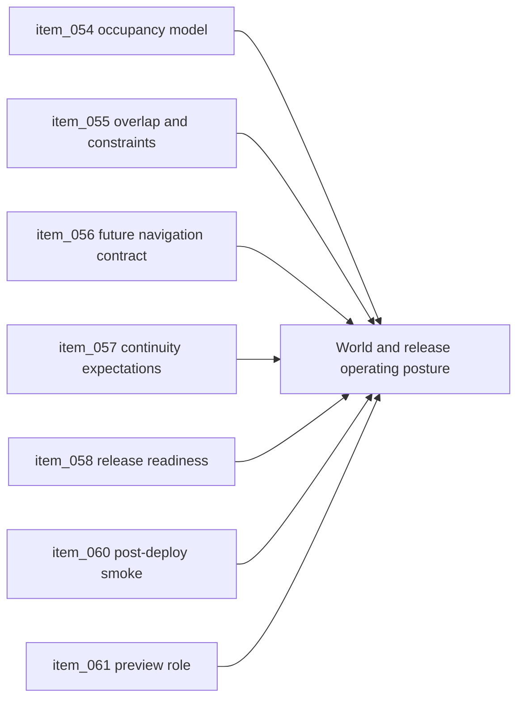

## task_023_orchestrate_world_occupancy_continuity_and_release_operations - Orchestrate world occupancy, continuity, and release operations
> From version: 0.1.3
> Status: Done
> Understanding: 94%
> Confidence: 90%
> Progress: 100%
> Complexity: High
> Theme: Operations
> Reminder: Update status/understanding/confidence/progress and dependencies/references when you edit this doc.

# Context
- Derived from backlog items `item_054_define_entity_occupancy_model_and_footprint_rules_in_world_space`, `item_055_define_traversal_overlap_and_early_movement_constraint_behavior`, `item_056_define_future_facing_navigation_and_terrain_interaction_contract`, `item_057_define_player_facing_continuity_and_world_presence_expectations`, `item_058_define_release_readiness_gates_and_deployable_artifact_identification`, `item_060_define_post_deployment_smoke_checks_and_rollback_posture`, and `item_061_define_preview_environment_role_in_the_delivery_workflow`.
- Related request(s): `req_014_define_world_occupancy_navigation_and_interaction_rules`, `req_015_define_release_workflow_and_deployment_operations`.
- The project still needs both a clearer world-occupancy posture and a fuller operational release posture before it can evolve toward a deployable game loop.
- This orchestration task groups the rules that govern how the player and entities inhabit the world, plus the release gatekeeping around deployable states.

# Dependencies
- Blocking: `task_014_orchestrate_entity_world_integration_and_debug_presentation`, `task_015_orchestrate_static_delivery_and_ci_hardening`, `task_017_orchestrate_player_facing_interaction_feedback_and_overlay_surfaces`, `task_022_orchestrate_testing_browser_smoke_and_ci_execution_tiers`.
- Unblocks: richer traversal constraints, meaningful release candidates, and preview/release branch operations.

# Plan
- [x] 1. Define occupancy, overlap, and early traversal constraints in world space.
- [x] 2. Capture player-facing continuity expectations and future-facing navigation or terrain interaction boundaries.
- [x] 3. Define release readiness gates, post-deploy smoke posture, and preview-environment role under the release-branch workflow.
- [x] 4. Validate runtime and delivery expectations, then update linked Logics docs.
- [ ] FINAL: Create a dedicated git commit for this orchestration scope.

# AC Traceability
- `item_054` -> Entity occupancy and footprint rules are explicit in world space. Proof: `src/game/entities/model/entityOccupancy.ts`, `src/game/entities/model/entityOccupancy.test.ts`.
- `item_055` -> Traversal overlaps and early movement constraints are explicit. Proof: `src/game/entities/model/entityOccupancy.ts`, `src/game/debug/ShellDiagnosticsPanel.tsx`.
- `item_056` -> Future navigation and terrain interaction contract is explicit. Proof: `src/game/entities/model/entityOccupancy.ts`.
- `item_057` -> Player-facing continuity and world presence expectations are explicit. Proof: `README.md`, `src/game/entities/model/entityOccupancy.ts`.
- `item_058` -> Release readiness gates and deployable artifact identification are explicit. Proof: `scripts/release/verifyReleaseReadiness.mjs`, `README.md`.
- `item_060` -> Post-deployment smoke checks and rollback posture are explicit. Proof: `scripts/release/runPostDeploySmoke.mjs`, `README.md`.
- `item_061` -> Preview environment role is explicit within the delivery workflow. Proof: `README.md`, `.github/workflows/ci.yml`.

# Decision framing
- Product framing: Required
- Product signals: engagement loop, navigation and discoverability, conversion journey
- Product follow-up: Keep the world-presence side aligned with readable traversal and the release side aligned with a cautious static-delivery posture.
- Architecture framing: Required
- Architecture signals: runtime and boundaries, delivery and operations
- Architecture follow-up: Keep alignment with `adr_003`, `adr_007`, `adr_012`, and `adr_013`.

# Links
- Product brief(s): `prod_000_initial_single_entity_navigation_loop`, `prod_002_readable_world_traversal_and_presence`, `prod_003_high_density_top_down_survival_action_direction`
- Architecture decision(s): `adr_003_define_coordinate_spaces_and_camera_contract`, `adr_007_isolate_runtime_input_from_browser_page_controls`, `adr_012_require_curated_versioned_changelogs_for_releases`, `adr_013_use_a_dedicated_release_branch_for_deployable_static_releases`
- Backlog item(s): `item_054_define_entity_occupancy_model_and_footprint_rules_in_world_space`, `item_055_define_traversal_overlap_and_early_movement_constraint_behavior`, `item_056_define_future_facing_navigation_and_terrain_interaction_contract`, `item_057_define_player_facing_continuity_and_world_presence_expectations`, `item_058_define_release_readiness_gates_and_deployable_artifact_identification`, `item_060_define_post_deployment_smoke_checks_and_rollback_posture`, `item_061_define_preview_environment_role_in_the_delivery_workflow`
- Request(s): `req_014_define_world_occupancy_navigation_and_interaction_rules`, `req_015_define_release_workflow_and_deployment_operations`

# Validation
- `npm run ci`
- `npm run release:changelog:validate`
- `python3 logics/skills/logics-doc-linter/scripts/logics_lint.py`

# Definition of Done (DoD)
- [x] Covered backlog items are implemented or explicitly split further with updated traceability.
- [x] World-occupancy and release-operation rules are explicit enough to support later growth without ambiguity.
- [x] Linked backlog/task docs are updated with proofs and status.
- [ ] A dedicated git commit has been created for the completed orchestration scope.
- [x] Status is `Done` and progress is `100%`.

# Report
- Added an explicit occupancy contract for circle-radius footprints, tolerated overlaps, continuous world-space movement, and future navigation boundaries.
- Surfaced overlap diagnostics in the runtime so early collision-free traversal remains observable instead of implicit.
- Added release-operation helpers for readiness and post-deployment smoke, and documented the preview/rollback posture around the `release` branch.
