## task_024_orchestrate_runtime_hardening_for_input_state_release_and_bundle_risk - Orchestrate runtime hardening for input state release and bundle risk
> From version: 0.1.0
> Status: Done
> Understanding: 98%
> Confidence: 96%
> Progress: 100%
> Complexity: Medium
> Theme: Quality
> Reminder: Update status/understanding/confidence/progress and dependencies/references when you edit this doc.

# Context
- Derived from backlog items `item_062_harden_touch_input_ownership_against_camera_debug_gesture_leakage`, `item_063_separate_entity_selection_presentation_from_simulation_state`, `item_064_enforce_release_readiness_against_release_branch_and_required_gates`, and `item_065_capture_and_reduce_pixi_bundle_warning_risk`.
- Related request(s): `req_016_harden_runtime_interaction_state_release_readiness_and_bundle_risk`.
- The current runtime and delivery foundation is broadly healthy, but the audit surfaced a small set of correctness and operational gaps that should be closed before the next gameplay wave builds on them.
- This orchestration task groups those hardening fixes so input ownership, state integrity, release semantics, and residual bundle risk move together as one quality pass.

# Dependencies
- Blocking: `task_022_orchestrate_testing_browser_smoke_and_ci_execution_tiers`, `task_023_orchestrate_world_occupancy_continuity_and_release_operations`.
- Unblocks: the next gameplay and release slices with a cleaner runtime contract and more trustworthy operational tooling.

```mermaid
flowchart LR
    Input[item_062 touch input hardening] --> Hardening[Runtime hardening pass]
    State[item_063 selection vs simulation state] --> Hardening
    Release[item_064 release readiness enforcement] --> Hardening
    Bundle[item_065 bundle warning risk] --> Hardening
```

# Plan
- [x] 1. Fix touch-input ownership so player-facing touch steering cannot invoke camera-debug gestures outside explicit debug mode.
- [x] 2. Separate selection or inspection presentation from underlying entity simulation state.
- [x] 3. Tighten release-readiness behavior so commands and docs agree on branch and validation-gate semantics.
- [x] 4. Record the Pixi bundle-size warning as an explicit residual risk with a first mitigation direction.
- [x] 5. Validate runtime, smoke, and release expectations, then update linked Logics docs.
- [x] FINAL: Create a dedicated git commit for this orchestration scope.

# AC Traceability
- `item_062` -> Touch input ownership is hardened against camera debug leakage. Proof: `src/game/camera/hooks/useCameraController.ts`, `src/game/camera/hooks/useCameraController.test.tsx`.
- `item_063` -> Selection presentation is separated from simulation state. Proof: `src/game/entities/model/entityContract.ts`, `src/game/entities/hooks/useEntityWorld.ts`, `src/game/entities/hooks/useEntityWorld.test.tsx`, `src/game/entities/render/EntityScene.tsx`, `src/app/components/EntityInspectionPanel.tsx`, `src/game/debug/ShellDiagnosticsPanel.tsx`.
- `item_064` -> Release-readiness behavior matches documented branch and gate semantics. Proof: `package.json`, `scripts/release/verifyReleaseReadiness.mjs`, `README.md`.
- `item_065` -> Pixi bundle warning risk is captured with a defined mitigation direction. Proof: `vite.config.ts`, `README.md`.

# Decision framing
- Product framing: Required
- Product signals: engagement loop, navigation and discoverability
- Product follow-up: Keep the first playable loop trustworthy before adding new gameplay density or control complexity.
- Architecture framing: Required
- Architecture signals: runtime and boundaries, delivery and operations
- Architecture follow-up: Keep alignment with the current camera, input-isolation, and release-branch ADRs.

# Links
- Product brief(s): `prod_000_initial_single_entity_navigation_loop`, `prod_002_readable_world_traversal_and_presence`, `prod_003_high_density_top_down_survival_action_direction`
- Architecture decision(s): `adr_003_define_coordinate_spaces_and_camera_contract`, `adr_007_isolate_runtime_input_from_browser_page_controls`, `adr_012_require_curated_versioned_changelogs_for_releases`, `adr_013_use_a_dedicated_release_branch_for_deployable_static_releases`
- Backlog item(s): `item_062_harden_touch_input_ownership_against_camera_debug_gesture_leakage`, `item_063_separate_entity_selection_presentation_from_simulation_state`, `item_064_enforce_release_readiness_against_release_branch_and_required_gates`, `item_065_capture_and_reduce_pixi_bundle_warning_risk`
- Request(s): `req_016_harden_runtime_interaction_state_release_readiness_and_bundle_risk`

# Validation
- `npm run ci`
- `npm run test:browser:smoke`
- `npm run release:changelog:validate`
- `python3 logics/skills/logics-doc-linter/scripts/logics_lint.py`

# Definition of Done (DoD)
- [x] Covered backlog items are implemented or explicitly split further with updated traceability.
- [x] Runtime interaction, state integrity, and release semantics are consistent with the documented contracts.
- [x] Residual bundle warning risk is documented with a concrete first mitigation direction.
- [x] Linked backlog/task docs are updated with proofs and status.
- [x] A dedicated git commit has been created for the completed orchestration scope.
- [x] Status is `Done` and progress is `100%`.

# Report
- Hardened the camera hook so touch pan, zoom, and rotation stay unavailable unless debug camera mode is explicitly enabled, and added targeted hook coverage for both guarded and allowed touch gestures.
- Removed `selected` from the entity simulation-state union and moved selection into explicit presentation state so runtime inspection and diagnostics keep reporting the real gameplay state.
- Strengthened release-readiness operations by making `npm run release:ready` enforce the `release` branch and rerun the required gates, while `npm run release:ready:advisory` preserves feature-branch rehearsal.
- Added a first bundle-risk mitigation by isolating React, Pixi, and remaining runtime vendor chunks, then documented the remaining `vendor-pixi` warning as an explicit residual delivery risk.
