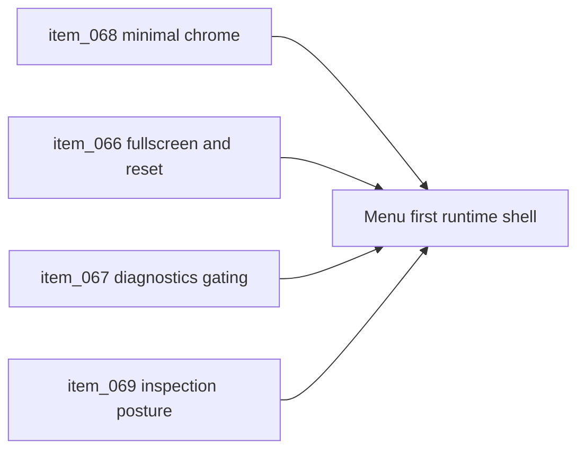

## task_025_orchestrate_runtime_overlay_simplification_around_a_floating_menu - Orchestrate runtime overlay simplification around a floating menu
> From version: 0.1.3
> Status: In Progress
> Understanding: 98%
> Confidence: 95%
> Progress: 90%
> Complexity: High
> Theme: UX
> Reminder: Update status/understanding/confidence/progress and dependencies/references when you edit this doc.

# Context
- Derived from backlog items `item_066_define_floating_shell_menu_actions_for_fullscreen_and_camera_reset`, `item_067_define_menu_driven_diagnostics_access_and_debug_gating`, `item_068_define_minimal_runtime_chrome_and_single_menu_trigger_baseline`, and `item_069_define_menu_driven_inspection_presentation_across_mobile_and_desktop`.
- Related request(s): `req_017_redesign_runtime_overlay_into_a_single_floating_menu`.
- The current runtime overlay still reflects an older panel-heavy posture, but the product direction now requires a world-first shell with one persistent menu trigger and optional tools revealed on demand.
- This orchestration task groups the shell simplification work needed to replace scattered controls and always-on panels with a coherent floating-menu model.

# Plan
- [x] 1. Replace persistent runtime chrome with a top-right menu trigger and remove redundant always-visible labels and cards from the baseline shell.
- [x] 2. Route `fullscreen` and `reset camera` through the floating shell menu while preserving current controller behavior.
- [x] 3. Move `diagnostics` and `inspecteur` behind the menu, with debug gating for diagnostics and breakpoint-specific inspection presentation.
- [x] 4. Validate the revised shell across mobile and desktop and update linked Logics docs.
- [x] FINAL: Update related Logics docs

# AC Traceability
- `item_068` -> The baseline runtime becomes menu-first and world-dominant instead of panel-heavy. Proof: `src/app/AppShell.tsx`, `src/app/styles/app.css`.
- `item_066` -> Fullscreen and reset-camera actions move into the floating shell menu. Proof: `src/app/components/ShellMenu.tsx`, `src/app/hooks/useFullscreenController.ts`, `src/game/camera/hooks/useCameraController.ts`, `src/app/AppShell.tsx`.
- `item_067` -> Diagnostics become menu-driven and remain debug-gated rather than player-facing by default. Proof: `src/game/debug/ShellDiagnosticsPanel.tsx`, `src/app/hooks/useShellPreferences.ts`, `src/app/AppShell.tsx`.
- `item_069` -> Inspection opens from the menu and adapts between desktop floating panel and mobile bottom sheet. Proof: `src/app/components/EntityInspectionPanel.tsx`, `src/app/styles/app.css`, `src/app/AppShell.tsx`.

# Decision framing
- Product framing: Required
- Product signals: navigation and discoverability
- Product follow-up: Keep the runtime severe about permanent chrome so later additions do not recreate the same clutter through the menu.
- Architecture framing: Required
- Architecture signals: runtime and boundaries, contracts and integration
- Architecture follow-up: Keep alignment with `adr_002`, `adr_006`, and `adr_007`.

# Links
- Product brief(s): `prod_001_minimal_overlay_and_feedback_for_early_runtime`, `prod_002_readable_world_traversal_and_presence`
- Architecture decision(s): `adr_002_separate_react_shell_from_pixi_runtime_ownership`, `adr_006_standardize_debug_first_runtime_instrumentation`, `adr_007_isolate_runtime_input_from_browser_page_controls`
- Backlog item(s): `item_066_define_floating_shell_menu_actions_for_fullscreen_and_camera_reset`, `item_067_define_menu_driven_diagnostics_access_and_debug_gating`, `item_068_define_minimal_runtime_chrome_and_single_menu_trigger_baseline`, `item_069_define_menu_driven_inspection_presentation_across_mobile_and_desktop`
- Request(s): `req_017_redesign_runtime_overlay_into_a_single_floating_menu`

# Validation
- `npm run lint`
- `npm run typecheck`
- `npm run test`
- `npm run build`
- `python3 logics/skills/logics-doc-linter/scripts/logics_lint.py`

# Definition of Done (DoD)
- [x] Scope implemented and acceptance criteria covered.
- [x] Validation commands executed and results captured.
- [x] The runtime exposes one persistent menu trigger and reveals optional tools only on demand.
- [x] Linked request/backlog/task docs updated.
- [ ] A dedicated git commit has been created for the completed orchestration scope.
- [ ] Status is `Done` and progress is `100%`.

# Report
- Replaced the panel-heavy top bar and persistent player HUD with a single top-right `ShellMenu` trigger that owns fullscreen, reset-camera, diagnostics, inspecteur, and optional install actions.
- Added menu-driven visibility control for the inspecteur and diagnostics, including persisted inspecteur visibility, explicit close actions on both panels, and a default-hidden diagnostics posture even in debug-capable environments.
- Shifted the shell overlay CSS to a floating-menu model with a desktop inspection card, a mobile bottom-sheet inspection posture, and diagnostics anchored independently from the menu trigger.
- Updated app-level coverage so the shell test now verifies the menu-first default state and on-demand reveal of inspecteur and diagnostics.
- Validation:
  `npm run lint`
  `npm run typecheck`
  `npm run test`
  `npm run build`
  `python3 logics/skills/logics-doc-linter/scripts/logics_lint.py`
- Residual note:
  `npm run build` still emits the existing `vendor-pixi` chunk-size warning, but the build completes successfully.
- Pending closure step:
  Create the dedicated implementation commit before promoting this task to `Done`.
