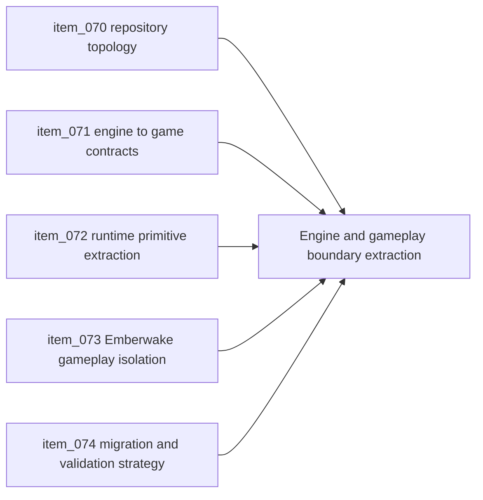

## task_026_orchestrate_engine_gameplay_boundary_extraction_for_runtime_reuse - Orchestrate engine gameplay boundary extraction for runtime reuse
> From version: 0.5.0
> Status: Done
> Understanding: 99%
> Confidence: 96%
> Progress: 100%
> Complexity: High
> Theme: Architecture
> Reminder: Update status/understanding/confidence/progress and dependencies/references when you edit this doc.

# Context
- Derived from backlog items `item_070_define_target_repository_topology_for_engine_runtime_and_game_modules`, `item_071_define_engine_to_game_contracts_for_update_render_and_input_integration`, `item_072_extract_reusable_runtime_primitives_from_current_game_modules`, `item_073_separate_emberwake_specific_gameplay_content_and_scenarios_from_runtime_code`, and `item_074_define_incremental_migration_and_validation_strategy_for_engine_gameplay_extraction`.
- Related request(s): `req_018_define_engine_and_gameplay_boundary_for_runtime_reuse`.
- The repository now needs an explicit engine-versus-gameplay boundary so Emberwake can keep shipping while the runtime foundation becomes reusable for later top-down 2D web games.
- This orchestration task groups the topology decision, contract definition, staged extraction, Emberwake isolation, and migration safety rules into one coordinated refactor plan.

# Dependencies
- Blocking: `task_014_orchestrate_entity_world_integration_and_debug_presentation`, `task_015_orchestrate_static_delivery_and_ci_hardening`, `task_018_orchestrate_simulation_cadence_debug_controls_and_performance_metrics`, `task_022_orchestrate_testing_browser_smoke_and_ci_execution_tiers`, `task_024_orchestrate_runtime_hardening_for_input_state_release_and_bundle_risk`.
- Unblocks: future gameplay expansion on a cleaner game layer, reuse of the runtime in later game projects, and safer long-term engine-facing refactors.

# Plan
- [x] 1. Define and document the target repository topology for `app shell`, `engine runtime`, and `Emberwake gameplay` ownership.
- [x] 2. Define the minimum engine-to-game contracts for initialization, update flow, input handoff, and render presentation.
- [x] 3. Extract the first stable runtime primitives behind engine-owned boundaries without introducing `engine -> game` dependencies.
- [x] 4. Move Emberwake-specific gameplay rules, scenario data, and content-facing modules behind game-owned boundaries.
- [x] 5. Execute the migration incrementally while keeping the current runtime buildable, testable, and release-safe.
- [x] 6. Validate CI, smoke, and release-readiness expectations throughout the staged extraction and update linked Logics docs.
- [x] FINAL: Create a dedicated git commit for this orchestration scope.

# AC Traceability
- `item_070` -> The repository exposes a concrete target topology for shell, engine, and game ownership. Proof target: repository structure, `README.md`, architecture docs, import paths.
- `item_071` -> Narrow engine-to-game contracts define initialization, update, input, and render boundaries. Proof target: engine bootstrap interfaces, game module entrypoints, runtime adapters, architecture docs.
- `item_072` -> Stable runtime primitives move behind engine-owned boundaries. Proof target: extracted camera, transform, input-math, runtime-surface, and related technical modules with updated tests.
- `item_073` -> Emberwake-specific gameplay, content, and scenario logic move behind game-owned boundaries. Proof target: Emberwake gameplay modules, content folders, scenario ownership, updated runtime wiring.
- `item_074` -> Migration phases, temporary dependency rules, and validation gates are explicit and enforced. Proof target: task plan, migration notes, CI results, smoke results, release-readiness validation.

# Request AC Traceability
- req_018_define_engine_and_gameplay_boundary_for_runtime_reuse coverage: AC1, AC10, AC11, AC12, AC2, AC3, AC4, AC5, AC6, AC7, AC8, AC9. Proof: `task_026_orchestrate_engine_gameplay_boundary_extraction_for_runtime_reuse` closes the linked request chain for `req_018_define_engine_and_gameplay_boundary_for_runtime_reuse` and carries the delivery evidence for `item_074_define_incremental_migration_and_validation_strategy_for_engine_gameplay_extraction`.

# Decision framing
- Product framing: Required
- Product signals: engagement loop, navigation and discoverability, conversion journey
- Product follow-up: Keep the refactor in service of gameplay delivery so Emberwake continues to evolve while the boundary becomes cleaner.
- Architecture framing: Required
- Architecture signals: runtime and boundaries, contracts and integration, delivery and operations
- Architecture follow-up: Capture the topology and contract decisions in architecture docs before or alongside broad code movement.

# Links
- Product brief(s): `prod_000_initial_single_entity_navigation_loop`, `prod_002_readable_world_traversal_and_presence`, `prod_003_high_density_top_down_survival_action_direction`
- Architecture decision(s): `adr_000_adopt_feature_oriented_organic_frontend_structure`, `adr_002_separate_react_shell_from_pixi_runtime_ownership`, `adr_003_define_coordinate_spaces_and_camera_contract`, `adr_004_run_simulation_on_a_fixed_timestep`, `adr_007_isolate_runtime_input_from_browser_page_controls`, `adr_012_require_curated_versioned_changelogs_for_releases`, `adr_013_use_a_dedicated_release_branch_for_deployable_static_releases`, `adr_014_adopt_a_modular_app_engine_game_topology_with_one_way_dependencies`, `adr_015_define_engine_to_game_runtime_contract_boundaries`
- Backlog item(s): `item_070_define_target_repository_topology_for_engine_runtime_and_game_modules`, `item_071_define_engine_to_game_contracts_for_update_render_and_input_integration`, `item_072_extract_reusable_runtime_primitives_from_current_game_modules`, `item_073_separate_emberwake_specific_gameplay_content_and_scenarios_from_runtime_code`, `item_074_define_incremental_migration_and_validation_strategy_for_engine_gameplay_extraction`
- Request(s): `req_018_define_engine_and_gameplay_boundary_for_runtime_reuse`

# Validation
- `npm run ci`
- `npm run test:browser:smoke`
- `npm run release:ready`
- `python3 logics/skills/logics-doc-linter/scripts/logics_lint.py`

# Definition of Done (DoD)
- [x] Covered backlog items are implemented or explicitly split further with updated traceability.
- [x] The repository has a concrete and documented boundary between app shell, reusable runtime, and Emberwake gameplay.
- [x] Engine-to-game contracts are explicit enough to prevent gameplay rules or content from drifting back into engine-owned modules.
- [x] The current playable runtime remains buildable and validated throughout the migration.
- [x] Linked request, backlog, task, and architecture docs are updated with proofs and status.
- [x] A dedicated git commit has been created for the completed orchestration scope.
- [x] Status is `Done` and progress is `100%`.

# Report
- Phase 1 materialized the target topology by adding first-class `apps/emberwake-web`, `packages/engine-core`, `packages/engine-pixi`, and `games/emberwake` entrypoints while keeping the current runtime behavior unchanged.
- Added path aliases in TypeScript, Vite, and Vitest so the new ownership zones can be referenced explicitly without broad relative-import churn.
- Introduced the first engine-owned runtime contract types in `packages/engine-core` and a first Emberwake-owned `GameModule` adapter in `games/emberwake` covering `initialize`, `mapInput`, `update`, and `present`.
- Rewired the runtime entry and selected runtime seams so the web app now boots from `apps/emberwake-web`, the simulation hook updates through the Emberwake game module, and runtime session defaults are sourced from the Emberwake game layer.
- Phase 2 extracted the first stable runtime primitives into engine-owned packages:
  - camera geometry and camera math now live in `packages/engine-core`
  - the Pixi error boundary now lives in `packages/engine-pixi`
  - legacy game-layer paths now act as compatibility re-export shims where needed
- Rewired the current runtime to consume engine-owned camera primitives in the camera hook, runtime surface, world types, and debug scenario bootstrap without changing visible behavior.
- Phase 3 moved Emberwake-owned scenario content into the game layer by relocating the official debug scenario and deterministic support-entity scenario builder into `games/emberwake/src/content/scenarios`, while preserving legacy import compatibility through re-export shims.
- Rewired Emberwake session bootstrapping, entity simulation, and runtime fixtures so current gameplay-facing scenario ownership now resolves from the game layer instead of the legacy `src/game/debug/data` location.
- Phase 4 started mechanical boundary enforcement by adding lint rules that forbid engine-owned packages from importing Emberwake game modules through `@game/*` or `@src/game/*` paths.
- Phase 5 extracted the first reusable Pixi runtime composition primitives into `packages/engine-pixi`:
  - `RuntimeCanvas` now owns the generic Pixi `Application` shell and runtime boundary composition
  - `WorldViewportContainer` now owns the reusable camera or viewport transform container for world-space Pixi scenes
- Rewired Emberwake `RuntimeSurface`, `WorldScene`, and `EntityScene` so game-owned rendering now composes engine-owned Pixi primitives instead of duplicating the same runtime shell and viewport math locally.
- Phase 6 extracted world or transform primitives into `packages/engine-core`:
  - world chunk identity and screen/world conversion helpers now live in engine-owned world contracts
  - camera-aware world-view math and picking helpers now live in engine-owned world-view modules
- Rewired runtime-facing consumers such as chunk visibility, world picking diagnostics, chunk labels, and selected-entity chunk reporting to use engine-owned world primitives directly, while preserving compatibility shims under `src/game/world/model`.
- Phase 7 extracted low-level virtual-stick geometry into `packages/engine-core`, so the engine now owns the raw stick resolution math while Emberwake keeps only the conversion from resolved geometry into gameplay `MovementIntent`.
- Phase 8 moved Emberwake-owned terrain and entity content definitions into `games/emberwake/src/content`, so debug terrain palettes, terrain ids, entity visuals, and archetype defaults now belong to the game layer instead of the legacy runtime path.
- Rewired scenario validation, chunk debug presentation, chunk generation typing, entity contracts, and debug scenario tests to resolve those content definitions from the Emberwake game layer while preserving compatibility shims in `src/game/world/data/worldData.ts` and `src/game/entities/data/entityData.ts`.
- Phase 9 moved Emberwake-specific chunk generation and chunk debug presentation data into `games/emberwake/src/content/world`, so world flavor thresholds, generated terrain composition, and debug tile colorization now belong to the game layer rather than the legacy `src/game/world/model` path.
- Rewired the world scene and compatibility model modules so the current runtime renders the same generated chunks while resolving generation and chunk debug data from the Emberwake game layer.
- Phase 10 moved the Emberwake entity contract into `games/emberwake/src/content/entities`, so the primary entity id, default archetype ownership, and generic mover factory now belong to the game layer instead of the legacy entity model path.
- Rewired Emberwake runtime composition and scenario builders to consume the game-owned entity contract directly while preserving a compatibility shim under `src/game/entities/model/entityContract.ts`.
- Phase 11 moved Emberwake entity simulation into `games/emberwake/src/runtime`, so the deterministic loop and simulated-entity typing now belong to the game layer instead of the legacy entity model path.
- Rewired the Emberwake runtime module and scenario helpers to consume game-owned simulation modules directly while preserving a compatibility shim under `src/game/entities/model/entitySimulation.ts`.
- Phase 12 moved the single-entity control contract into `games/emberwake/src/input`, so player-control ownership, keyboard bindings, movement-intent typing, and virtual-stick thresholds now belong to the game layer instead of the legacy input model path.
- Rewired Emberwake runtime simulation to consume the game-owned control contract directly while preserving a compatibility shim under `src/game/input/model/singleEntityControlContract.ts`.
- Validation passed with:
  - `npm run ci`
  - `npm run test:browser:smoke`
- Release-readiness guard validated with:
  - `npm run release:ready` blocks on `main` by design and must be rerun from the `release` branch before deployment promotion
- Closure note:
  - remaining `src/game/*` rendering, hooks, and diagnostics modules are intentionally kept as transitional feature adapters because they bind current shell composition to the extracted engine and Emberwake game modules without reintroducing `engine -> game` coupling
