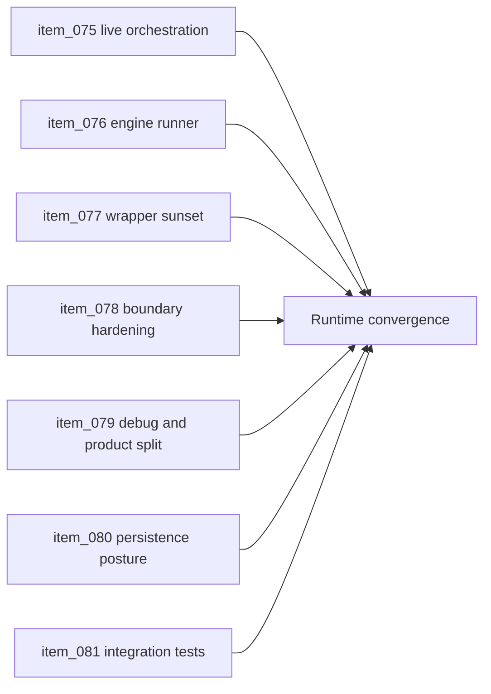

## task_027_orchestrate_runtime_convergence_and_modular_boundary_hardening - Orchestrate runtime convergence and modular boundary hardening
> From version: 0.1.2
> Status: Done
> Understanding: 98%
> Confidence: 95%
> Progress: 100%
> Complexity: High
> Theme: Architecture
> Reminder: Update status/understanding/confidence/progress and dependencies/references when you edit this doc.

# Context
- Derived from backlog items `item_075_route_live_runtime_through_engine_game_module_orchestration`, `item_076_extract_an_engine_owned_runtime_runner_for_fixed_step_input_update_and_present_flow`, `item_077_remove_or_sunset_transitional_runtime_wrappers_under_src_game`, `item_078_harden_public_module_boundaries_and_dependency_rules_across_app_engine_and_game`, `item_079_separate_debug_fixtures_from_product_runtime_defaults_and_scene_bootstrapping`, `item_080_define_domain_oriented_versioned_persistence_for_runtime_growth`, and `item_081_add_engine_to_game_integration_tests_for_runtime_contract_flow`.
- Related request(s): `req_019_complete_runtime_convergence_and_harden_modular_architecture_boundaries`.
- The repository already has the intended `app shell -> engine runtime -> Emberwake game` topology, but the live runtime still depends on transitional app-owned orchestration, soft package boundaries, and debug-first defaults in key places.
- This orchestration task groups the final convergence work needed to make the runtime architecture operational at its intended boundaries without interrupting current delivery discipline.

# Dependencies
- Blocking: `task_018_orchestrate_simulation_cadence_debug_controls_and_performance_metrics`, `task_020_orchestrate_persistence_and_reconstruction_boundaries`, `task_022_orchestrate_testing_browser_smoke_and_ci_execution_tiers`, `task_024_orchestrate_runtime_hardening_for_input_state_release_and_bundle_risk`, `task_026_orchestrate_engine_gameplay_boundary_extraction_for_runtime_reuse`.
- Unblocks: a product-facing non-debug bootstrap, safer gameplay-system growth on top of the modular runtime, stronger contract-level validation, and future performance or scene-architecture work on a cleaner base.

# Plan
- [x] 1. Route the live runtime through the engine-to-game contract so the active app no longer relies on parallel app-owned orchestration for the authoritative gameplay flow.
- [x] 2. Extract a narrow engine-owned runtime runner that owns fixed-step cadence and the `input -> mapInput -> update -> present` sequence while keeping React responsible for shell composition and overlays.
- [x] 3. Remove pure re-export wrappers under `src/game/*` and explicitly bound any remaining migration adapters that still need to exist temporarily.
- [x] 4. Harden public module boundaries and dependency rules across app, engine, and game modules so future additions do not recreate cross-import drift.
- [x] 5. Separate product runtime defaults from debug fixtures and debug-first bootstrapping while preserving developer tooling and existing fixture-driven validation.
- [x] 6. Define or implement a domain-oriented versioned persistence posture that remains local-first and static-hosting compatible.
- [x] 7. Add integration validation around the engine-to-game runtime contract, especially the `input -> mapInput -> update -> present` chain.
- [x] 8. Re-run quality gates and update linked Logics docs with the final convergence posture, residual risks, and follow-up splits if needed.
- [x] FINAL: Create a dedicated git commit for this orchestration scope.

# AC Traceability
- `item_075` -> The live runtime uses the engine-to-game contract as the authoritative orchestration path. Proof target: active runtime entry modules, `src/app/AppShell.tsx`, engine runner wiring, game-module integration.
- `item_076` -> A narrow engine-owned runtime runner owns cadence and contract flow. Proof target: `packages/engine-core`, timing orchestration modules, reduced app-owned loop logic.
- `item_077` -> Transitional wrappers are removed or explicitly bounded. Proof target: `src/game/*` cleanup, import graph review, remaining adapter notes.
- `item_078` -> Public interfaces and dependency rules are harder and more explicit. Proof target: package entrypoints, import rules, updated architecture notes, reduced deep-path imports.
- `item_079` -> Product runtime defaults are separated from debug fixtures and scene bootstrapping. Proof target: runtime bootstrap modules, fixture ownership, diagnostics compatibility.
- `item_080` -> Persistence is modeled as a clearer set of versioned domains. Proof target: storage modules, versioning posture, domain-specific state contracts, docs.
- `item_081` -> Integration tests validate the runtime contract chain near the engine-to-game boundary. Proof target: targeted integration tests, test organization, validation reports.

# Decision framing
- Product framing: Required
- Product signals: engagement loop, navigation and discoverability
- Product follow-up: Use the convergence work to prepare a real player-facing runtime bootstrap rather than extending the debug-first slice indefinitely.
- Architecture framing: Required
- Architecture signals: runtime and boundaries, contracts and integration, delivery and operations
- Architecture follow-up: Capture any durable dependency or runtime-runner decisions in architecture docs if the implementation crystallizes new repository-level rules.

# Links
- Product brief(s): `prod_000_initial_single_entity_navigation_loop`, `prod_003_high_density_top_down_survival_action_direction`
- Architecture decision(s): `adr_002_separate_react_shell_from_pixi_runtime_ownership`, `adr_004_run_simulation_on_a_fixed_timestep`, `adr_014_adopt_a_modular_app_engine_game_topology_with_one_way_dependencies`, `adr_015_define_engine_to_game_runtime_contract_boundaries`
- Backlog item(s): `item_075_route_live_runtime_through_engine_game_module_orchestration`, `item_076_extract_an_engine_owned_runtime_runner_for_fixed_step_input_update_and_present_flow`, `item_077_remove_or_sunset_transitional_runtime_wrappers_under_src_game`, `item_078_harden_public_module_boundaries_and_dependency_rules_across_app_engine_and_game`, `item_079_separate_debug_fixtures_from_product_runtime_defaults_and_scene_bootstrapping`, `item_080_define_domain_oriented_versioned_persistence_for_runtime_growth`, `item_081_add_engine_to_game_integration_tests_for_runtime_contract_flow`
- Request(s): `req_019_complete_runtime_convergence_and_harden_modular_architecture_boundaries`

# Validation
- `npm run ci`
- `npm run test:browser:smoke`
- `npm run release:ready:advisory`
- `python3 logics/skills/logics-doc-linter/scripts/logics_lint.py`

# Definition of Done (DoD)
- [x] Covered backlog items are implemented or explicitly split further with updated traceability.
- [x] The live runtime no longer depends on app-owned orchestration as its authoritative gameplay path.
- [x] A narrow engine-owned runtime runner exists or the equivalent ownership is clearly materialized at the engine boundary.
- [x] Transitional wrappers and soft-boundary imports are reduced to an explicitly bounded set.
- [x] Product runtime defaults are no longer structurally debug-first.
- [x] Persistence posture and contract-level integration validation are updated to match the converged architecture.
- [x] Linked request, backlog, task, and architecture docs are updated with proofs and status.
- [x] A dedicated git commit has been created for the completed orchestration scope.
- [x] Status is `Done` and progress is `100%`.

# Report
- Routed the live runtime through an engine-owned `RuntimeRunner` in [`packages/engine-core/src/runtime/runtimeRunner.ts`](/Users/alexandreagostini/Documents/emberwake/packages/engine-core/src/runtime/runtimeRunner.ts), and rewired [`useEntitySimulation.ts`](/Users/alexandreagostini/Documents/emberwake/src/game/entities/hooks/useEntitySimulation.ts) so the app now executes gameplay through `GameModule` instead of a React-local loop.
- Rewired [`AppShell.tsx`](/Users/alexandreagostini/Documents/emberwake/src/app/AppShell.tsx) to follow the game module presentation output for camera targeting, making `present` part of the live runtime path instead of an unused abstraction.
- Added a dedicated Emberwake runtime bootstrap in [`emberwakeRuntimeBootstrap.ts`](/Users/alexandreagostini/Documents/emberwake/games/emberwake/src/runtime/emberwakeRuntimeBootstrap.ts) and removed structural dependence on the official debug scenario for session defaults, player spawn, and support-entity bootstrapping.
- Removed pure wrapper files under `src/game/*` that no longer earned their keep and added lint rules preventing `games/emberwake` from depending on `@app/*` or legacy `@src/game/*` adapters.
- Refactored persistence around explicit versioned storage domains with [`storageDomain.ts`](/Users/alexandreagostini/Documents/emberwake/src/shared/lib/persistence/storageDomain.ts) and [`storageDomainCatalog.ts`](/Users/alexandreagostini/Documents/emberwake/src/shared/lib/persistence/storageDomainCatalog.ts), while preserving local-storage-first behavior.
- Added contract-level integration coverage in [`emberwakeRuntimeIntegration.test.ts`](/Users/alexandreagostini/Documents/emberwake/games/emberwake/src/runtime/emberwakeRuntimeIntegration.test.ts), covering both the `mapInput -> update -> present` chain and the engine-owned runner.
- Fixed a real runner edge case uncovered by integration testing: a first frame timestamp of `0` no longer prevents progression.
- Validation completed with:
  `npm run ci`
  `npm run test:browser:smoke`
  `npm run release:ready:advisory`
  `python3 logics/skills/logics-doc-linter/scripts/logics_lint.py`
- Residual note:
  the existing `vendor-pixi` chunk-size warning still appears during production builds and remains a follow-up performance concern rather than a release blocker.
- Delivery was split across staged commits:
  `1ab71c3 Route live runtime through engine runner`
  `04e0c8c Separate runtime bootstrap from debug fixtures`
  `46235ee Remove legacy runtime wrappers`
  `02e38f4 Refactor persistence into storage domains`
