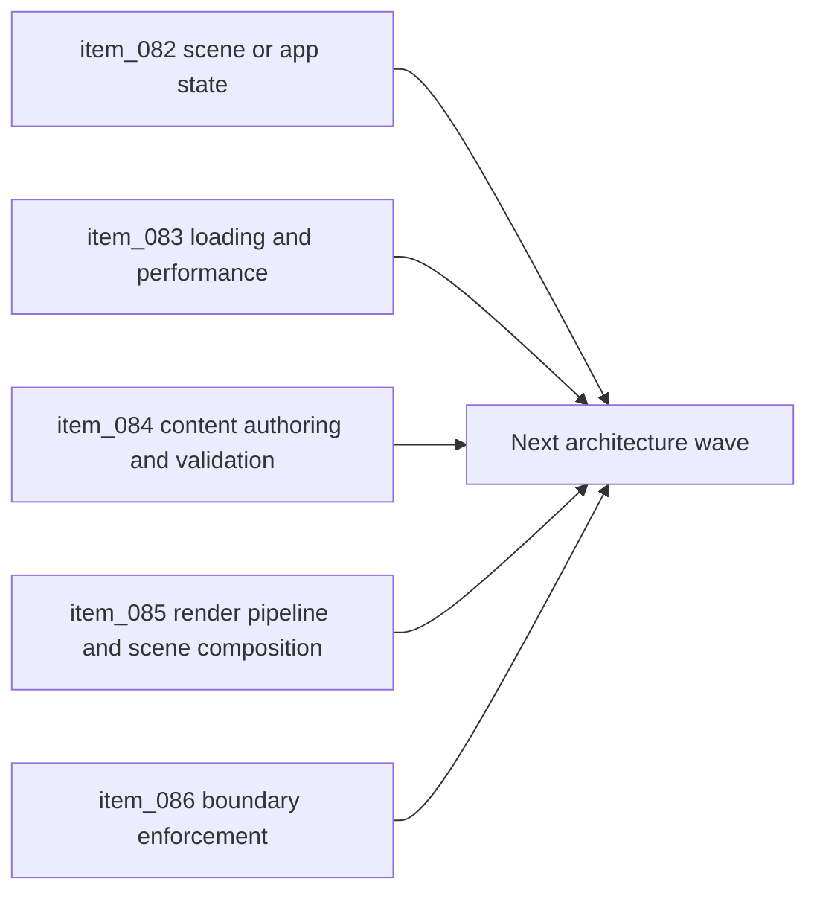

## task_028_orchestrate_the_next_architecture_wave_for_app_state_loading_content_rendering_and_boundary_enforcement - Orchestrate the next architecture wave for app state loading content rendering and boundary enforcement
> From version: 0.1.2
> Status: Ready
> Understanding: 98%
> Confidence: 95%
> Progress: 0%
> Complexity: High
> Theme: Architecture
> Reminder: Update status/understanding/confidence/progress and dependencies/references when you edit this doc.

# Context
- Derived from backlog items `item_082_define_scene_and_app_state_architecture_for_boot_flow_runtime_pause_and_meta_surfaces`, `item_083_define_runtime_loading_and_performance_architecture_for_pixi_mobile_startup_and_chunk_strategy`, `item_084_define_content_authoring_and_validation_architecture_for_gameplay_world_and_entity_data`, `item_085_define_render_pipeline_and_scene_composition_boundary_between_engine_pixi_and_game_visual_layers`, and `item_086_define_boundary_enforcement_strategy_for_public_modules_import_rules_and_architecture_regression_checks`.
- Related request(s): `req_020_define_the_next_architecture_wave_for_app_state_loading_content_rendering_and_boundary_enforcement`.
- The runtime core is now converged, but the next architecture risks have shifted outward into app-state structure, loading posture, content contracts, render-layer ownership, and boundary-regression prevention.
- This orchestration task groups those five architecture points into one coherent follow-up wave so the next implementation slices can build on a consistent direction instead of ad hoc local decisions.

# Dependencies
- Blocking: `task_027_orchestrate_runtime_convergence_and_modular_boundary_hardening`.
- Unblocks: future player-facing scene work, runtime-loading optimization, richer content systems, render-layer growth, and stronger architecture-regression prevention across app, engine, and game modules.

# Plan
- [ ] 1. Define a scene and app-state architecture for `boot`, `runtime`, `pause`, `failure`, `settings`, and equivalent meta-surfaces, with explicit ownership between shell state and gameplay runtime state.
- [ ] 2. Define a runtime-loading and performance architecture for Pixi startup, chunk or lazy-loading boundaries, and mobile-sensitive startup constraints.
- [ ] 3. Define a content-authoring and validation architecture for gameplay, world, entity, and scenario data, including id/reference posture and validation direction.
- [ ] 4. Define a render-pipeline and scene-composition boundary between engine-level Pixi adapters and game-owned visual layers.
- [ ] 5. Define a stronger boundary-enforcement strategy for public modules, import rules, and architecture-regression checks.
- [ ] 6. Split the resulting architecture wave into implementation-ready follow-up backlog or task slices where needed, and update linked Logics docs with the chosen posture.
- [ ] 7. Validate the resulting architecture docs and any implementation-safe outputs against current repository constraints and delivery posture.
- [ ] FINAL: Create a dedicated git commit for this orchestration scope.

# AC Traceability
- `item_082` -> Scene/app-state ownership is explicit for runtime and meta-surfaces. Proof target: architecture notes, scene model, app-shell ownership guidance.
- `item_083` -> Loading and startup posture are defined architecturally. Proof target: loading strategy docs, chunk or lazy-boundary guidance, mobile-startup constraints.
- `item_084` -> Content-authoring and validation posture are explicit. Proof target: content contracts, id/reference guidance, validation direction.
- `item_085` -> Render-layer ownership between engine and game is explicit. Proof target: render-pipeline notes, scene-composition model, visual-layer guidance.
- `item_086` -> Boundary-enforcement strategy is explicit and durable. Proof target: import-rule strategy, regression-check guidance, architecture-enforcement notes.

# Decision framing
- Product framing: Required
- Product signals: navigation and discoverability, conversion journey, engagement loop
- Product follow-up: Use this wave to keep future player-facing systems additive rather than structurally disruptive.
- Architecture framing: Required
- Architecture signals: runtime and boundaries, contracts and integration, delivery and operations
- Architecture follow-up: Keep the five architecture points coordinated so scene, loading, content, render, and enforcement decisions do not contradict one another.

# Links
- Product brief(s): `prod_000_initial_single_entity_navigation_loop`, `prod_003_high_density_top_down_survival_action_direction`
- Architecture decision(s): `adr_002_separate_react_shell_from_pixi_runtime_ownership`, `adr_004_run_simulation_on_a_fixed_timestep`, `adr_014_adopt_a_modular_app_engine_game_topology_with_one_way_dependencies`, `adr_015_define_engine_to_game_runtime_contract_boundaries`
- Backlog item(s): `item_082_define_scene_and_app_state_architecture_for_boot_flow_runtime_pause_and_meta_surfaces`, `item_083_define_runtime_loading_and_performance_architecture_for_pixi_mobile_startup_and_chunk_strategy`, `item_084_define_content_authoring_and_validation_architecture_for_gameplay_world_and_entity_data`, `item_085_define_render_pipeline_and_scene_composition_boundary_between_engine_pixi_and_game_visual_layers`, `item_086_define_boundary_enforcement_strategy_for_public_modules_import_rules_and_architecture_regression_checks`
- Request(s): `req_020_define_the_next_architecture_wave_for_app_state_loading_content_rendering_and_boundary_enforcement`

# Validation
- `python3 logics/skills/logics-doc-linter/scripts/logics_lint.py`

# Definition of Done (DoD)
- [ ] Covered backlog items are implemented or explicitly split further with updated traceability.
- [ ] The repository has a coherent next-phase architecture direction for scene state, loading posture, content contracts, render-layer ownership, and boundary enforcement.
- [ ] The resulting architecture wave remains compatible with the current runtime runner, game-module contract, static frontend posture, and release discipline.
- [ ] Linked request, backlog, task, and architecture docs are updated with proofs and status.
- [ ] A dedicated git commit has been created for the completed orchestration scope.
- [ ] Status is `Done` and progress is `100%`.
