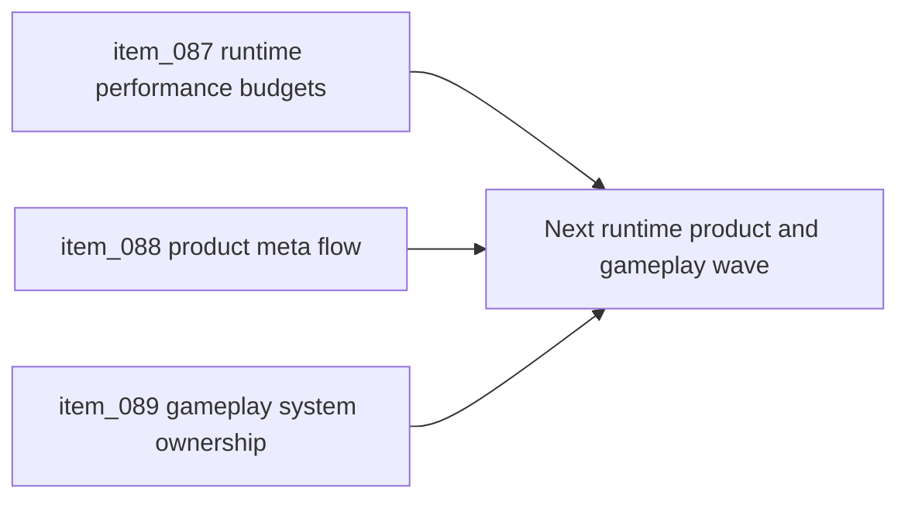

## task_029_orchestrate_runtime_performance_product_meta_flow_and_gameplay_system_architecture - Orchestrate runtime performance product meta flow and gameplay system architecture
> From version: 0.1.2
> Status: Ready
> Understanding: 98%
> Confidence: 95%
> Progress: 0%
> Complexity: High
> Theme: Architecture
> Reminder: Update status/understanding/confidence/progress and dependencies/references when you edit this doc.

# Context
- Derived from backlog items `item_087_define_runtime_performance_budgets_profiling_and_mobile_limits_for_shell_and_pixi_startup`, `item_088_define_product_meta_flow_architecture_for_pause_settings_failure_and_runtime_reentry`, and `item_089_define_gameplay_system_ownership_for_combat_status_effects_ai_and_progression`.
- Related request(s): `req_021_define_the_next_runtime_product_and_gameplay_system_architecture_wave`.
- The repository now has a structurally cleaner shell, runtime boundary, content posture, and render ownership model, but the next growth risks have shifted toward runtime cost control, player-facing meta-flow, and gameplay-system scale.
- This orchestration task groups those three architecture points into one coherent follow-up wave so the next product and gameplay slices do not reopen ambiguity through local performance hacks, shell drift, or ad hoc gameplay-system growth.

# Dependencies
- Blocking: `task_028_orchestrate_the_next_architecture_wave_for_app_state_loading_content_rendering_and_boundary_enforcement`.
- Unblocks: explicit performance budgeting, durable pause or failure product flow, and scalable gameplay-system growth for combat, AI, effects, and progression.

# Plan
- [ ] 1. Define runtime-performance budgets, profiling posture, and mobile-sensitive operating limits for shell startup and Pixi runtime activation.
- [ ] 2. Define the product meta-flow architecture for `pause`, `settings`, `failure`, and runtime re-entry, with explicit ownership between shell scenes and gameplay signals or state.
- [ ] 3. Define gameplay-system ownership for combat-adjacent logic, AI or autonomous logic, status or effect systems, progression-facing state, and their relation to update, presentation, content, and persistence seams.
- [ ] 4. Split the resulting architecture wave into implementation-ready follow-up backlog or task slices where needed, and update linked Logics docs with the chosen posture.
- [ ] 5. Validate the resulting architecture docs and any implementation-safe outputs against current repository constraints and delivery posture.
- [ ] FINAL: Create a dedicated git commit for this orchestration scope.

# AC Traceability
- `item_087` -> Runtime startup budgets, profiling posture, and mobile limits are explicit. Proof target: performance architecture notes, profiling strategy, budget definitions.
- `item_088` -> Product meta-flow ownership is explicit for pause, settings, failure, and runtime re-entry. Proof target: flow model, shell or gameplay ownership notes, recovery posture.
- `item_089` -> Gameplay-system ownership is explicit for combat, AI, status or effect systems, and progression-facing state. Proof target: ownership matrix, gameplay-system notes, system-boundary guidance.

# Decision framing
- Product framing: Required
- Product signals: conversion journey, navigation and discoverability, engagement loop
- Product follow-up: Use this wave to keep runtime cost, player-facing recovery flow, and future gameplay systems additive rather than structurally disruptive.
- Architecture framing: Required
- Architecture signals: delivery and operations, runtime and boundaries, contracts and integration
- Architecture follow-up: Keep performance, meta-flow, and gameplay-system ownership coordinated so future implementation waves do not optimize one layer by destabilizing the others.

# Links
- Product brief(s): `prod_000_initial_single_entity_navigation_loop`, `prod_003_high_density_top_down_survival_action_direction`
- Architecture decision(s): `adr_015_define_engine_to_game_runtime_contract_boundaries`, `adr_016_define_shell_scene_state_and_meta_surface_ownership`, `adr_017_lazy_load_pixi_runtime_behind_a_shell_owned_boot_boundary`, `adr_018_validate_emberwake_content_as_a_typed_cross_catalog_graph`, `adr_019_keep_engine_pixi_as_adapter_and_game_as_runtime_scene_composer`, `adr_020_enforce_architecture_boundaries_with_targeted_module_scoped_lint_rules`
- Backlog item(s): `item_087_define_runtime_performance_budgets_profiling_and_mobile_limits_for_shell_and_pixi_startup`, `item_088_define_product_meta_flow_architecture_for_pause_settings_failure_and_runtime_reentry`, `item_089_define_gameplay_system_ownership_for_combat_status_effects_ai_and_progression`
- Request(s): `req_021_define_the_next_runtime_product_and_gameplay_system_architecture_wave`

# Validation
- `python3 logics/skills/logics-doc-linter/scripts/logics_lint.py`

# Definition of Done (DoD)
- [ ] Covered backlog items are implemented or explicitly split further with updated traceability.
- [ ] The repository has a coherent next-phase architecture direction for runtime budgets, product meta-flow, and gameplay-system ownership.
- [ ] The resulting architecture wave remains compatible with the current shell-scene posture, runtime runner, game-module contract, static frontend posture, and release discipline.
- [ ] Linked request, backlog, task, and architecture docs are updated with proofs and status.
- [ ] A dedicated git commit has been created for the completed orchestration scope.
- [ ] Status is `Done` and progress is `100%`.
