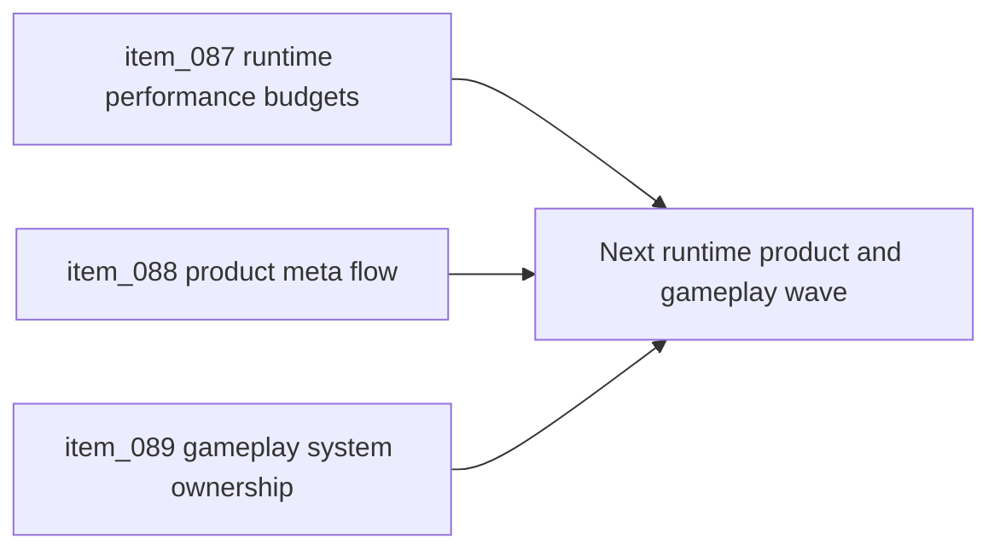

## task_029_orchestrate_runtime_performance_product_meta_flow_and_gameplay_system_architecture - Orchestrate runtime performance product meta flow and gameplay system architecture
> From version: 0.5.0
> Status: Done
> Understanding: 99%
> Confidence: 96%
> Progress: 100%
> Complexity: High
> Theme: Architecture
> Reminder: Update status/understanding/confidence/progress and dependencies/references when you edit this doc.

# Context
- Derived from backlog items `item_087_define_runtime_performance_budgets_profiling_and_mobile_limits_for_shell_and_pixi_startup`, `item_088_define_product_meta_flow_architecture_for_pause_settings_failure_and_runtime_reentry`, and `item_089_define_gameplay_system_ownership_for_combat_status_effects_ai_and_progression`.
- Related request(s): `req_021_define_the_next_runtime_product_and_gameplay_system_architecture_wave`.
- The repository now has a structurally cleaner shell, runtime boundary, content posture, and render ownership model, but the next growth risks have shifted toward runtime cost control, player-facing meta-flow, and gameplay-system scale.
- This orchestration task groups those three architecture points into one coherent follow-up wave so the next product and gameplay slices do not reopen ambiguity through local performance hacks, shell drift, or ad hoc gameplay-system growth.

# Dependencies
- Blocking: `task_028_orchestrate_the_next_architecture_wave_for_app_state_loading_content_rendering_and_boundary_enforcement`.
- Unblocks: explicit performance budgeting, durable pause or failure product flow, and scalable gameplay-system growth for combat, AI, effects, and progression.

# Plan
- [x] 1. Define runtime-performance budgets, profiling posture, and mobile-sensitive operating limits for shell startup and Pixi runtime activation.
- [x] 2. Define the product meta-flow architecture for `pause`, `settings`, `failure`, and runtime re-entry, with explicit ownership between shell scenes and gameplay signals or state.
- [x] 3. Define gameplay-system ownership for combat-adjacent logic, AI or autonomous logic, status or effect systems, progression-facing state, and their relation to update, presentation, content, and persistence seams.
- [x] 4. Split the resulting architecture wave into implementation-ready follow-up backlog or task slices where needed, and update linked Logics docs with the chosen posture.
- [x] 5. Validate the resulting architecture docs and any implementation-safe outputs against current repository constraints and delivery posture.
- [x] FINAL: Create a dedicated git commit for this orchestration scope.

# AC Traceability
- `item_087` -> Runtime startup budgets, profiling posture, and mobile limits are explicit. Proof target: performance architecture notes, profiling strategy, budget definitions.
- `item_088` -> Product meta-flow ownership is explicit for pause, settings, failure, and runtime re-entry. Proof target: flow model, shell or gameplay ownership notes, recovery posture.
- `item_089` -> Gameplay-system ownership is explicit for combat, AI, status or effect systems, and progression-facing state. Proof target: ownership matrix, gameplay-system notes, system-boundary guidance.

# Request AC Traceability
- req_021_define_the_next_runtime_product_and_gameplay_system_architecture_wave coverage: AC1, AC2, AC3, AC4, AC5, AC6, AC7. Proof: `task_029_orchestrate_runtime_performance_product_meta_flow_and_gameplay_system_architecture` closes the linked request chain for `req_021_define_the_next_runtime_product_and_gameplay_system_architecture_wave` and carries the delivery evidence for `item_089_define_gameplay_system_ownership_for_combat_status_effects_ai_and_progression`.

# Decision framing
- Product framing: Required
- Product signals: conversion journey, navigation and discoverability, engagement loop
- Product follow-up: Use this wave to keep runtime cost, player-facing recovery flow, and future gameplay systems additive rather than structurally disruptive.
- Architecture framing: Required
- Architecture signals: delivery and operations, runtime and boundaries, contracts and integration
- Architecture follow-up: Keep performance, meta-flow, and gameplay-system ownership coordinated so future implementation waves do not optimize one layer by destabilizing the others.

# Links
- Product brief(s): `prod_000_initial_single_entity_navigation_loop`, `prod_003_high_density_top_down_survival_action_direction`
- Architecture decision(s): `adr_015_define_engine_to_game_runtime_contract_boundaries`, `adr_016_define_shell_scene_state_and_meta_surface_ownership`, `adr_017_lazy_load_pixi_runtime_behind_a_shell_owned_boot_boundary`, `adr_018_validate_emberwake_content_as_a_typed_cross_catalog_graph`, `adr_019_keep_engine_pixi_as_adapter_and_game_as_runtime_scene_composer`, `adr_020_enforce_architecture_boundaries_with_targeted_module_scoped_lint_rules`, `adr_021_define_runtime_performance_budgets_and_profiling_at_the_shell_to_runtime_boundary`, `adr_022_keep_product_meta_flow_shell_owned_while_runtime_state_remains_game_preserved`, `adr_023_model_gameplay_systems_as_game_owned_state_slices_around_the_game_module`
- Backlog item(s): `item_087_define_runtime_performance_budgets_profiling_and_mobile_limits_for_shell_and_pixi_startup`, `item_088_define_product_meta_flow_architecture_for_pause_settings_failure_and_runtime_reentry`, `item_089_define_gameplay_system_ownership_for_combat_status_effects_ai_and_progression`
- Request(s): `req_021_define_the_next_runtime_product_and_gameplay_system_architecture_wave`

# Validation
- `python3 logics/skills/logics-doc-linter/scripts/logics_lint.py`

# Definition of Done (DoD)
- [x] Covered backlog items are implemented or explicitly split further with updated traceability.
- [x] The repository has a coherent next-phase architecture direction for runtime budgets, product meta-flow, and gameplay-system ownership.
- [x] The resulting architecture wave remains compatible with the current shell-scene posture, runtime runner, game-module contract, static frontend posture, and release discipline.
- [x] Linked request, backlog, task, and architecture docs are updated with proofs and status.
- [x] A dedicated git commit has been created for the completed orchestration scope.
- [x] Status is `Done` and progress is `100%`.

# Report
- Added repository-owned runtime performance budgets in `src/shared/config/runtimePerformanceBudget.json` and wired them into `src/shared/constants/performanceBudget.ts`, so shell startup, lazy runtime activation, and mobile-sensitive expectations now share one contract.
- Added `scripts/performance/validateRuntimeBudgets.mjs` and extended `scripts/testing/runBrowserSmoke.mjs` so build validation and browser smoke both enforce the shell-to-runtime performance boundary.
- Extended `src/app/hooks/useRendererHealth.ts`, `src/app/AppShell.tsx`, and `src/game/debug/ShellDiagnosticsPanel.tsx` so runtime activation metrics are observable in diagnostics and testable through browser automation.
- Added `src/app/components/AppMetaScenePanel.tsx` and rewired `src/app/AppShell.tsx`, `src/app/components/ShellMenu.tsx`, `src/app/components/RuntimeSceneBoundary.tsx`, `src/app/hooks/useShellPreferences.ts`, and `src/shared/lib/shellPreferencesStorage.ts` so `pause`, `settings`, and runtime re-entry stay shell-owned while preserving the live runtime session.
- Added explicit `pause()` support to `packages/engine-core/src/runtime/runtimeRunner.ts` and updated `src/game/entities/hooks/useEntitySimulation.ts` so meta-flow transitions hold or resume the engine-owned runner without recreating gameplay state.
- Added `games/emberwake/src/systems/gameplaySystems.ts` plus tests and integrated those slices into `games/emberwake/src/runtime/emberwakeGameModule.ts`, so autonomy, combat, progression, and status-effect ownership now sit inside game-owned state rather than leaking into ad hoc runtime code.
- Added accepted ADRs `adr_021` through `adr_023` so runtime budgeting, product meta-flow, and gameplay-system ownership are explicit repository decisions.
- Validation completed with:
  `npm run ci`
  `npm run test:browser:smoke`
  `npm run release:ready:advisory`
  `python3 logics/skills/logics-doc-linter/scripts/logics_lint.py`
- Delivery was split across staged commits:
  `9f68e4b Add runtime performance budgets and validation`
  `7afd728 Add shell meta flow and runtime reentry`
  `3bbd993 Define gameplay system ownership seams`
