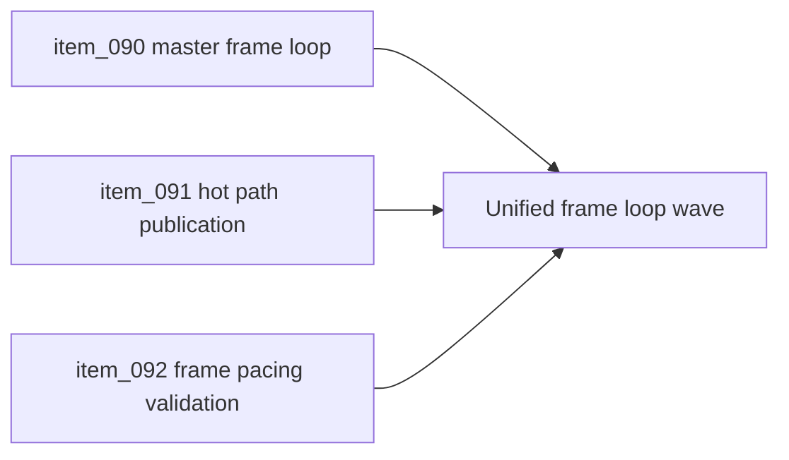

## task_030_orchestrate_unified_frame_loop_architecture_for_runtime_stability_and_render_scheduling - Orchestrate unified frame loop architecture for runtime stability and render scheduling
> From version: 0.1.2
> Status: Ready
> Understanding: 98%
> Confidence: 95%
> Progress: 0%
> Complexity: High
> Theme: Architecture
> Reminder: Update status/understanding/confidence/progress and dependencies/references when you edit this doc.

# Context
- Derived from backlog items `item_090_define_the_target_master_frame_loop_between_runtime_runner_presentation_and_pixi_render_submission`, `item_091_define_hot_path_state_publication_rules_between_runtime_shell_and_diagnostics_surfaces`, and `item_092_define_frame_pacing_profiling_and_validation_for_unified_runtime_scheduling`.
- Related request(s): `req_022_define_a_unified_frame_loop_architecture_for_runtime_stability_and_render_scheduling`.
- The repository now has a converged runtime runner, shell-owned runtime boundary, startup-performance budgets, and explicit gameplay-system seams, but mild frame-pacing instability can still emerge because update and render cadence are not yet owned by one explicit scheduling model.
- This orchestration task groups the master frame-loop decision, hot-path state-publication rules, and frame-pacing proof posture into one coherent architecture wave so runtime smoothness work does not devolve into isolated local optimizations.

# Dependencies
- Blocking: `task_029_orchestrate_runtime_performance_product_meta_flow_and_gameplay_system_architecture`.
- Unblocks: unified runtime scheduling, cleaner hot-path publication boundaries, and measurable frame-pacing validation for future rendering and gameplay-density growth.

# Plan
- [ ] 1. Define the target master frame loop between the runtime runner, presentation derivation, and Pixi render submission, including authoritative clock ownership and fixed-step compatibility.
- [ ] 2. Define hot-path state-publication rules between runtime state, shell surfaces, and diagnostics so loop unification is not undermined by avoidable React publication churn.
- [ ] 3. Define frame-pacing profiling and validation posture so the repository can compare the current dual-loop runtime against the target unified scheduling model with repeatable evidence.
- [ ] 4. Split the resulting architecture wave into implementation-ready follow-up backlog or task slices where needed, and update linked Logics docs with the chosen posture.
- [ ] 5. Validate the resulting architecture docs and any implementation-safe outputs against current repository constraints and delivery posture.
- [ ] FINAL: Create a dedicated git commit for this orchestration scope.

# AC Traceability
- `item_090` -> The target master frame loop is explicit. Proof target: frame-phase model, ownership notes, scheduling decision.
- `item_091` -> Hot-path state-publication rules are explicit. Proof target: shell-versus-runtime consumer matrix, publication guidance, diagnostics posture.
- `item_092` -> Frame-pacing profiling and validation posture is explicit. Proof target: profiling strategy, evidence targets, repeatable validation path.

# Decision framing
- Product framing: Required
- Product signals: engagement loop
- Product follow-up: Use this wave to improve runtime smoothness before denser gameplay systems, richer overlays, and more expensive visual composition arrive.
- Architecture framing: Required
- Architecture signals: runtime and boundaries, contracts and integration, delivery and operations
- Architecture follow-up: Keep scheduling ownership, hot-path publication, and performance proof aligned so loop unification remains a coherent architecture move rather than a set of isolated tweaks.

# Links
- Product brief(s): `prod_000_initial_single_entity_navigation_loop`, `prod_003_high_density_top_down_survival_action_direction`
- Architecture decision(s): `adr_015_define_engine_to_game_runtime_contract_boundaries`, `adr_017_lazy_load_pixi_runtime_behind_a_shell_owned_boot_boundary`, `adr_019_keep_engine_pixi_as_adapter_and_game_as_runtime_scene_composer`, `adr_021_define_runtime_performance_budgets_and_profiling_at_the_shell_to_runtime_boundary`, `adr_022_keep_product_meta_flow_shell_owned_while_runtime_state_remains_game_preserved`, `adr_023_model_gameplay_systems_as_game_owned_state_slices_around_the_game_module`
- Backlog item(s): `item_090_define_the_target_master_frame_loop_between_runtime_runner_presentation_and_pixi_render_submission`, `item_091_define_hot_path_state_publication_rules_between_runtime_shell_and_diagnostics_surfaces`, `item_092_define_frame_pacing_profiling_and_validation_for_unified_runtime_scheduling`
- Request(s): `req_022_define_a_unified_frame_loop_architecture_for_runtime_stability_and_render_scheduling`

# Validation
- `python3 logics/skills/logics-doc-linter/scripts/logics_lint.py`

# Definition of Done (DoD)
- [ ] Covered backlog items are implemented or explicitly split further with updated traceability.
- [ ] The repository has a coherent architecture direction for unified frame scheduling, hot-path publication boundaries, and frame-pacing validation.
- [ ] The resulting architecture wave remains compatible with the current shell-scene posture, runtime runner, `GameModule` contract, Pixi-adapter ownership, static frontend posture, and release discipline.
- [ ] Linked request, backlog, task, and architecture docs are updated with proofs and status.
- [ ] A dedicated git commit has been created for the completed orchestration scope.
- [ ] Status is `Done` and progress is `100%`.
