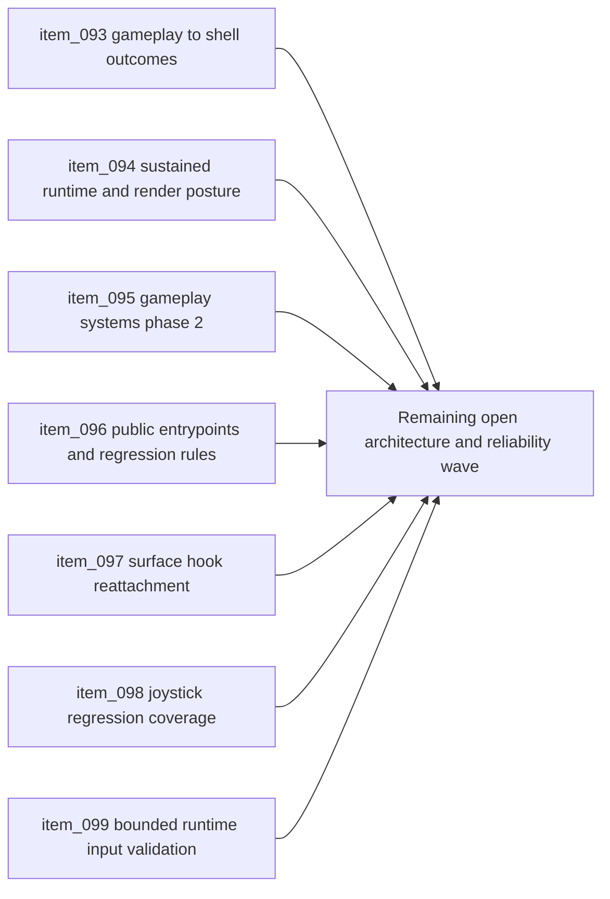

## task_031_orchestrate_the_remaining_open_architecture_and_runtime_input_reliability_wave - Orchestrate the remaining open architecture and runtime input reliability wave
> From version: 0.5.0
> Status: Done
> Understanding: 99%
> Confidence: 96%
> Progress: 100%
> Complexity: High
> Theme: Architecture
> Reminder: Update status/understanding/confidence/progress and dependencies/references when you edit this doc.

# Context
- Derived from backlog items `item_093_define_gameplay_to_shell_outcome_contracts_for_defeat_victory_restart_and_runtime_recovery`, `item_094_define_sustained_runtime_performance_and_render_phase_two_architecture_for_density_redraw_and_debug_budgeting`, `item_095_define_gameplay_system_phase_two_ownership_for_ordered_phases_signals_and_progression_scale`, `item_096_define_public_entrypoint_hardening_and_architecture_regression_rules_for_app_engine_and_game_modules`, `item_097_restore_surface_bound_interaction_hooks_to_attach_after_lazy_runtime_mount`, `item_098_add_regression_coverage_for_mobile_joystick_and_surface_interactions_after_delayed_surface_availability`, and `item_099_validate_runtime_surface_input_reliability_without_reopening_input_ownership_design`.
- Related request(s): `req_023_define_the_next_runtime_shell_render_and_system_boundary_architecture_wave`, `req_024_restore_runtime_surface_input_binding_reliability_after_lazy_mount`.
- The repository has already converged on shell ownership, runtime modularity, gameplay-system seams, and unified frame scheduling, but the remaining open backlog now clusters into two connected concerns:
  - the next growth-layer architecture above the runtime core
  - the immediate runtime-surface input reliability correction exposed by lazy mount timing
- This orchestration task intentionally groups those still-open items so the repo can close the current open backlog with one coherent wave instead of splitting architecture growth and corrective runtime reliability into disconnected local work.

# Dependencies
- Blocking: `task_030_orchestrate_unified_frame_loop_architecture_for_runtime_stability_and_render_scheduling`.
- Unblocks: gameplay-to-shell outcome flow, sustained runtime and render posture, gameplay-system scale phase 2, stronger module entrypoint enforcement, and restored joystick or surface interaction reliability after lazy runtime mount.

# Plan
- [x] 1. Define and implement a gameplay-to-shell outcome contract for defeat, victory, restart-needed, recovery, and equivalent runtime outcomes without leaking shell semantics into gameplay internals.
- [x] 2. Define and implement the sustained runtime-performance and render phase-two posture, including density growth, redraw policy, and debug-surface budgeting where required by the current runtime.
- [x] 3. Define and implement gameplay-system phase-two ownership for ordered phases, narrow signals, and progression-scale growth while keeping compatibility with the current `GameModule` posture.
- [x] 4. Define and implement stronger public entrypoint and architecture-regression enforcement for `app`, `engine-core`, `engine-pixi`, and `games/emberwake`.
- [x] 5. Restore reliable runtime-surface interaction binding after lazy runtime mount, covering the mobile joystick path and other hooks that attach directly to the runtime surface.
- [x] 6. Add regression coverage and bounded validation proving that delayed runtime-surface availability no longer breaks joystick or adjacent surface-bound interactions.
- [x] 7. Update linked request, backlog, task, and architecture docs with the resulting posture, proofs, and traceability.
- [x] 8. Validate the full wave against current repository delivery constraints.
- [x] FINAL: Create dedicated git commit(s) for this orchestration scope.

# AC Traceability
- `item_093` -> Gameplay-to-shell outcome contracts are explicit. Proof target: outcome model, ownership notes, shell consumption posture.
- `item_094` -> Sustained runtime and render phase-two posture is explicit. Proof target: density, redraw, and debug-budget architecture guidance.
- `item_095` -> Gameplay-system phase-two ownership is explicit. Proof target: ordered phases, narrow signal posture, system responsibility split.
- `item_096` -> Public entrypoint hardening and architecture-regression rules are explicit. Proof target: entrypoint posture, lint or check strategy, module-boundary guidance.
- `item_097` -> Surface-bound hooks reliably attach after lazy runtime mount. Proof target: corrected surface-subscription behavior across affected hooks.
- `item_098` -> Regression coverage exists for delayed surface availability. Proof target: focused automated tests covering joystick and adjacent surface interactions.
- `item_099` -> Validation remains bounded and aligned with the current input model. Proof target: targeted repo validation path and correction closure criteria.

# Request AC Traceability
- req_023_define_the_next_runtime_shell_render_and_system_boundary_architecture_wave coverage: AC1, AC2, AC3, AC4, AC5, AC6. Proof: `task_031_orchestrate_the_remaining_open_architecture_and_runtime_input_reliability_wave` closes the linked request chain for `req_023_define_the_next_runtime_shell_render_and_system_boundary_architecture_wave` and carries the delivery evidence for `item_096_define_public_entrypoint_hardening_and_architecture_regression_rules_for_app_engine_and_game_modules`.

# Decision framing
- Product framing: Required
- Product signals: input responsiveness, engagement loop, session outcomes
- Product follow-up: Use this wave to keep future gameplay growth and immediate control reliability aligned with the player-facing runtime instead of forcing tradeoffs between architecture and responsiveness.
- Architecture framing: Required
- Architecture signals: runtime and boundaries, contracts and integration, delivery and operations
- Architecture follow-up: Close the remaining open backlog with one coherent direction so outcome flow, performance posture, system scale, boundary enforcement, and runtime input reliability do not drift apart.

# Links
- Product brief(s): `prod_000_initial_single_entity_navigation_loop`, `prod_003_high_density_top_down_survival_action_direction`
- Architecture decision(s): `adr_015_define_engine_to_game_runtime_contract_boundaries`, `adr_016_define_shell_scene_state_and_meta_surface_ownership`, `adr_017_lazy_load_pixi_runtime_behind_a_shell_owned_boot_boundary`, `adr_019_keep_engine_pixi_as_adapter_and_game_as_runtime_scene_composer`, `adr_020_enforce_architecture_boundaries_with_targeted_module_scoped_lint_rules`, `adr_022_keep_product_meta_flow_shell_owned_while_runtime_state_remains_game_preserved`, `adr_023_model_gameplay_systems_as_game_owned_state_slices_around_the_game_module`, `adr_024_drive_live_runtime_from_the_pixi_visual_frame_while_engine_keeps_fixed_step_authority`, `adr_025_keep_shell_chrome_event_driven_and_sample_diagnostics_off_the_runtime_hot_path`, `adr_026_validate_unified_runtime_scheduling_with_frame_pacing_telemetry_and_browser_smoke`, `adr_027_expose_gameplay_outcomes_as_a_game_owned_shell_consumable_contract`, `adr_028_budget_player_runtime_and_debug_visuals_as_separate_render_modes`, `adr_029_model_phase_two_gameplay_systems_with_ordered_phases_and_narrow_signals`, `adr_030_harden_public_package_entrypoints_with_targeted_deep_import_rules`, `adr_031_bind_runtime_surface_interactions_to_resolved_elements_after_lazy_mount`
- Backlog item(s): `item_093_define_gameplay_to_shell_outcome_contracts_for_defeat_victory_restart_and_runtime_recovery`, `item_094_define_sustained_runtime_performance_and_render_phase_two_architecture_for_density_redraw_and_debug_budgeting`, `item_095_define_gameplay_system_phase_two_ownership_for_ordered_phases_signals_and_progression_scale`, `item_096_define_public_entrypoint_hardening_and_architecture_regression_rules_for_app_engine_and_game_modules`, `item_097_restore_surface_bound_interaction_hooks_to_attach_after_lazy_runtime_mount`, `item_098_add_regression_coverage_for_mobile_joystick_and_surface_interactions_after_delayed_surface_availability`, `item_099_validate_runtime_surface_input_reliability_without_reopening_input_ownership_design`
- Request(s): `req_023_define_the_next_runtime_shell_render_and_system_boundary_architecture_wave`, `req_024_restore_runtime_surface_input_binding_reliability_after_lazy_mount`

# Validation
- `npm run ci`
- `npm run test:browser:smoke`
- `npm run release:ready:advisory`
- `python3 logics/skills/logics-doc-linter/scripts/logics_lint.py`

# Definition of Done (DoD)
- [x] Covered backlog items are implemented or explicitly split further with updated traceability.
- [x] The repository has a coherent direction for gameplay-to-shell outcomes, sustained runtime and render posture, gameplay-system phase-two growth, and public entrypoint hardening.
- [x] Runtime-surface input binding is reliable again after lazy runtime mount, including the mobile joystick path.
- [x] Focused regression coverage and bounded validation prove the correction without reopening broader input-ownership redesign.
- [x] Linked request, backlog, task, and architecture docs are updated with proofs and status.
- [x] Dedicated git commit(s) have been created for the completed orchestration scope.
- [x] Status is `Done` and progress is `100%`.

# Report
- Restored lazy-mounted runtime-surface interaction reliability by routing the resolved surface element through `packages/engine-pixi/src/components/RuntimeCanvas.tsx` and rebinding joystick, camera, diagnostics, and guard hooks from actual mounted elements instead of assuming `ref.current` existed on the first effect pass.
- Added focused regression coverage in `src/game/input/hooks/useMobileVirtualStick.test.tsx` and extended `src/game/camera/hooks/useCameraController.test.tsx` so delayed surface availability is now automated and the joystick bug is harder to reintroduce.
- Added a game-owned `GameplayShellOutcome` contract in `games/emberwake/src/systems/gameplayOutcome.ts`, published it through `games/emberwake/src/runtime/emberwakeGameModule.ts`, and taught the shell scene model to consume it through `src/app/model/appScene.ts`, `src/app/hooks/useAppScene.ts`, and `src/app/components/AppMetaScenePanel.tsx`.
- Added a phase-two gameplay systems posture in `games/emberwake/src/systems/gameplaySystems.ts` with explicit phase order, narrow signals, lifecycle tracking, and shell-outcome compatibility while keeping the current live slice on the idle outcome by default.
- Added a game-owned render-performance contract in `games/emberwake/src/presentation/emberwakeRenderPerformance.ts` and routed `player` versus `diagnostics` modes through `src/game/render/RuntimeSurface.tsx`, `src/game/world/render/WorldScene.tsx`, and `src/game/entities/render/EntityScene.tsx` so debug labels and grids are degraded outside diagnostics mode.
- Hardened public-entrypoint posture through bare `@engine`, `@engine-pixi`, and `@game` TypeScript entrypoints plus targeted ESLint deep-import rules for app-shell and render-boundary consumers.
- Added accepted ADRs `adr_027` through `adr_031` so outcome flow, render budgeting, gameplay-system phase ordering, public entrypoint hardening, and lazy-mounted surface interaction reliability are explicit repository decisions.
- Validation completed with:
  `npm run ci`
  `npm run test:browser:smoke`
  `npm run release:ready:advisory`
  `python3 logics/skills/logics-doc-linter/scripts/logics_lint.py`
- Delivery was split across staged commits:
  `d9d0979 Restore lazy-mounted runtime surface interactions`
  `caad51b Add gameplay shell outcomes and render phase 2 seams`
