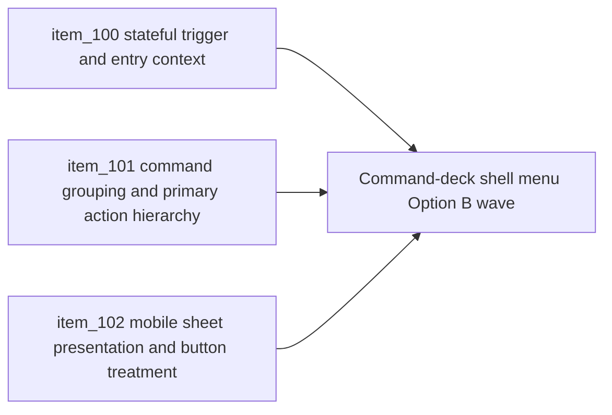

## task_032_orchestrate_command_deck_shell_menu_option_b_for_runtime_controls - Orchestrate command-deck shell menu Option B for runtime controls
> From version: 0.5.0
> Status: Done
> Understanding: 100%
> Confidence: 97%
> Progress: 100% (docs synced)
> Complexity: Medium
> Theme: UX
> Reminder: Update status/understanding/confidence/progress and dependencies/references when you edit this doc.

# Context
- Derived from backlog items `item_100_define_stateful_shell_menu_trigger_and_context_header_for_runtime_status`, `item_101_define_command_deck_grouping_and_primary_action_hierarchy_for_shell_menu_option_b`, and `item_102_define_mobile_sheet_presentation_and_button_treatment_for_shell_menu_option_b`.
- Related request(s): `req_025_define_a_command_deck_shell_menu_and_button_hierarchy_for_runtime_option_b`.
- The repository already simplified the runtime overlay around a floating menu and now has a cleaner shell posture, but the current shell menu still reads as a technically tidy list rather than a deliberate command surface.
- The remaining UX gap is no longer overlay clutter. It is command hierarchy: the trigger is too generic, the opened panel needs stronger entry context, primary and utility actions compete with similar weight, and the mobile opened-menu posture still feels closer to a compressed desktop popover than to a touch-first control sheet.
- This orchestration task groups the next shell UX refinement into one coherent wave so trigger posture, menu hierarchy, and mobile treatment evolve together rather than through disconnected styling tweaks.

# Dependencies
- Blocking: `task_025_orchestrate_runtime_overlay_simplification_around_a_floating_menu`, `task_031_orchestrate_the_remaining_open_architecture_and_runtime_input_reliability_wave`.
- Unblocks: a more legible shell command surface, stronger runtime-state signaling in the shell, and a more product-ready control posture across mobile and desktop.

# Plan
- [x] 1. Define and implement a stateful shell-menu trigger and contextual entry treatment so the menu communicates runtime or shell status before the user parses command rows.
- [x] 2. Define and implement the command-deck grouping model, including a primary current-state action and clearer priority separation between session commands, view controls, and debug or utility tools.
- [x] 3. Define and implement the mobile opened-menu posture as a more intentional sheet with touch-appropriate row and button treatment while keeping the trigger stable.
- [x] 4. Update shell UX copy, styling, and interaction notes so the resulting menu reads as a deliberate control surface rather than a flat action list.
- [x] 5. Update linked request, backlog, task, and any architecture-adjacent docs needed to preserve traceability for the new shell posture.
- [x] 6. Validate the resulting UX wave against current repository delivery constraints and responsive shell behavior.
- [x] FINAL: Create dedicated git commit(s) for this orchestration scope.

# AC Traceability
- `item_100` -> Stateful trigger and entry context are explicit. Proof target: trigger state mapping, first-entry structure, status copy.
- `item_101` -> Command grouping and primary-action hierarchy are explicit. Proof target: menu IA, CTA treatment, priority differentiation across commands.
- `item_102` -> Mobile sheet posture and button treatment are explicit. Proof target: responsive panel behavior, touch sizing, mobile-specific control treatment.

# Request AC Traceability
- req_025_define_a_command_deck_shell_menu_and_button_hierarchy_for_runtime_option_b coverage: AC1, AC2, AC3, AC4, AC5, AC6, AC7, AC8, AC9. Proof: `task_032_orchestrate_command_deck_shell_menu_option_b_for_runtime_controls` closes the linked request chain for `req_025_define_a_command_deck_shell_menu_and_button_hierarchy_for_runtime_option_b` and carries the delivery evidence for `item_102_define_mobile_sheet_presentation_and_button_treatment_for_shell_menu_option_b`.

# Decision framing
- Product framing: Required
- Product signals: usability, clarity, and runtime control confidence
- Product follow-up: Use this wave to make the shell feel intentional and readable at the moment of interaction instead of leaving users to decode a flat control list.
- Architecture framing: Supporting
- Architecture signals: shell chrome and scene-owned controls
- Architecture follow-up: Improve the shell command surface without reopening shell ownership, runtime ownership, or gameplay/HUD architecture that is already converged.

# Links
- Product brief(s): `prod_001_minimal_overlay_and_feedback_for_early_runtime`
- Architecture decision(s): `adr_002_separate_react_shell_from_pixi_runtime_ownership`, `adr_016_define_shell_scene_state_and_meta_surface_ownership`, `adr_022_keep_product_meta_flow_shell_owned_while_runtime_state_remains_game_preserved`, `adr_025_keep_shell_chrome_event_driven_and_sample_diagnostics_off_the_runtime_hot_path`
- Backlog item(s): `item_100_define_stateful_shell_menu_trigger_and_context_header_for_runtime_status`, `item_101_define_command_deck_grouping_and_primary_action_hierarchy_for_shell_menu_option_b`, `item_102_define_mobile_sheet_presentation_and_button_treatment_for_shell_menu_option_b`
- Request(s): `req_025_define_a_command_deck_shell_menu_and_button_hierarchy_for_runtime_option_b`

# Validation
- `npm run ci`
- `npm run test:browser:smoke`
- `python3 logics/skills/logics-doc-linter/scripts/logics_lint.py`

# Definition of Done (DoD)
- [x] Covered backlog items are implemented or explicitly split further with updated traceability.
- [x] The shell exposes a clearer stateful trigger, an explicit opened-menu entry context, and a stronger hierarchy between primary, secondary, and utility actions.
- [x] The mobile opened-menu posture behaves as a touch-first sheet without changing the current trigger ownership or menu-driven shell model.
- [x] Linked request, backlog, task, and related docs are updated with proofs and status.
- [x] Dedicated git commit(s) have been created for the completed orchestration scope.
- [x] Status is `Done` and progress is `100%`.

# Report
- Reworked `src/app/components/ShellMenu.tsx` into a state-aware command deck that now exposes runtime-context labels, a primary current-state CTA as the first opened-menu entry surface, and grouped `Session`, `View`, and `Tools` sections.
- Updated `src/app/AppShell.tsx` so the shell passes retry and layout-mode context into the command deck without reopening shell ownership or the existing runtime boundary model.
- Reworked `src/app/styles/app.css` so the shell menu now has stronger trigger and entry-surface treatment, clearer command hierarchy, and a bottom-sheet posture with larger touch targets on mobile.
- Extended `src/app/components/ShellMenu.test.tsx` to cover the stateful trigger, opened-menu primary action entry, grouped command families, and mobile-layout marking.
- A later refinement removed the separate runtime-context intro card, so the delivered state context now lives in the stateful trigger and `Current action` module rather than a dedicated header panel.
- Updated `scripts/testing/runBrowserSmoke.mjs` so repository smoke validation targets the new stateful command-deck trigger instead of the retired static `Menu` label.
- Visual sanity checks were performed against the running app in browser on desktop and mobile-sized viewports to confirm the new trigger, grouped command deck, and mobile sheet posture.
