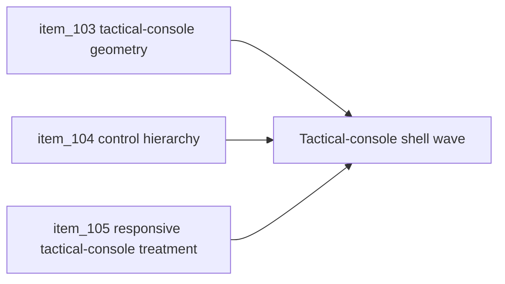

## task_033_orchestrate_tactical_console_visual_direction_for_shell_controls_and_menus - Orchestrate tactical-console visual direction for shell controls and menus
> From version: 0.2.1
> Status: Draft
> Understanding: 96%
> Confidence: 94%
> Progress: 0%
> Complexity: Medium
> Theme: UX
> Reminder: Update status/understanding/confidence/progress and dependencies/references when you edit this doc.

# Context
- Derived from backlog items `item_103_define_tactical_console_geometry_for_shell_buttons_panels_and_state_chips`, `item_104_define_tactical_console_hierarchy_for_primary_secondary_and_utility_shell_controls`, and `item_105_define_responsive_tactical_console_treatment_for_mobile_sheet_and_desktop_command_deck`.
- Related request(s): `req_026_define_a_tactical_console_visual_direction_for_shell_controls_and_menus`.
- The repository now has a functional command-deck shell, but its visual tone remains softer and more capsule-driven than the intended Emberwake runtime posture.
- This orchestration task groups the next shell-polish wave into one coherent visual-direction pass so geometry, hierarchy, and responsive treatment evolve together under the same tactical-console language.

# Dependencies
- Blocking: `task_032_orchestrate_command_deck_shell_menu_option_b_for_runtime_controls`.
- Unblocks: a sharper shell identity, a more readable control hierarchy, and a more coherent console posture across desktop and mobile.

# Plan
- [ ] 1. Define and implement tactical-console geometry for shell buttons, panels, and state chips so the shell moves away from the current pill-heavy softness.
- [ ] 2. Define and implement a clearer tactical-console hierarchy between primary, secondary, and utility controls inside the shell command deck.
- [ ] 3. Define and implement the responsive tactical-console treatment for desktop command deck and mobile sheet while preserving the existing trigger and shell ownership posture.
- [ ] 4. Update linked request, backlog, task, and any supporting UX notes needed to keep the visual-direction wave traceable.
- [ ] 5. Validate the resulting shell polish against current repository delivery constraints and runtime-shell behavior.
- [ ] FINAL: Create dedicated git commit(s) for this orchestration scope.

# AC Traceability
- `item_103` -> Tactical-console geometry is explicit. Proof target: updated control and panel geometry notes or implementation.
- `item_104` -> Tactical-console control hierarchy is explicit. Proof target: primary vs secondary vs utility treatment notes or implementation.
- `item_105` -> Responsive tactical-console treatment is explicit. Proof target: desktop/mobile adaptation notes or implementation.

# Decision framing
- Product framing: Required
- Product signals: visual identity, clarity, and usability
- Product follow-up: Use this wave to make the shell feel like a deliberate tactical control surface rather than a softened mobile-style overlay.
- Architecture framing: Supporting
- Architecture signals: shell chrome and responsive shell posture
- Architecture follow-up: Keep the current shell model intact while refining its visual language.

# Links
- Product brief(s): `prod_001_minimal_overlay_and_feedback_for_early_runtime`
- Architecture decision(s): `adr_002_separate_react_shell_from_pixi_runtime_ownership`, `adr_016_define_shell_scene_state_and_meta_surface_ownership`, `adr_025_keep_shell_chrome_event_driven_and_sample_diagnostics_off_the_runtime_hot_path`
- Backlog item(s): `item_103_define_tactical_console_geometry_for_shell_buttons_panels_and_state_chips`, `item_104_define_tactical_console_hierarchy_for_primary_secondary_and_utility_shell_controls`, `item_105_define_responsive_tactical_console_treatment_for_mobile_sheet_and_desktop_command_deck`
- Request(s): `req_026_define_a_tactical_console_visual_direction_for_shell_controls_and_menus`

# Validation
- `npm run ci`
- `npm run test:browser:smoke`
- `python3 logics/skills/logics-doc-linter/scripts/logics_lint.py`

# Definition of Done (DoD)
- [ ] Covered backlog items are implemented or explicitly split further with updated traceability.
- [ ] The shell adopts a coherent tactical-console visual direction across geometry, hierarchy, and responsive treatment.
- [ ] The resulting shell polish remains compatible with the existing command-deck model and mobile sheet posture.
- [ ] Linked request, backlog, task, and related docs are updated with proofs and status.
- [ ] Dedicated git commit(s) have been created for the completed orchestration scope.
- [ ] Status is `Done` and progress is `100%`.

# Report
- Pending.
