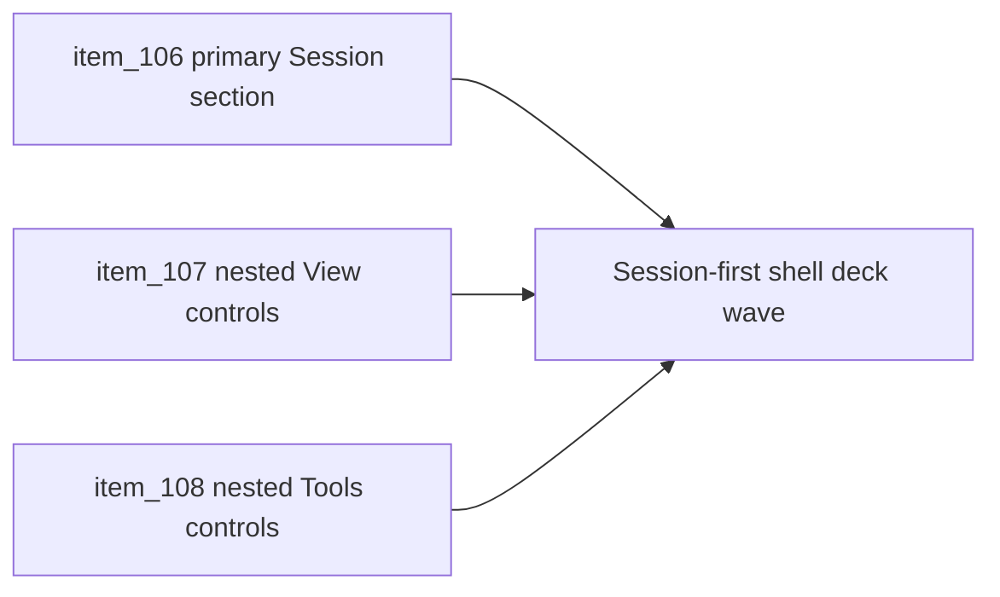

## task_034_orchestrate_session_first_shell_command_deck_hierarchy - Orchestrate session-first shell command-deck hierarchy
> From version: 0.2.2
> Status: Done
> Understanding: 100%
> Confidence: 97%
> Progress: 100% (docs synced)
> Complexity: Medium
> Theme: UX
> Reminder: Update status/understanding/confidence/progress and dependencies/references when you edit this doc.

# Context
- Derived from backlog items `item_106_define_session_as_the_single_primary_shell_menu_section`, `item_107_define_nested_view_controls_within_session_without_reopening_camera_ownership`, and `item_108_define_nested_tools_controls_within_session_without_reintroducing_menu_clutter`.
- Related request(s): `req_027_restructure_the_shell_command_deck_around_a_primary_session_section`.
- The repository already has a stateful command deck and a converged tactical-console visual direction, but the current shell menu still exposes `Session`, `View`, and `Tools` as peer top-level families.
- This orchestration task groups the next menu IA refinement so the shell becomes more compact and session-first without reopening the settled shell model or tactical-console posture.

# Dependencies
- Blocking: `task_032_orchestrate_command_deck_shell_menu_option_b_for_runtime_controls`, `task_033_orchestrate_tactical_console_visual_direction_for_shell_controls_and_menus`.
- Unblocks: a more compact top-level deck structure, clearer session-first hierarchy, and a cleaner mobile command surface.

# Plan
- [x] 1. Define and implement `Session` as the only first-level shell section beneath the always-visible current action.
- [x] 2. Define and implement `View` as a nested subordinate screen inside `Session` while preserving reset-camera and camera-mode reachability.
- [x] 3. Define and implement `Tools` as a nested subordinate screen inside `Session` while preserving inspecteur, diagnostics, and install access without reintroducing clutter.
- [x] 4. Update linked request, backlog, task, and any supporting UX notes needed to keep the session-first navigation wave traceable.
- [x] 5. Validate the resulting shell IA refinement against current repository delivery constraints and responsive shell behavior.
- [x] FINAL: Create dedicated git commit(s) for this orchestration scope.

# AC Traceability
- `item_106` -> Session-first top-level hierarchy is explicit. Proof target: menu IA update or implementation report.
- `item_107` -> Nested View screen is explicit. Proof target: nested structure or interaction notes for camera controls.
- `item_108` -> Nested Tools screen is explicit. Proof target: nested structure or interaction notes for utility controls.

# Decision framing
- Product framing: Required
- Product signals: clarity, compactness, and control prioritization
- Product follow-up: Use this wave to make the command deck read like one coherent session-control surface rather than a set of parallel peer sections.
- Architecture framing: Supporting
- Architecture signals: shell menu IA and responsive shell posture
- Architecture follow-up: Preserve current shell ownership, tactical-console direction, and action inventory while tightening grouping hierarchy.

# Links
- Product brief(s): `prod_001_minimal_overlay_and_feedback_for_early_runtime`
- Architecture decision(s): `adr_002_separate_react_shell_from_pixi_runtime_ownership`, `adr_016_define_shell_scene_state_and_meta_surface_ownership`, `adr_025_keep_shell_chrome_event_driven_and_sample_diagnostics_off_the_runtime_hot_path`
- Backlog item(s): `item_106_define_session_as_the_single_primary_shell_menu_section`, `item_107_define_nested_view_controls_within_session_without_reopening_camera_ownership`, `item_108_define_nested_tools_controls_within_session_without_reintroducing_menu_clutter`
- Request(s): `req_027_restructure_the_shell_command_deck_around_a_primary_session_section`

# Validation
- `npm run ci`
- `npm run test:browser:smoke`
- `python3 logics/skills/logics-doc-linter/scripts/logics_lint.py`

# Definition of Done (DoD)
- [x] Covered backlog items are implemented or explicitly split further with updated traceability.
- [x] The shell exposes `Session` as the single first-level section below the current action.
- [x] `View` and `Tools` are re-presented as subordinate nested screens without losing access to the current action inventory.
- [x] The resulting shell IA refinement remains compatible with the existing shell-owned command deck and tactical-console direction.
- [x] Linked request, backlog, task, and related docs are updated with proofs and status.
- [x] Dedicated git commit(s) have been created for the completed orchestration scope.
- [x] Status is `Done` and progress is `100%`.

# Report
- Reworked `src/app/components/ShellMenu.tsx` so the menu now exposes one first-level `Session` section below the always-visible `Current action`, with `View` and `Tools` opening as dedicated subordinate sub-screens instead of remaining peer top-level blocks.
- Updated `src/app/styles/app.css` so the session root and submenu screens stay visually subordinate while preserving the current tactical-console direction and keeping the mobile sheet readable.
- Extended `src/app/components/ShellMenu.test.tsx` to cover the session-first top-level structure plus focused `View` and `Tools` access, so the new submenu model cannot silently regress.
- Visual browser checks were performed on desktop and mobile-sized viewports against the local app to confirm the focused `Session -> View / Tools` navigation remains readable and compact.
