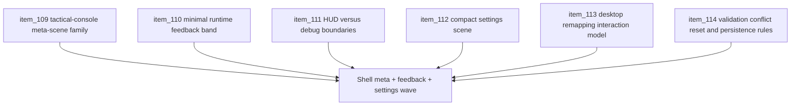

## task_035_orchestrate_shell_meta_feedback_and_settings_configuration_wave - Orchestrate shell meta feedback and settings configuration wave
> From version: 0.2.2
> Status: Draft
> Understanding: 96%
> Confidence: 94%
> Progress: 0%
> Complexity: High
> Theme: UX
> Reminder: Update status/understanding/confidence/progress and dependencies/references when you edit this doc.

# Context
- Derived from backlog items `item_109_define_a_shared_tactical_console_family_for_shell_owned_meta_scenes`, `item_110_define_a_minimal_player_facing_runtime_feedback_band_outside_the_command_deck`, `item_111_define_boundaries_between_player_hud_information_and_shell_debug_utilities`, `item_112_define_a_compact_settings_meta_scene_that_prioritizes_configuration_over_context_copy`, `item_113_define_desktop_control_remapping_scope_and_interaction_model_for_settings`, and `item_114_define_validation_conflict_reset_and_persistence_rules_for_desktop_control_customization`.
- Related request(s): `req_028_define_a_cohesive_shell_meta_and_runtime_feedback_surface`, `req_029_define_a_lightweight_settings_scene_with_desktop_control_customization`.
- The repository now has a stronger command deck and a settled tactical-console language, but the rest of the shell experience still needs one coordinated wave so meta scenes, runtime feedback, and settings configuration stop evolving as disconnected slices.
- This orchestration task groups the next shell-product wave so the repo can align shell-owned scenes, define a minimal player-facing HUD posture, and turn `Settings` into a compact configuration surface with desktop-control customization.

# Dependencies
- Blocking: `task_033_orchestrate_tactical_console_visual_direction_for_shell_controls_and_menus`, `task_034_orchestrate_session_first_shell_command_deck_hierarchy`.
- Unblocks: cohesive shell-owned meta scenes, a clearer runtime feedback model, and a settings scene that provides real desktop-control configuration instead of mostly explanatory copy.

# Plan
- [ ] 1. Define the shared shell-family posture for pause, settings, defeat, and victory so those shell-owned scenes read as one tactical-console product family.
- [ ] 2. Define and implement a minimal player-facing runtime feedback surface that stays visible outside the command deck without becoming a second control deck.
- [ ] 3. Define and enforce the boundary between player-facing HUD information and shell/debug utilities so diagnostics and operator controls remain explicitly gated.
- [ ] 4. Redesign the `Settings` scene into a compact shell-owned configuration surface that sharply reduces explanatory copy and foregrounds meaningful settings content.
- [ ] 5. Define and implement the desktop-control customization interaction model, including supported bindings, editing flow, save/apply behavior, and clarity around current assignments.
- [ ] 6. Define and implement conflict handling, invalid-binding treatment, persistence rules, and a clear `Reset controls to defaults` path for desktop controls.
- [ ] 7. Update linked requests, backlog items, tasks, and any supporting UX notes needed to keep the wave traceable across shell meta scenes, runtime feedback, and settings customization.
- [ ] 8. Validate the resulting wave against current repository delivery constraints on desktop and mobile.
- [ ] FINAL: Create dedicated git commit(s) for this orchestration scope.

# AC Traceability
- `item_109` -> Shell-owned meta scenes share one tactical-console family. Proof target: aligned scene structure or visual-system implementation notes.
- `item_110` -> Minimal runtime feedback surface is explicit. Proof target: HUD or runtime feedback implementation/report.
- `item_111` -> Player HUD and debug/tooling boundaries are explicit. Proof target: information architecture or runtime surface proof.
- `item_112` -> Settings scene is materially lighter and more configuration-led. Proof target: scene IA update or implementation report.
- `item_113` -> Desktop-control remapping model is explicit. Proof target: settings interaction model or implementation.
- `item_114` -> Conflict/reset/persistence rules are explicit. Proof target: validation behavior and persistence implementation/report.

# Decision framing
- Product framing: Required
- Product signals: clarity, usefulness, restraint, and consistent shell identity
- Product follow-up: Treat this wave as the point where shell-owned scenes, always-visible runtime feedback, and configuration surfaces stop behaving like separate UX experiments.
- Architecture framing: Supporting
- Architecture signals: shell ownership, input-setting persistence, and player-facing surface boundaries
- Architecture follow-up: Preserve current shell/runtime ownership and command-deck model while tightening how information and configuration are presented.

# Links
- Product brief(s): `prod_001_minimal_overlay_and_feedback_for_early_runtime`
- Architecture decision(s): `adr_002_separate_react_shell_from_pixi_runtime_ownership`, `adr_007_isolate_runtime_input_from_browser_page_controls`, `adr_016_define_shell_scene_state_and_meta_surface_ownership`, `adr_025_keep_shell_chrome_event_driven_and_sample_diagnostics_off_the_runtime_hot_path`
- Backlog item(s): `item_109_define_a_shared_tactical_console_family_for_shell_owned_meta_scenes`, `item_110_define_a_minimal_player_facing_runtime_feedback_band_outside_the_command_deck`, `item_111_define_boundaries_between_player_hud_information_and_shell_debug_utilities`, `item_112_define_a_compact_settings_meta_scene_that_prioritizes_configuration_over_context_copy`, `item_113_define_desktop_control_remapping_scope_and_interaction_model_for_settings`, `item_114_define_validation_conflict_reset_and_persistence_rules_for_desktop_control_customization`
- Request(s): `req_028_define_a_cohesive_shell_meta_and_runtime_feedback_surface`, `req_029_define_a_lightweight_settings_scene_with_desktop_control_customization`

# Validation
- `npm run ci`
- `npm run test:browser:smoke`
- `python3 logics/skills/logics-doc-linter/scripts/logics_lint.py`

# Definition of Done (DoD)
- [ ] Covered backlog items are implemented or explicitly split further with updated traceability.
- [ ] Shell-owned meta scenes share one coherent tactical-console family.
- [ ] The runtime exposes a minimal player-facing feedback surface outside the command deck without leaking debug clutter.
- [ ] `Settings` is materially lighter and centered on actual configuration tasks.
- [ ] Desktop-control remapping, conflict handling, persistence, and reset-to-defaults behavior are explicit and validated.
- [ ] Linked request, backlog, task, and related docs are updated with proofs and status.
- [ ] Dedicated git commit(s) have been created for the completed orchestration scope.
- [ ] Status is `Done` and progress is `100%`.
