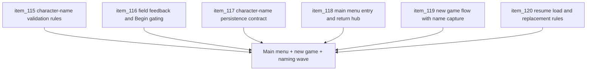

## task_036_orchestrate_main_menu_new_game_and_character_name_entry_wave - Orchestrate main menu, new-game, and character-name entry wave
> From version: 0.5.0
> Status: Done
> Understanding: 100%
> Confidence: 97%
> Progress: 100%
> Complexity: High
> Theme: UX
> Reminder: Update status/understanding/confidence/progress and dependencies/references when you edit this doc.

# Context
- Derived from backlog items `item_115_define_character_name_validation_rules_for_new_game_entry`, `item_116_define_character_name_field_feedback_and_begin_gating_behavior`, `item_117_define_character_name_persistence_contract_for_session_creation`, `item_118_define_a_shell_owned_main_menu_as_the_primary_product_entry_and_return_hub`, `item_119_define_a_new_game_flow_that_captures_character_name_before_runtime_start`, and `item_120_define_resume_load_and_session_replacement_rules_for_main_menu_navigation`.
- Related request(s): `req_030_define_a_shell_owned_main_menu_and_new_game_entry_flow`, `req_031_define_character_name_validation_and_constraints_for_new_game_entry`.
- The repository now has a more mature shell and command deck, but the product still lacks a stable shell-owned front door, a deliberate new-game entry flow, and a clear character-name contract before runtime start.
- This orchestration task groups the next entry-flow wave so the game gains a durable `Main menu`, a lightweight `New game` creation step, and one explicit naming contract that stays aligned across UI, session creation, and persistence.

# Dependencies
- Blocking: `task_034_orchestrate_session_first_shell_command_deck_hierarchy`, `task_035_orchestrate_shell_meta_feedback_and_settings_configuration_wave`.
- Unblocks: intentional product boot flow, safe return-to-menu behavior, lightweight session creation, and deterministic character-name handling before runtime start.

# Plan
- [x] 1. Define the shell-owned `Main menu` as the default product entry and durable return hub, aligned with the current shell family and command-deck routing model.
- [x] 2. Define and implement the first-slice `New game` flow so runtime start happens through a lightweight shell-owned entry step rather than an immediate bootstrap.
- [x] 3. Define and implement `Resume`, `Load game`, and session-replacement rules so the menu behaves safely and predictably with or without an active session.
- [x] 4. Define and implement the character-name validation contract, including allowed values, whitespace handling, and rejection of obviously broken names.
- [x] 5. Define and implement field feedback, default-name posture, and `Begin` gating so the naming step feels guided and deterministic.
- [x] 6. Define and implement how the validated character name is normalized, persisted, and attached to the created session contract.
- [x] 7. Update linked requests, backlog items, tasks, and any supporting UX notes needed to keep main-menu, new-game, and naming behavior traceable.
- [x] 8. Validate the resulting entry-flow wave against current repository delivery constraints on desktop and mobile.
- [x] FINAL: Create dedicated git commit(s) for this orchestration scope.

# AC Traceability
- `item_115` -> Character-name validation rules are explicit. Proof target: validation contract or implementation report.
- `item_116` -> Field feedback and `Begin` gating are explicit. Proof target: form-state model, interaction note, or implementation report.
- `item_117` -> Character-name persistence contract is explicit. Proof target: session creation/storage note or behavior summary.
- `item_118` -> Main menu is the primary entry and return hub. Proof target: scene routing or implementation report.
- `item_119` -> `New game` flow is explicit and captures character name before runtime start. Proof target: flow implementation or UX summary.
- `item_120` -> `Resume`, `Load`, and replacement rules are explicit. Proof target: transition rules or behavior summary.

# Request AC Traceability
- req_030_define_a_shell_owned_main_menu_and_new_game_entry_flow coverage: AC1, AC2, AC3, AC4, AC5, AC6, AC7, AC8. Proof: `task_036_orchestrate_main_menu_new_game_and_character_name_entry_wave` closes the linked request chain for `req_030_define_a_shell_owned_main_menu_and_new_game_entry_flow` and carries the delivery evidence for `item_120_define_resume_load_and_session_replacement_rules_for_main_menu_navigation`.

# Decision framing
- Product framing: Required
- Product signals: intentional entry, safety, and coherence
- Product follow-up: Treat this wave as the moment Emberwake stops behaving like a runtime-first prototype and starts behaving like a game with a stable front door.
- Architecture framing: Supporting
- Architecture signals: shell-owned routing, session creation, and local-first session persistence
- Architecture follow-up: Preserve shell/runtime ownership while making session entry and return explicit and robust.

# Links
- Product brief(s): `prod_001_minimal_overlay_and_feedback_for_early_runtime`
- Architecture decision(s): `adr_002_separate_react_shell_from_pixi_runtime_ownership`, `adr_009_limit_persistence_to_local_versioned_frontend_storage`, `adr_016_define_shell_scene_state_and_meta_surface_ownership`, `adr_025_keep_shell_chrome_event_driven_and_sample_diagnostics_off_the_runtime_hot_path`
- Backlog item(s): `item_115_define_character_name_validation_rules_for_new_game_entry`, `item_116_define_character_name_field_feedback_and_begin_gating_behavior`, `item_117_define_character_name_persistence_contract_for_session_creation`, `item_118_define_a_shell_owned_main_menu_as_the_primary_product_entry_and_return_hub`, `item_119_define_a_new_game_flow_that_captures_character_name_before_runtime_start`, `item_120_define_resume_load_and_session_replacement_rules_for_main_menu_navigation`
- Request(s): `req_030_define_a_shell_owned_main_menu_and_new_game_entry_flow`, `req_031_define_character_name_validation_and_constraints_for_new_game_entry`

# Validation
- `npm run ci`
- `npm run test:browser:smoke`
- `python3 logics/skills/logics-doc-linter/scripts/logics_lint.py`

# Definition of Done (DoD)
- [x] Covered backlog items are implemented or explicitly split further with updated traceability.
- [x] The product boots into a shell-owned `Main menu` rather than dropping directly into runtime.
- [x] `New game`, `Resume`, `Load game`, and `Settings` behave coherently with preserved session ownership and replacement safeguards.
- [x] Character-name validation, UI feedback, `Begin` gating, and session persistence all share one explicit contract.
- [x] Linked request, backlog, task, and related docs are updated with proofs and status.
- [x] Dedicated git commit(s) have been created for the completed orchestration scope.
- [x] Status is `Done` and progress is `100%`.
