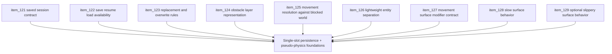

## task_037_orchestrate_single_slot_persistence_and_pseudo_physics_foundations - Orchestrate single-slot persistence and pseudo-physics foundations
> From version: 0.2.2
> Status: Done
> Understanding: 98%
> Confidence: 96%
> Progress: 100%
> Complexity: High
> Theme: Gameplay
> Reminder: Update status/understanding/confidence/progress and dependencies/references when you edit this doc.

# Context
- Derived from backlog items `item_121_define_a_single_slot_saved_session_contract_for_local_first_persistence`, `item_122_define_save_resume_and_load_availability_across_shell_owned_surfaces`, `item_123_define_active_session_replacement_and_overwrite_rules_for_single_slot_save_load`, `item_124_define_a_first_obstacle_layer_representation_for_runtime_traversal`, `item_125_define_movement_resolution_against_non_traversable_world_space`, `item_126_define_a_lightweight_entity_separation_posture_for_runtime_collisions`, `item_127_define_a_first_movement_surface_modifier_contract_for_traversable_world_space`, `item_128_define_slow_surface_behavior_for_fixed_step_runtime_movement`, and `item_129_define_optional_slippery_surface_behavior_without_reopening_full_physics_scope`.
- Related request(s): `req_032_define_a_single_slot_save_and_load_flow_for_shell_owned_session_entry`, `req_033_define_a_first_collision_and_blocking_world_wave_for_runtime_gameplay`, `req_034_define_a_first_movement_surface_modifiers_wave_for_runtime_gameplay`.
- The repository now has a shell-owned main menu, resumable sessions, runtime HUD, and settings controls, but the next gameplay-facing gap is split across two fronts:
  - durable single-slot save/load behavior
  - first pseudo-physics foundations for blocked traversal, entity separation, and movement-affecting surfaces
- This orchestration task groups those remaining foundations so entry-flow persistence and world traversal rules can advance coherently instead of fragmenting across unrelated partial waves.

# Dependencies
- Blocking: `task_035_orchestrate_shell_meta_feedback_and_settings_configuration_wave`, `task_036_orchestrate_main_menu_new_game_and_character_name_entry_wave`.
- Unblocks: real `Save / Load`, obstacle-based traversal blocking, lightweight entity separation, first movement surface effects, and the next meaningful gameplay loop wave.

# Plan
- [x] 1. Define and implement the first single-slot saved-session contract, including minimal metadata and local-first storage compatibility.
- [x] 2. Define and implement where `Save`, `Resume`, and `Load game` are available across current shell-owned surfaces.
- [x] 3. Define and implement replacement, overwrite, and confirmation rules for `Save`, `Load game`, and `New game` in the single-slot model.
- [x] 4. Define and implement a first obstacle-layer representation that stays separate from visual terrain identity while remaining compatible with deterministic world generation.
- [x] 5. Define and implement first-slice movement resolution against non-traversable world space in a fixed-step deterministic posture.
- [x] 6. Define and implement a lightweight entity/entity separation posture for the first relevant collidable entity set.
- [x] 7. Define and implement the movement-surface modifier contract for traversable world space, distinct from both terrain and obstacle layers.
- [x] 8. Define and implement `slow` surface behavior as the first guaranteed movement modifier.
- [x] 9. Evaluate and implement `slippery` surface behavior only if it remains bounded, readable, and compatible with the deterministic pseudo-physics posture.
- [x] 10. Update linked requests, ADRs, backlog items, and any supporting runtime/gameplay docs so persistence and pseudo-physics foundations remain traceable.
- [x] 11. Validate the resulting wave with repository delivery constraints, runtime tests, and browser smoke coverage.
- [x] FINAL: Create dedicated git commit(s) for this orchestration scope.

# AC Traceability
- `item_121` -> Single-slot saved-session contract is explicit. Proof target: storage contract or implementation report.
- `item_122` -> Save/resume/load availability is explicit. Proof target: shell availability matrix or implementation summary.
- `item_123` -> Replacement and overwrite rules are explicit. Proof target: transition rules or behavior summary.
- `item_124` -> Obstacle-layer representation is explicit. Proof target: world contract or generation summary.
- `item_125` -> Movement resolution against blocked world is explicit. Proof target: movement semantics or collision implementation report.
- `item_126` -> Entity separation posture is explicit. Proof target: collidable-set note or collision behavior summary.
- `item_127` -> Movement-surface modifier contract is explicit. Proof target: world-layer contract or implementation report.
- `item_128` -> `slow` surface behavior is explicit. Proof target: movement modifier note or runtime behavior summary.
- `item_129` -> `slippery` posture is explicit if shipped, or explicitly deferred if it would violate the bounded pseudo-physics posture. Proof target: effect note or implementation summary.

# Decision framing
- Product framing: Required
- Product signals: durability, traversal credibility, and gameplay texture
- Product follow-up: Treat this wave as the point where Emberwake stops being only a shell-improved prototype and gains the first durable progression and first meaningful world traversal rules.
- Architecture framing: Required
- Architecture signals: local-first persistence, layered world semantics, and deterministic pseudo-physics
- Architecture follow-up: Preserve the separation between terrain, obstacles, and movement modifiers while keeping collision and save/load bounded and explicit.

# Links
- Product brief(s): `prod_001_minimal_overlay_and_feedback_for_early_runtime`
- Architecture decision(s): `adr_009_limit_persistence_to_local_versioned_frontend_storage`, `adr_016_define_shell_scene_state_and_meta_surface_ownership`, `adr_022_keep_product_meta_flow_shell_owned_while_runtime_state_remains_game_preserved`, `adr_032_separate_visual_terrain_blocking_obstacles_and_movement_surface_modifiers`, `adr_033_adopt_deterministic_movement_oriented_pseudo_physics_instead_of_a_full_physics_engine`, `adr_034_model_traversable_surface_effects_as_bounded_movement_modifiers`, `adr_035_resolve_entity_collisions_as_lightweight_deterministic_separation`
- Backlog item(s): `item_121_define_a_single_slot_saved_session_contract_for_local_first_persistence`, `item_122_define_save_resume_and_load_availability_across_shell_owned_surfaces`, `item_123_define_active_session_replacement_and_overwrite_rules_for_single_slot_save_load`, `item_124_define_a_first_obstacle_layer_representation_for_runtime_traversal`, `item_125_define_movement_resolution_against_non_traversable_world_space`, `item_126_define_a_lightweight_entity_separation_posture_for_runtime_collisions`, `item_127_define_a_first_movement_surface_modifier_contract_for_traversable_world_space`, `item_128_define_slow_surface_behavior_for_fixed_step_runtime_movement`, `item_129_define_optional_slippery_surface_behavior_without_reopening_full_physics_scope`
- Request(s): `req_032_define_a_single_slot_save_and_load_flow_for_shell_owned_session_entry`, `req_033_define_a_first_collision_and_blocking_world_wave_for_runtime_gameplay`, `req_034_define_a_first_movement_surface_modifiers_wave_for_runtime_gameplay`

# Validation
- `npm run ci`
- `npm run test:browser:smoke`
- `python3 logics/skills/logics-doc-linter/scripts/logics_lint.py`

# Definition of Done (DoD)
- [x] Covered backlog items are implemented or explicitly split further with updated traceability.
- [x] Single-slot `Save / Load` is real, understandable, and safe across shell-owned entry surfaces.
- [x] World blocking works through an explicit obstacle layer rather than through terrain kind alone.
- [x] Movement resolution and entity separation are deterministic and compatible with the fixed-step runtime posture.
- [x] Traversable movement modifiers are explicit, with `slow` shipped and `slippery` either shipped safely or explicitly deferred.
- [x] Linked request, backlog, task, and ADR docs are updated with proofs and status.
- [x] Dedicated git commit(s) have been created for the completed orchestration scope.
- [x] Status is `Done` and progress is `100%`.
