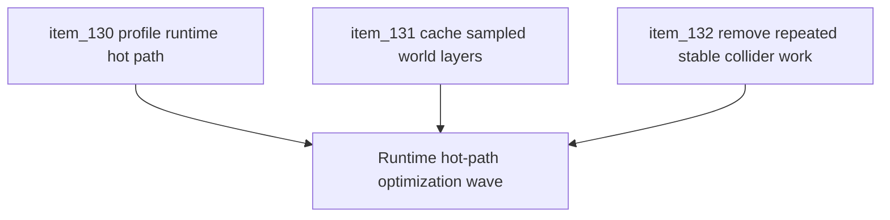

## task_038_orchestrate_runtime_hot_path_optimization_for_pseudo_physics_and_world_queries - Orchestrate runtime hot-path optimization for pseudo-physics and world queries
> From version: 0.5.0
> Status: Done
> Understanding: 100%
> Confidence: 100%
> Progress: 100%
> Complexity: High
> Theme: Performance
> Reminder: Update status/understanding/confidence/progress and dependencies/references when you edit this doc.

# Context
- Derived from backlog items `item_130_profile_and_confirm_runtime_hot_path_regression_sources_after_pseudo_physics_wave`, `item_131_cache_sampled_world_layers_for_deterministic_obstacle_and_surface_queries`, and `item_132_remove_repeated_stable_collider_work_from_the_fixed_step_runtime_loop`.
- Related request(s): `req_035_define_a_runtime_hot_path_optimization_wave_for_pseudo_physics_and_world_queries`.
- The repository now has obstacle-based traversal, lightweight pseudo-physics, and movement-surface modifiers, but the live runtime appears to suffer from a player-facing symptom where lower FPS can reduce movement speed over real time.
- This orchestration task groups the first bounded optimization wave so profiling, query reuse, and stable-collider cleanup advance together instead of creating partial fixes that leave the core symptom ambiguous.

# Dependencies
- Blocking: `task_037_orchestrate_single_slot_persistence_and_pseudo_physics_foundations`.
- Unblocks: hot-path optimization of runtime traversal, confirmation of movement-throughput slowdown sources, and follow-up gameplay work that depends on trustworthy movement speed under load.

# Plan
- [x] 1. Profile and confirm the first credible runtime hot-path regression sources after the pseudo-physics wave, including the lower-FPS movement-slowdown symptom.
- [x] 2. Define and implement bounded reuse or caching for sampled world tile layers so obstacle and surface checks stop repeating equivalent deterministic work.
- [x] 3. Define and implement reuse of stable support-collider inputs so the fixed-step loop stops rebuilding immutable collision data.
- [x] 4. Re-evaluate movement throughput under lower-FPS conditions and confirm whether catch-up saturation remains part of the symptom after the hot-path wins land.
- [x] 5. Update linked request, backlog, task, and supporting notes so the optimization wave remains traceable.
- [x] 6. Validate the resulting optimization wave against repository delivery constraints and live runtime behavior.
- [x] FINAL: Create dedicated git commit(s) for this orchestration scope.

# AC Traceability
- `item_130` -> Runtime hot-path regression sources are confirmed. Proof target: profiling summary, runtime metrics report, or implementation note.
- `item_131` -> World-layer query reuse is explicit. Proof target: cache contract, implementation report, or test summary.
- `item_132` -> Stable collider reuse is explicit. Proof target: implementation note or collision-loop summary.

# Request AC Traceability
- req_035_define_a_runtime_hot_path_optimization_wave_for_pseudo_physics_and_world_queries coverage: AC1, AC2, AC3, AC4, AC5, AC6, AC7. Proof: `task_038_orchestrate_runtime_hot_path_optimization_for_pseudo_physics_and_world_queries` closes the linked request chain for `req_035_define_a_runtime_hot_path_optimization_wave_for_pseudo_physics_and_world_queries` and carries the delivery evidence for `item_132_remove_repeated_stable_collider_work_from_the_fixed_step_runtime_loop`.

# Decision framing
- Product framing: Required
- Product signals: stable movement speed under load and better runtime feel
- Product follow-up: Treat this wave as a runtime-correction slice, not as optional polish.
- Architecture framing: Required
- Architecture signals: deterministic hot-path efficiency and bounded optimization
- Architecture follow-up: Preserve layered world semantics while making the fixed-step loop cheaper and more trustworthy.

# Links
- Product brief(s): `prod_001_minimal_overlay_and_feedback_for_early_runtime`
- Architecture decision(s): `adr_032_separate_visual_terrain_blocking_obstacles_and_movement_surface_modifiers`, `adr_033_adopt_deterministic_movement_oriented_pseudo_physics_instead_of_a_full_physics_engine`, `adr_034_model_traversable_surface_effects_as_bounded_movement_modifiers`, `adr_035_resolve_entity_collisions_as_lightweight_deterministic_separation`
- Backlog item(s): `item_130_profile_and_confirm_runtime_hot_path_regression_sources_after_pseudo_physics_wave`, `item_131_cache_sampled_world_layers_for_deterministic_obstacle_and_surface_queries`, `item_132_remove_repeated_stable_collider_work_from_the_fixed_step_runtime_loop`
- Request(s): `req_035_define_a_runtime_hot_path_optimization_wave_for_pseudo_physics_and_world_queries`

# Validation
- `npx vitest run games/emberwake/src/runtime/emberwakeRuntimeIntegration.test.ts`
- `npx vitest run src/game/world/model/worldGeneration.test.ts`
- `npx vitest run games/emberwake/src/runtime/emberwakeRuntimeIntegration.test.ts games/emberwake/src/runtime/pseudoPhysics.test.ts`
- `npm run typecheck`
- `npm run ci`
- `npm run test:browser:smoke`
- `python3 logics/skills/logics-doc-linter/scripts/logics_lint.py`

# Implementation notes
- `30bfe61` made frame-clamp loss and dropped simulation debt explicit in runtime telemetry and diagnostics.
- `3afe763` introduced a bounded shared cache for deterministic world-layer samples.
- `34beb5b` removed repeated support-collider reconstruction from the fixed-step loop.
- The confirmed runtime symptom now has two observable contributors:
  - frame time dropped by the `fixedStep * 4` clamp
  - simulation debt dropped when catch-up saturates
- The wave intentionally did not retune `maxCatchUpStepsPerFrame`; it made the causes measurable first and reduced the avoidable hot-path cost before any behavioral clamp change.

# Definition of Done (DoD)
- [x] Covered backlog items are implemented or explicitly split further with updated traceability.
- [x] The first credible source(s) of runtime movement slowdown under lower FPS are confirmed rather than guessed.
- [x] World-layer queries reuse deterministic sampled data instead of repeating equivalent work in the hot path.
- [x] Stable support-collider data is no longer rebuilt unnecessarily inside the fixed-step runtime loop.
- [x] Linked request, backlog, and task docs are updated with proofs and status.
- [x] Dedicated git commit(s) have been created for the completed orchestration scope.
- [x] Status is `Done` and progress is `100%`.
