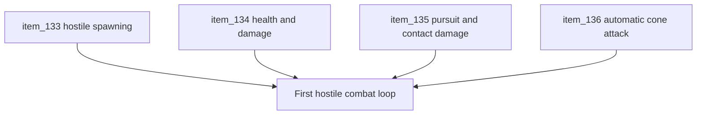

## task_039_orchestrate_the_first_hostile_combat_loop_wave - Orchestrate the first hostile combat loop wave
> From version: 0.5.0
> Status: Done
> Understanding: 100%
> Confidence: 100%
> Progress: 100%
> Complexity: High
> Theme: Gameplay
> Reminder: Update status/understanding/confidence/progress and dependencies/references when you edit this doc.

# Context
- Derived from backlog items `item_133_define_hostile_spawning_near_the_player_chunk_with_a_local_population_cap`, `item_134_define_shared_entity_health_and_damage_resolution_for_first_combatants`, `item_135_define_hostile_focus_pursuit_and_contact_damage_for_the_first_combat_loop`, and `item_136_define_an_automatic_forward_player_cone_attack_for_first_hostile_combat`.
- Related request(s): `req_036_define_a_first_hostile_combat_loop_with_spawns_contact_damage_and_player_cone_attack`.
- This orchestration task groups the first hostile combat wave so spawning, health, pursuit, contact damage, and automatic player attack land as one coherent gameplay loop instead of disconnected partial features.

# Dependencies
- Blocking: `task_037_orchestrate_single_slot_persistence_and_pseudo_physics_foundations`, `task_038_orchestrate_runtime_hot_path_optimization_for_pseudo_physics_and_world_queries`.
- Unblocks: first hostile combat pressure, first combat-driven defeat loop, and follow-up gameplay work around enemy variety or progression.

# Plan
- [x] 1. Define and implement hostile spawning near the player chunk with a bounded local cap and safe spawn distance.
- [x] 2. Define and implement shared health/damage resolution for the player and first hostile combatants.
- [x] 3. Define and implement hostile pursuit toward the player and contact-based enemy damage with a cooldown.
- [x] 4. Define and implement the player’s automatic forward cone attack with bounded reach, arc, and cooldown.
- [x] 5. Wire first defeat/removal handling and validate the resulting combat loop end to end.
- [x] 6. Update linked request, backlog, task, and supporting notes so the combat wave remains traceable.
- [x] FINAL: Create dedicated git commit(s) for this orchestration scope.

# Request AC Traceability
- req_036_define_a_first_hostile_combat_loop_with_spawns_contact_damage_and_player_cone_attack coverage: AC1, AC2, AC3, AC4, AC5, AC6, AC7. Proof: `task_039_orchestrate_the_first_hostile_combat_loop_wave` closes the linked request chain for `req_036_define_a_first_hostile_combat_loop_with_spawns_contact_damage_and_player_cone_attack` and carries the delivery evidence for `item_136_define_an_automatic_forward_player_cone_attack_for_first_hostile_combat`.

# Links
- Backlog item(s): `item_133_define_hostile_spawning_near_the_player_chunk_with_a_local_population_cap`, `item_134_define_shared_entity_health_and_damage_resolution_for_first_combatants`, `item_135_define_hostile_focus_pursuit_and_contact_damage_for_the_first_combat_loop`, `item_136_define_an_automatic_forward_player_cone_attack_for_first_hostile_combat`
- Request(s): `req_036_define_a_first_hostile_combat_loop_with_spawns_contact_damage_and_player_cone_attack`

# Validation
- `npx vitest run src/game/entities/model/entitySimulation.test.ts games/emberwake/src/runtime/emberwakeRuntimeIntegration.test.ts`
- `npx vitest run src/game/entities/hooks/useEntityWorld.test.tsx src/game/entities/model/entitySpatialIndex.test.ts games/emberwake/src/systems/gameplaySystems.test.ts`
- `npx vitest run src/app/components/PlayerHudCard.test.tsx`
- `npm run ci`
- `npm run test:browser:smoke`
- `python3 logics/skills/logics-doc-linter/scripts/logics_lint.py`

# Implementation notes
- `4c60012` introduced the first hostile combat loop foundations:
  - local hostile spawn maintenance with a cap of `5`
  - shared player/hostile health state
  - direct hostile pursuit and cooldown-based contact damage
  - automatic player cone attack and hostile cleanup
  - shell-owned defeat outcome when player health reaches zero
  - first HUD readout for player HP.

# Definition of Done (DoD)
- [x] Covered backlog items are implemented or explicitly split further with updated traceability.
- [x] Hostiles can appear near the player, pursue, and damage on contact.
- [x] The player can damage hostiles through the automatic cone attack.
- [x] Shared health/damage resolution is wired through to first defeat and hostile removal outcomes.
- [x] Linked request, backlog, and task docs are updated with proofs and status.
- [x] Dedicated git commit(s) have been created for the completed orchestration scope.
- [x] Status is `Done` and progress is `100%`.
